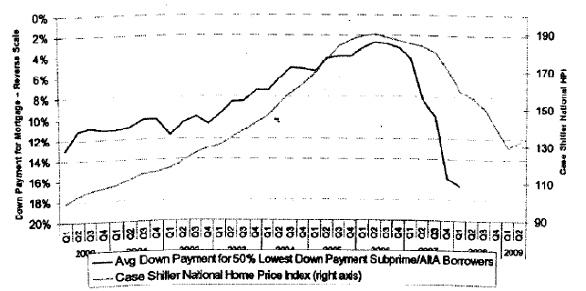

<!--yml

分类：未分类

日期：2024-05-18 06:59:25

-->

# 物理学视角：杠杆周期

> 来源：[`physicsoffinance.blogspot.com/2012/12/the-leverage-cycle.html#0001-01-01`](http://physicsoffinance.blogspot.com/2012/12/the-leverage-cycle.html#0001-01-01)

我的最新彭博社专栏文章预计将在周日晚上某个时候发表，我期望。我想在这里给读者提供几个链接，链接到 John Geanakoplos 关于杠杆周期的几篇关键论文，以及关于几个观点的进一步讨论。

首先，

[这是](http://cowles.econ.yale.edu/~gean/art/p1304.pdf)

Geanakoplos 最详细的论文（据我所知），描述了杠杆周期——一种自然反馈过程，反复推动经济周期，其中杠杆上升，推动资产价格上涨，然后下降，投资者变得不确定，更加谨慎，并要求更多的抵押品，价格随即相应暴跌。他的论点是，杠杆（由抵押品率决定）是一个完全独立于利率的关键宏观经济变量，通常对整个经济同样重要。特别是，杠杆的增加（减少）是导致价格上涨（或下跌）的一个关键直接原因。作为证据，请查看下面的图表，了解 2000 年至 2009 年间的房价。它显示了次级抵押贷款平均首付要求如何上升然后下降，两种情况都是在房价上涨之前。 （好吧，这并不是一个

[因果链接](http://physicsoffinance.blogspot.ch/2012/12/a-new-take-on-causality.html)

，我想，但这足以让我信服。)

但在阅读“严肃”的论文之前，我建议首先阅读

[这个演讲](http://cowles.econ.yale.edu/~gean/crisis/p1306.pdf)

两年前在意大利由 Geanakoplos 所做的。它非常非正式，并以清晰的方式提出了所有主要观点。

从实际角度来看，我认为他的论点中有两件事让我印象深刻：

首先，鉴于杠杆在驱动经济结果中的重要性的清晰性，美联储银行在过去没有做出任何系统性努力来收集它需要的数据，以监测经济中的平均抵押品率，这是非常令人瞩目的。例如，在 2000 年和 2005 年之间，美联储的任何人都没有去银行收集他们在放贷时要求多少抵押品的信息。这被认为是关键的宏观经济变量。从他的讲话语气判断，Geanakoplos 也认为这非常令人惊讶。他提到美联储在 2008 年或 2009 年左右联系他获取这类数据。看起来美联储现在接受了杠杆的系统重要性，并认真考虑将杠杆作为未来宏观经济监测的关键变量。是否需要银行和对冲基金报告杠杆水平，我不知道，但这个想法至少摆在桌面上。我认为这是一个好事。

第二个有趣的问题是，回想起来似乎有点显而易见。在 Geanakoplos 的图片中推动价格上涨的杠杆是多头杠杆，这使得乐观的投资者能够购买比他们原本能够购买更多的东西。相反意义上的杠杆，允许悲观主义者对市场崩溃进行投机的空头杠杆，会起到推低价格的作用。因此，信用违约互换（CDS）于 2005 年创立的可能性，或许在危机的开始阶段起到了关键的触发作用。正如 Geanakoplos 所写，

> 在我看来，2007-2009 年金融危机的一个重要触发因素是 2005 年底在房地产市场高峰期引入了 CDS 合约。公司债券的信用违约互换已经交易了好几年，但直到 2005 年之前，还没有标准化过的按揭 CDS 合约。我不知道推动这一标准化的动力是什么；也许当市场达到如此高度时，更多的人想要做空市场。但后果是，此后悲观主义者以及乐观主义者都有了杠杆的机会。这肯定会导致按揭证券价格下跌。...这又迫使按揭证券的承销商要求更高的抵押物，以使按揭贷款更具吸引力，而这又使得房主无法重新融资按揭，迫使许多房主违约，这又开始推低房价，这又使得新房贷更难销售，如此循环。我相信，在按揭产品上大规模引入 CDS 交易是危机中的一个关键、被忽视的因素。到目前为止，人们一直认为一切都始于 2006 年房价开始下跌。但房价为何那时开始下跌一直是个谜。
> 
> 当然，如果从一开始就引入 CDS，价格永远不会涨得这么高。但它们是在市场达到顶峰后才引入的。

并不是没有 CDS 合约危机就不会发生，但它们可能加速了崩溃。

最后，关于相关问题，我认为很多人可能会发现很好的价值。

[这篇文章](http://www.bwater.com/Uploads/FileManager/research/how-the-economic-machine-works/How-the-Economic-Machine%20Works--A-Template-for-Understanding-What-is-Happening-Now-Ray-Dalio-Bridgewater.pdf)

由桥水投资公司负责人雷·达里奥撰写。这是达里奥试图给出一个简单解释的“经济是如何运作的”，他把信贷的扩张和收缩放在非常核心的位置。他基本上是在用一种不太正式的方式提出和 Geanakoplos 相同的论点。我认为这本书既有趣又富有教益。
