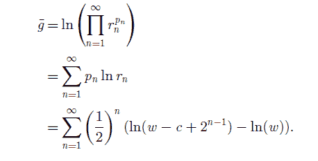

<!--yml

category: 未分类

date: 2024-05-18 07:00:00

-->

# 物理视角：为什么期望值是一个错误

> 来源：[`physicsoffinance.blogspot.com/2012/11/why-expected-value-is-mistake.html#0001-01-01`](http://physicsoffinance.blogspot.com/2012/11/why-expected-value-is-mistake.html#0001-01-01)

我想更仔细地研究我在

[我上一篇帖子](http://physicsoffinance.blogspot.fr/2012/11/ergodicity-biggest-mistake-in-economics.html)

中提到的奥尔·彼得斯的非常有趣的工作。他认为，在经济学和金融中通常用于计算“预期”回报的集合平均数，在许多情况下，不适合于在现实世界中做出决策；特别是，它们严重低估了风险。彼得斯从一个简单的赌注开始：

> 让我来给你提供以下的赌注：你掷一次骰子，如果你掷到了 6，我将给你一百倍于你的总财富。其他任何结果，你都必须把你所有的东西都给我，包括你的退休储蓄和你最喜欢的袜子。我应该指出，我非常富有，即使在这个艰难的时刻，你也不必担心我的支付能力。你会这么做吗？…理性的答案似乎是“是”—在掷一次骰子的时间内，你的投资的预期回报是 1,583 1/3%。但你的直觉是什么？

正如他所指出的，几乎没有真实的人会接受这个赌注。你有 6 次中的 5 次可能会一贫如洗，一次可能会变得非常富有。不知何故，大多数人对结果的权衡方式与简单且据说“理性”的最大化预期回报的观点不同。为什么会这样？我们是在犯错吗？还是这其中有一些智慧？

彼得斯的赌注是对最初由尼古拉斯·伯努利提出的著名的圣彼得堡“悖论”的变体，后来由他的兄弟丹尼尔讨论过。问题是要确定一个理性个体应该愿意为基于抛硬币的抽奖而支付多少。在抽奖中，如果第一次抛硬币是正面，你赢得 1 美元。如果第一次是反面，你再抛一次。如果硬币现在是正面，你赢得 2 美元，否则你再抛一次，依此类推。如果在第 n 次抛硬币时出现正面，抽奖将支付 2^n（^表示指数）美元。一个简单的计算显示，抽奖的预期支付是无限的——由不收敛的总和给出（1*1/2 + 2*(1/2)² + 4*(1/2)³ + …）=（1/2 + 1/2 + 1/2 + …）。 “悖论”再次出在为什么现实中的人们不认为这个抽奖是无限诱人的，通常只愿意支付不到 10 美元来参加。

这当然是一个悖论，除非你有某些理由认为人们应该按照最大化预期回报的原则行事。有这样的理由吗？我对经济学和决策理论的历史了解不够，无法说是否有这样的理由——也许可以证明这种行为在某种特定意义上是理性的，即与某些公理一致？但是如果是这样，那么这个悖论实际上似乎确立的是这样的规则在现实世界生活中的有限相关性（即这样的规则捕捉到了一种无效的理性）。

[彼得斯对悖论的解决](http://rsta.royalsocietypublishing.org/content/369/1956/4913.full.pdf)

显示了原因（至少对我来说是这样的）。

他的基本想法是我们生活在时间中，在时间中行动，在这方面我们没有任何选择。因此，考虑任何赌注可能带来的回报的最自然方式是想象连续多次玩这个赌注（而不是同时多次，如在 ensemble average 中）。无限期地这样做，你应该会遇到所有可能的结果，好坏都有。从数学角度来看，这种思维方式使彼得斯考虑玩家从财富 W 开始，在 N 个时期内玩这个赌注的增长率（对数回报）的时间平均，当 N 趋于无穷大时。在他的论文中，他进行了一次简单的计算，找到了这个增长率公式：

这里的第三行明确是为圣彼得堡彩票设计的，而第二行对任何概率 p_i 给出回报 r_i 的赌注（求和延伸到所有可能的结果）更一般适用。

这立即为圣彼得堡悖论提供了更有意义的指导，因为这种预期的增长率对于成本 c 足够低时为正，而当 c 过高时为负。最重要的是，你愿意支付多少取决于

***基于你的初始财富 w***

（因为这将决定你在破产之前能承受多大的损失。注意这一点在任何 ensemble average 中都没有体现。这是一个初始条件，实际上使得不同财富的玩家的赌注不同。巧合的是，这个结果与丹尼尔·伯努利最初提出的解决悖论的方案完全相同，他简单地假设了对数效用，并假设人们试图最大化效用，而不是原始财富。这个想法反映了进一步的财富对有钱人来说相对不那么重要的事实。相比之下，彼得斯的结果在没有这样的任意效用假设的情况下出现（尽管它们可能是合理的）。这仅仅是一个人多次玩这个游戏，从财富 W 开始，预期的增长率。输入数字显示，对于一个百万富翁来说，成本 c 小于大约 10 美元时，回报变为正数。只有 1000 美元的人不应该愿意支付超过大约 6 美元。）

回顾并简化骰子游戏来解决问题也是很有用的。关于这个公式需要注意的是，在任何可能导致一个人一次性失去所有财富的赌注中，平均增长率是负无穷大，无论这个结果有多不可能发生。这适用于之前描述的骰子赌注。我一直在想这真的有任何意义，但在进一步探索后我现在认为它确实是有意义的。秘诀是再次考虑玩游戏的人拥有财富 W，并且失败的代价不是整个财富，而是某个成本 c。简单计算后可以发现，骰子游戏的平均增长率如下面的图所示，显示了增长率与 c/w 的关系，即玩家财富的百分比。

你可以看到，当成本小于玩家财富的大约 60%时，回报是正的，这个赌注是值得一试的。如果超过这个比例，平均增长率是负的。并且，当 c/w 接近 1 时，增长率变得更负，当 c/w=1 时，恢复到原始游戏。再次强调，当考虑一个人的初始财富时，一切都会更有意义。这个初始条件真的很重要，而且一个赌注可能的回报强烈地依赖于它，因为较低的财富意味着更快破产的可能性，然后完全退出游戏。无论多么不可能，一次性失去所有财富的可能性在长期内是决定性的，因为这最终是确定的。

再次强调，这种思维方式可能具有远远超出这个悖论的重要意义。它实际上指出，集合平均值作为决策指导是非常具有误导性的，尤其是当所涉及的潜在收益和损失变得更大时。如果它们与个人的总体财富（或投资组合）相比仍然较小，那么集合平均值和时间平均值最终是相同的，给出一个初始财富无关的公式。但是，当潜在的收益/损失变得很大时，初始条件确实很重要，集合平均值就变得危险了。这些问题在这篇文章中解释得非常清楚。

【Towers Watson 文章](http://www.towerswatson.com/assets/pdf/8271/The-Irreversibility-of-Time.pdf)

我曾在早前的文章中提及。

这使我想到一个最后的观点。Ivan 在评论中提到，也许 Peters 通过查看时间平均而不是 ensemble 平均来改变了初始问题，因此并没有真正解决圣彼得堡悖论。我还不太确定自己对此的看法。如果我没有弄错，这个悖论是为什么人们不按照使用 ensemble 平均计算出的预期回报原则行事。在我看来，Peters 的观点完全解决了这个问题，因为它表明这个 ensemble 平均在很多情况下给出的建议非常糟糕。特别是，它让人感觉一个人的初始财富应该与这个问题无关。如果你面临赌博，像我们所有人一样在生活中以一种形式或另一种形式反复面对，那么像我们这样考虑依次面对它们是有意义的。但这不是，如我所说，我的最终观点.....这是那些你越思考就越觉得深奥的东西之一.....
