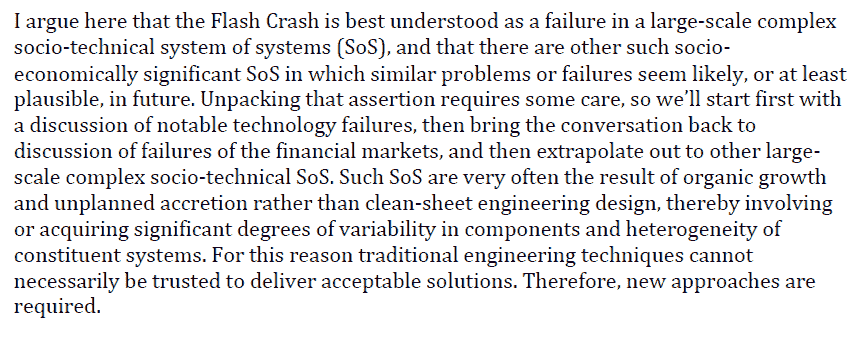
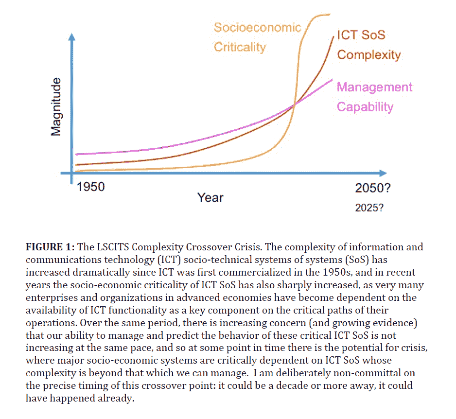
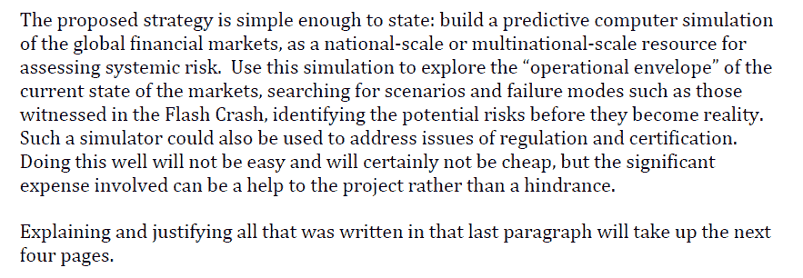

<!--yml

分类：未分类

日期：2024-05-18 07:01:47

-->

# 物理学视角：为何我们需要模拟全球金融市场

> 来源：[`physicsoffinance.blogspot.com/2012/01/why-we-need-to-simulate-global.html#0001-01-01`](http://physicsoffinance.blogspot.com/2012/01/why-we-need-to-simulate-global.html#0001-01-01)

我强烈推荐

[这篇文章](http://www.cs.bris.ac.uk/home/dc/cliff_wtf_transcript_final.pdf)

由计算机科学家戴夫·克 iff 在当今全球市场的复杂性、它们内在的技术依赖以及潜在的灾难性崩溃方面进行探讨。这是基于他在 2010 年 5 月 6 日闪崩后不久向英国政府做的报告。他从一位既 closely involved with developing automated trading algorithms, 又对大型社会技术系统的稳定性和潜在崩溃进行了深入思考的人的视角，提供了宝贵的见解。

最重要的是，克 iff 认为我们面临着一个无法控制的复杂性危机，我们真的缺乏理解能力。对金融系统自我调节的盲目信任是完全站不住脚的，避免潜在灾难的唯一方法可能就是利用技术本身——通过大规模模拟——试图预见可能出现的问题。一些论点的亮点：

在更广泛的讨论中，克 iff 还认为，计算技术的发展使我们进入了一个危机的时代，因为我们的能力在构建和依赖复杂系统方面远远超过了我们在理解和管理这些系统方面的能力。我认为这是无可争议的。克 iff 用一个有启发性的图表来说明这一点，如下：

考虑到这个问题以及它对金融的明显特殊重要性（考虑到过去十年 HFT 的转变），克 iff 接着在文中概述了一种可能的解决方法。主要观点是，经济学和金融学真的需要转向已经在其他科学和工程领域使用的方法。也就是说，构建合理的大规模模拟模型，以对复杂系统（如天气）有所了解。正如他所说，计算在金融中得到广泛应用，但通常用于像定价期权这样的事情，很少用于模拟整个市场。然而，这种状况正在慢慢改变，尽管传统经济学界存在抵触。

克 iff 的基本建议：

我 elsewhere 也提出过类似的事情（详细程度不如这里，说服力也不如这里）。问题是全球范围内的政府是否有这种意愿，面对似乎很享受对全球风险理解更少而不是更多的金融业。
