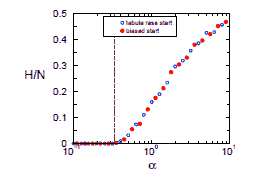

<!--yml

分类：未分类

日期：2024-05-18 07:01:26

-->

# 物理视角：少数游戏

> 来源：[`physicsoffinance.blogspot.com/2012/02/minority-games.html#0001-01-01`](http://physicsoffinance.blogspot.com/2012/02/minority-games.html#0001-01-01)

我有

[一篇刚刚发表的论文](http://www.bloomberg.com/news/2012-02-07/a-bar-may-be-best-place-to-understand-markets-commentary-by-mark-buchanan.html)

在彭博社。这篇文章非常短，我希望给感兴趣的读者提供一些关于如何构建简单且可信的金融市场模型的更多细节和阅读链接。因此，写了这篇文章。

传统市场经济学模型基于均衡理念。市场中的变化被假设为反映两者的相互作用：1. 无数市场参与者的决策，他们在自己的最佳利益下或多或少地表现出理性，他们的集体行动将市场带向一种平衡，在这种平衡中，股票、债券或其他工具实现其现实的“基本”价值（至少是接近这些价值），以及 2. 以新的企业、政治事件、法规变化、技术发现等形式对市场造成外部冲击的信息。没有外部的冲击，这些模型暗示，市场将迅速（假设非常快）进入一个不变的状态。该观点认为，市场中发生的所有事情都可以追溯到新信息对这种平衡的扰动。

我以前写过（

[在这里](http://physicsoffinance.blogspot.com/2011/05/whats-efficient-in-efficient-markets.html)

，例如，以及

[在这里](http://physicsoffinance.blogspot.com/2011/10/what-moves-markets-part-i.html)

）关于这幅图的有力证据。这包括许多在市场没有明显“冲击”的情况下发生的大规模市场运动，以及“过度波动”——市场价格普遍高估了它们真实价值的理性计算。许多研究已经证实，市场波动中存在强烈的数学规律性，反映了这种过度波动，包括

[市场收益的厚尾统计](http://physicsoffinance.blogspot.com/2011/12/power-laws-in-finance.html)

以及收益的长记忆性——市场吸收信息的方式，从经验上看，并不快，而是涉及一个长达十年甚至更长的缓慢消化过程。

那么，如何构建超越均衡图像的模型呢？如果简单的均衡概念过于简单，无法解释市场现实，为什么不尝试非均衡模型呢？也就是说，在个体行动甚至没有外部冲击的情况下，市场不会达到某种均衡状态的模型。相反，人们可能会不断改变他们的想法和策略，以一种赋予市场丰富的内在动态的方式互动，就像天气一样。对非常简单的双玩家战略游戏的研究实际上表明了

应该预料到这种结果](http://physicsoffinance.blogspot.com/2011/10/why-game-theory-is-often-useless.html)

在任何情况下，个体面临的决定都是相当复杂的，无法简单地用理性解决方案来解决——也就是说，在大多数情况下（显然是在任何现实世界市场的案例中）。

科学常常通过提出抓住某些问题逻辑本质的玩具模型来取得进步。通过研究它，人们可以学习新的思维方式。在我的彭博社专栏中，我提到了最近启发了市场非均衡模型的一个玩具模型。这是经济学家布莱恩·阿瑟在 1994 年发明的所谓的 El Farol 酒吧问题。

原始论文](http://tuvalu.santafe.edu/%7Ewbarthur/Papers/Pdf_files/El_Farol.pdf)

仍然值得一读；这是那种提出如此坚实、可信的观念，以至于它看起来显而易见的论文，很难相信其观点是革命性的，与主流经济习惯背道而驰。直到今天，这仍然是正确的。但是，背景已经足够了。

我的彭博社专栏为酒吧问题提供了大致的想法——它是人们无法通过理性思考做出决定，而必须采取更实际的方法的一个典型情况，形成假设和理论，并从经验中学习。结果是一个持续随时间演变的非均衡状态，永远不会达到均衡。有很多文章提供了关于模型及其工作方式的更详细的摘要。

但条形图模型的本质自那时起通过另一种模型——所谓的少数派游戏——被探索得更加详细。这只是一个条形图模型，尽可能简化但仍保留无人能“破解”的本质元素。玩游戏没有严格理性的方式；智能游戏需要不断适应和学习。少数派游戏可能是最简单的市场数学模型。当然，它太简单了，只能算是一个玩具模型。但至少，这个玩具模型比 EMH 或经济学中的任何东西更像真实的市场。而且，它相对简单的优点是，可以看到各种基本因素如何影响其运作，而不是其他可能有数千种潜在的复杂性使问题变得模糊。

所以——少数派游戏是什么？

阿瑟假设人们会喜欢酒吧的出席率在 60%以下，如果超过 60%就会很痛苦。少数派游戏将截止率简化为 50%，给问题带来对称性——现在在任何一周表现良好的人都是那些行动以成为少数派的人（当其他人呆在家里时出去，反之亦然）。少数派游戏还摒弃了酒吧的故事。只需让每个 N 代理在每次游戏中选择 1 或-1，少数派获得一些回报（让 N 为奇数）。现在让他们玩很多次。每个代理只是尝试每次成为少数派。怎么做呢？

当然，一切取决于我们假设代理如何玩游戏。遵循阿瑟，典型的方法是假设他们使用某种试错学习。游戏的结局记录由一些 1 和-1 的序列给出——这些给出了每个实例中的少数派的选择。例如，最后 5 个结果可能是 1,1,-1,-1,1。在少数派游戏中，“策略”将每个这样的近期历史与下一步的选择关联——1 或-1 的选择。策略可能说，如果（1,1,-1,-1,1）那么选择 1，或者相反，如果（1,1,-1,-1,1）那么选择-1。如果我们假设代理在试图预测未来时回顾过去的 M 个结果（这通常被称为他们的“大脑大小”），那么有 P=2

^M

不同的事件历史，代理可以解决或洞察。从数学的角度来说，策略是一个地图或关联，为每一个可能的事件分配一个 1 或-1 的选择。

^M

不同的事件历史。策略是一个行动计划，如果你愿意，是为每一种可能的事件序列（在代理能感知的层面）制定的 IF...THEN 声明。

现在，由于每个可能的序列可以与 1 或-1 相关联，实际上有 2

^P

或 2

^(2^M)

不同的可能策略。即使 M 低至 5，这已经是 2

³²

这是超过一万亿美元的不同的可能策略。随着 M 的增大，它增长得非常快。

少数派游戏是这样玩的：在一开始，每个玩家随机分配到一组策略 S。你可以把它看作他们的知识遗产。这是 S 种不同的“思考方式”的集合，关于如何预测世界。（模型的有趣特性并不取决于这个选择。）代理使用这些策略来玩游戏，并记录哪些策略似乎效果好，哪些不奏效。这通常是通过某种简单的算法来完成的，其中代理包中的每种策略预测正确时得分，预测错误时扣分。每次游戏，代理查看他们的包，选择得分最高的策略。这就像一个人在脑海中考虑各种理论，并使用过去最成功的那个。

所以就是这样。你有一组使用简单学习动态来尝试基于过去预测未来的代理。他们在每个时刻都试图选择大多数人不会选择的策略。显然，没有任何一种策略能脱颖而出成为赢家，因为如果有一种策略做到了，并且每个人都开始使用它，那么他们都会成为多数，都会是输家。成功的策略因此埋下了自己消亡的种子。这就是使游戏有趣的原因。但等等——这和市场有什么关系？

从性质上讲，少数派游戏有点像市场。这是一个每个人试图通过选择正确的策略来获利的局面，但“正确”的是什么是由所有人的集体行动决定的。没有独立于他人行为之外的“正确”。少数派游戏，和任何市场一样，是一个涉及大量复杂互动策略的生态游戏。只不过这里没有价格。一个小小的变化可以改变这一点，然而。

如果我们把选择 1 的人视为“买家”而选择-1 的人视为某种股票的“卖家”，那么我们就能得到市场最简单的粗略模型。自然而然，买家的数量超过卖家会推高价格，反之亦然。从数学角度，你可以说在时间 t，价格对数的变化（即回报）与买家数量减去卖家数量成比例。这样得到的价格行为极其不稳定，大致类似于金融市场的波动。特别是，即使没有外部信息冲击市场，没有来自外部的影响或任何类型的干扰，价格也会因为交易策略的不断演变而不可预测地上下波动。有一天，看似无缘无故，价格可能突然下跌 10% —— 仅仅是因为许多参与者选择卖出，这成了他们试图预测接下来会发生什么的其中一部分。

这篇文章已经足够长了。对于很多细节，我强烈推荐

**[这篇优秀的评论](http://arxiv.org/abs/physics/0608091)**

**托拜厄斯·加 lla**、** Giancarlo Mosetti** 和 **Yi-Cheng Zhang** 提出的少数派游戏，我强烈推荐（张是少数派游戏的共同发明者之一）。还有很多东西可以说，但现在最重要的两点是：

1. 少数派游戏市场最简单的版本 **并不产生** 真实市场的所谓“风格化事实”——收益分布的厚尾统计，以及市场波动的长期记忆和持续性。事实上，当玩家数量较大时，这个最简单的少数派游戏市场的收益是高斯分布。然而，这个模型只是一个开始，一旦包括了几个更现实的特征，这些风格化的事实就会非常自然地出现。例如，在这个游戏的版本中，每个代理人在每个时刻都必须选择 1（买入）或 -1（卖出）。因此，成交量总是相同的；它被强制固定，这当然是完全不自然的。

放松这个条件的一个简单方法是赋予代理人也放弃的权利——他们可能只是持有他们所拥有的，既不买也不卖。这可以有一定的信心包含在内，即除非代理人的某一个策略在最近过去非常成功，否则代理人不进行交易。这立即导致了一个成交量波动的市场，这个市场确实具有与真实市场类似的“风格化事实”，即收益分布的厚尾和市场波动的长记忆。允许成交量波动的另一种方法是让代理人在一段时间内积累财富，并让他们的交易量与他们积累的财富成比例增长。同样，这是走向现实的明显一步，同样导致具有许多真实市场所见到的丰富统计特征的市场波动，即使是在如此简单的模型中。

2. 另一个重要点是少数派游戏非常简单，以至于可以用从物理学借来的某些分析技术来解决。细节并不重要，但结果显示市场中有一种相变，将两种不同行为区域分开。这幅画面提供了一个美丽的粗粒度理解，将市场视为相互作用代理人的生态系统。

基本故事是，少数派游戏中的一个关键参数决定了其整体特征。该参数是 α=P/N，其中 N 是游戏中的代理人数。如果这个值小，那么相对于他们可以感知的不同市场历史数量，玩家就很多。如果这个值大，那么有很多不同的可能历史，相对于只有少数人。这两种极端导致了非常不同的市场行为，原因不难看出。

下面的图表（来自 Galla 等人论文）有效地展示了市场可预测性作为参数α=P/N 的函数。换句话说，这个图表显示了过去价格记录可以用来准确预测未来价格的程度。对于大的α，这种可预测性是正的，并且随着α的增大而增长。为什么？从原则上讲，这种可预测性应该使游戏中的成功变得容易。但只有当代理的行为足够灵活，能够抓住模式并利用它时才成立。在这种状态下，价格中经常出现模式，然而却没有代理有足够的智力能力去利用它。回想一下，每个个体都被随机给定了一组策略来操作。在市场中人数非常少时，这意味着相对于代理做出决策的许多可能的市历史，策略非常少。简而言之，如果代理及其行为策略的多样性不足以让他们抓住所有可能的模式，市场就会保持一定程度的可预测性。

对于另一个极端情况，当α很小时，情况看起来非常不同。现在我们有相对于可识别历史数量的代理和策略过剩。现在很可能会有一种可预测的模式适合某个代理的策略组合，该代理将会抓住这个模式，获利，并且他们的活动倾向于抹掉这种模式。这个阶段看起来很像有效市场——如此丰富的代理多样性，拥有不同的技能和心态，任何可预测的模式都会立即被冲走。

其中一些

[最有趣的猜想](http://arxiv.org/abs/cond-mat/9901243)

从这幅图中可以看出，真实的市场可能类似于“边际有效”，至少在大部分时间里是这样。如果完全有效且因此不可预测（市场中有许多代理，α较低），那么在市场中获利非常困难。这应该使市场变得不那么有吸引力，有些人应该离开去做其他事情。但随着人数的减少，这推动了市场向更高的α值发展，并进入低效阶段，市场变得可预测。这反过来又吸引了更多的人进入市场，从容易的模式中获利。在这幅简单的图中，市场应该倾向于向一个α值发展，其中价格的可预测性低但不为零，这使得在市场中找到模式困难但并非不可能。从宽松的非科学角度来看，市场似乎经常处于这样的位置。

目前研究少数派游戏的文章已经不下数千篇，而我只想传达最基本的概念。这是一个优美的简单模型，它能捕捉市场的许多定性特征，并且可以通过进一步的改变逐步向更复杂的市场模型发展。没有必要坚持认为收益总是归于少数派。这个游戏已经推广到了其他类型，例如多数派游戏（其中趋势跟随能带来收益）或者混合多数派-少数派游戏（其中市场回归和趋势跟随都发挥作用）。再进一步，你就可以忘记游戏本身，仅仅将市场建模为人们运用各种交易策略相互作用的系统，每个人都在买卖，而价格则通过他们的集体行动而变动。计算能力和想象力是唯一的限制。

我将来会探索这些更复杂的模型，但少数派游戏之所以极其重要，正是因为其简单性。这种简单性使得我们可以进行完整的分析，得出上面所示的两个阶段的图像。但这已经比基于假设的完全理性行为的市场模型复杂得多。这个模型很粗糙，确实如此，但它是在正确方向上的一个小步骤。
