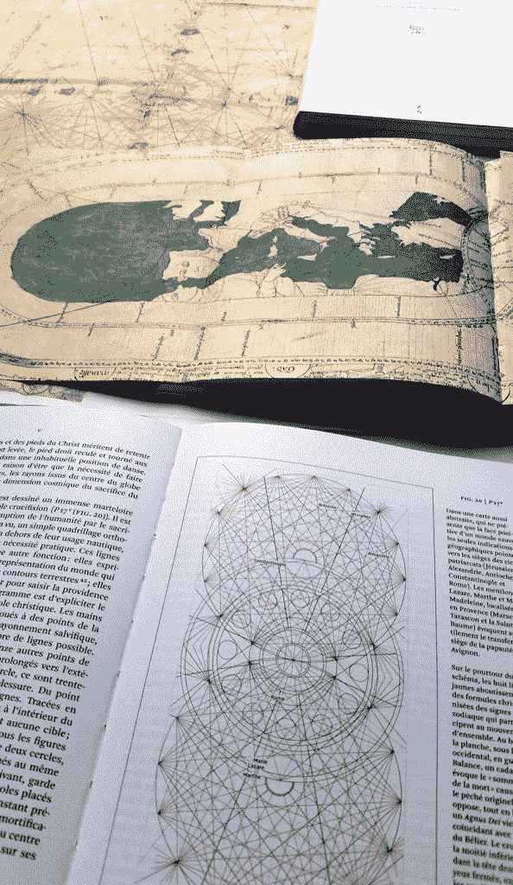
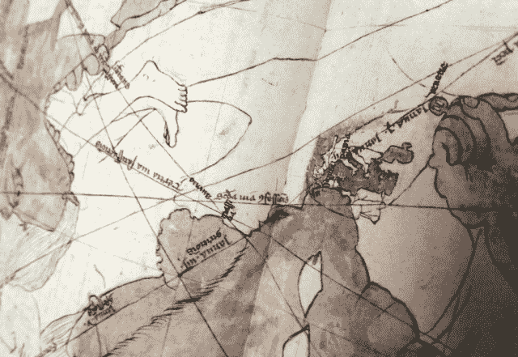
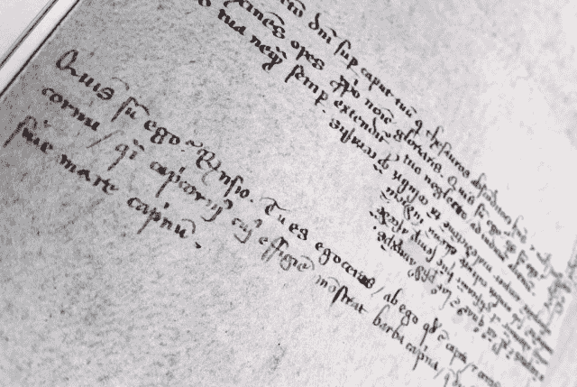
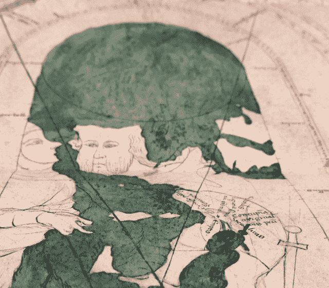
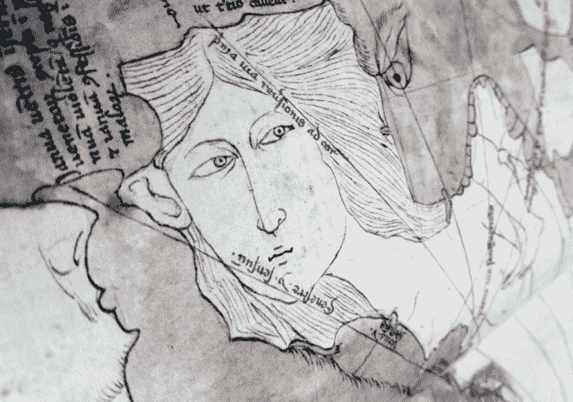
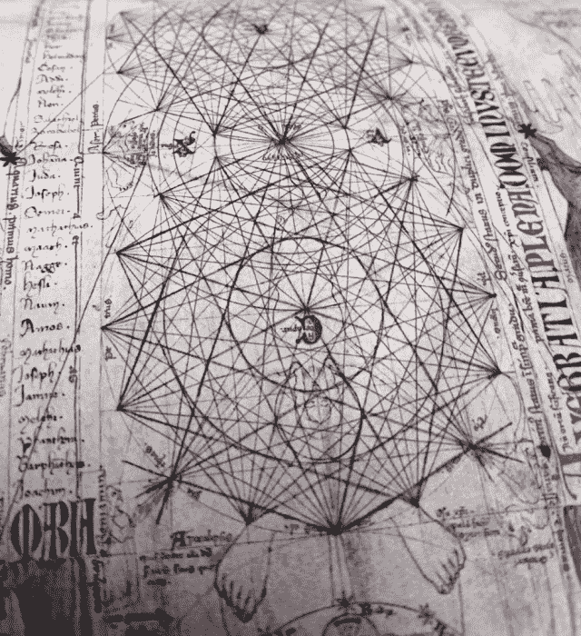
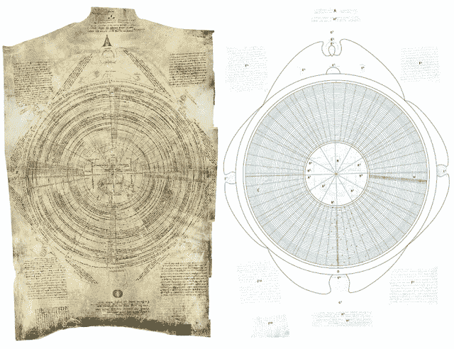
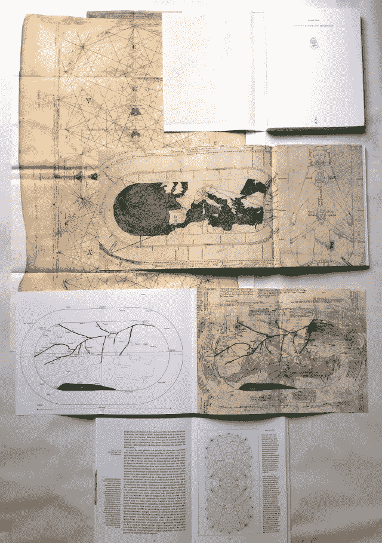
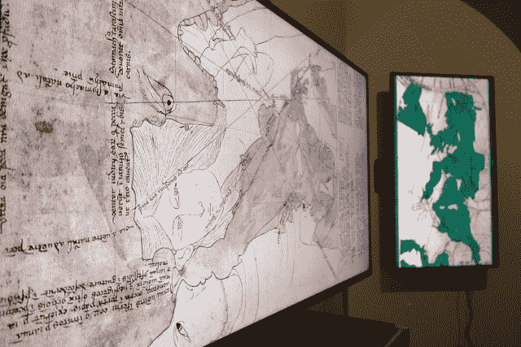

<!--yml

分类：未分类

日期：2024-05-18 14:13:46

-->

# 请见 Opicino – Sniper In Mahwah &朋友们

> 来源：[`sniperinmahwah.wordpress.com/2015/10/22/please-meet-opicino/#0001-01-01`](https://sniperinmahwah.wordpress.com/2015/10/22/please-meet-opicino/#0001-01-01)

这篇简短的文章与高频交易（HFT）或市场结构无关。但没有 HFT，这一切都不会存在。这就是*怪物的辩证法*，由我的出版社出版的新书（除了在市场结构上做一些工作、在艺术学院教书并为其他出版商设计一些书籍外，自 1998 年以来我一直是一名图书出版商，已经出版了 75 多本书）。当我的[自己的书](http://www.zones-sensibles.org/livres/6-5/)在 2013 年发布时，它吸引了市场上各种人的注意，我与一位对中世纪哲学家感兴趣的法国对冲基金首席执行官进行了一次非常有趣的谈话，这些哲学家对我们现在所说的“市场微观结构”写了很多东西（我稍后会在今年发布关于这些哲学家的文章）。就这样，我遇到了中世纪学者 Sylvain Piron，他将法语翻译并编辑了关于市场和合同的最具趣味的中世纪文本之一，即皮埃尔·德·让·奥利维的*De contractibus*（我在之前的[帖子](https://sniperinmahwah.wordpress.com/2014/03/30/iex-de-contractibus/)中简要提到了 Olivi）。Sylvain 和我讨论了很多关于市场、交易所、公平、合同、宗教等等的问题。后来我们在其他（令人悲伤的）情况下又见面了，在雅克·勒高夫的葬礼上。雅克·勒高夫不仅是我们的共同朋友，而且是有史以来最好的中世纪学者之一。就在那之后，我们开始考虑可能关于 Opicino de Canistris 的书籍，最后我们完成了一本非常不寻常的书，*怪物的辩证法*。*关于 Opicino de Canistris 的调查*（*怪物的辩证法调查*），该书今天以法语发布。

我可以写数千字关于奥皮钦诺迷人作品/世界，但让我们简洁一点。奥皮钦诺（1296-1535）是来自 Lombardia 的中世纪意大利牧师，他可能患有精神疾病（他可能患有精神分裂症）。他与当时应该存在的教会存在道德问题，并在法国阿维尼翁（法国）教皇宫担任抄写员。但他还制作了两本迷人的手稿（现在在梵蒂冈图书馆），充满了非常美丽而奇怪的插图——确切地说，是文本和插图的混合。很可能他只是为了自己制作它们，而且很可能在他的一生中没有人看到过它们；这两本手稿一直保存在梵蒂冈图书馆，直到 19 世纪末才被一些首批艺术史学家对这些奇怪的插图产生兴趣（手稿几个世纪未被触摸解释了为什么它们得以从光中保存下来）。一个世纪前重新发现，奥皮钦诺的作品自那时以来一直吸引着许多人。但令人惊讶的是，直到今天世界上还没有专门介绍奥皮钦诺·德·卡尼斯特里斯的书籍（关于他的书有一些，两本用法语，一本用英语，但这些书没有给奥皮钦诺的作品提供一个公平和全面的视角；两本法语书籍是与一位精神分析师合著的，这位分析师犯了很多错误（婉转语），而英语书籍只涉及他的地图制作工作）。因此，我们的书是第一本向读者介绍奥皮钦诺的书籍：他是谁？他是如何制作他的插图的？他与教会和他的家庭有什么问题？我们如何解读他的文本？他在设计插图时在想什么？

以下是书籍的一些图片：

：

一个带有微型欧洲的人形欧洲地图，地图上布满血迹，并被一个怪物的手指侵犯：

：

一个印有奥皮钦诺自问：“*Qui sum ego?*”，“我是谁？”的板块：

：

另一张地图绘制，对比欧洲和马格里布：

：

欧洲的面孔（西班牙）：

：

一些带有两个基督的复杂图表：

：

他令人难以置信的自传（每个同心圆代表一年），重新设计并在书中翻译：

：

最后一张（颜色不正确，但你可以意识到 Sylvain 和我做的这项工作——这本书像一个大的折叠袖子，复制了最壮观的板块之一，我们还在这本书中包括了几个“传单”）：

我们花费巨资**梵蒂冈图书馆**获取这些版画的最佳照片，并努力以尽可能高的质量印刷图纸（感谢随机筛选等技术）。我们为此书工作了数月，我花了数十个小时重新绘制一些版画，以理解奥皮钦诺是如何设计它们的（透视、错误、轮廓、文字、细节……）。在这里我无法详细说明这些图纸中可以看到的内容，但它们是宗教、硬性色情、历史、教会、海洋怪物、制图艺术、他自己的生活等等的独特混合。没有其他中世纪艺术家像奥皮钦诺·德·卡尼斯特里斯那样迷人。研究这样的艺术家比研究算法有趣得多。

我们决定为这本书建立一个网站，[dialectiquedumonstre.net](http://dialectiquedumonstre.net)（在那里你可以找到其他图片、完整的第一章以及我们从拉丁语翻译并放入书中的奥皮钦诺的所有文本）。考虑到这是真正第一次介绍奥皮钦诺，书的翻译很快将出现在英语、意大利语等语言。奥皮钦诺·德·卡尼斯特里斯复杂的设计世界值得这样一本书。

