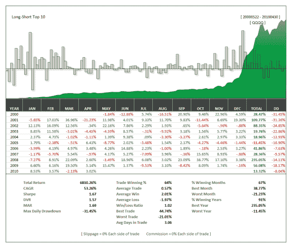

<!--yml

分类：未分类

日期：2024-05-12 18:27:23

-->

# 从内部预测市场：适应性广度 | CSSA

> 来源：[`cssanalytics.wordpress.com/2010/05/05/predicting-the-market-from-the-inside-out-adaptive-breadth/#0001-01-01`](https://cssanalytics.wordpress.com/2010/05/05/predicting-the-market-from-the-inside-out-adaptive-breadth/#0001-01-01)

几周前我有一个灵感时刻，在那个时刻我理论化认为指数中的某些股票比其他股票更有可能是指数回报的“驱动者”。不同的变量，如交易量和活动，可能能够帮助区分哪些股票对预测指数回报有用，哪些则没有。真正判断这种排名是否有力量的方法是进行一种“前进测试”，在这种测试中，每天都会选择使用 DV2 指标作为“预测者”的 QQQQ 股票。**有效地从这个群体中创建了一个信号来交易 QQQQ**。结果证明，这种方法相当强大——通过排名，绝对回报和风险调整回报几乎呈线性增加。使用排名前 10 的股票创建一个适应性广度指数（平均排名前股票的 dv2 值）来交易长.5，表现明显优于仅使用 QQQQ 的 DV2（基准）。与标准广度指标不同，后者关于如何最佳应用它们的理论和寓言故事很多，这种方法更“无假设”。正如市场回放的**杰夫·皮特施**喜欢说的：“马尔可夫会感到骄傲！”

### 使用适应性排名来确定哪只纳斯达克 100 股票最能用 DV2 指标预测 QQQQ

从 2000 年 5 月 22 日到 2010 年 4 月 30 日的回测 [2500 个柱子]

基准 = 长 QQQQ DV2 < .50 — 短 QQQQ DV2 > .50

