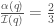

<!--yml

分类：未分类

日期：2024-05-18 06:42:13

-->

# 价格影响在有效市场中的作用 | 机械市场

> 来源：[`mechanicalmarkets.wordpress.com/2016/08/15/price-impact-in-efficient-markets/#0001-01-01`](https://mechanicalmarkets.wordpress.com/2016/08/15/price-impact-in-efficient-markets/#0001-01-01)

市场价格通常会对供应或需求的增加作出反应。这种现象称为“价格影响”，在金融市场中占据核心地位。价格影响为供需之间提供了反馈，这是价格发现机制（[price discovery mechanism](https://arxiv.org/abs/0809.0822)）的一个基本组成部分。价格影响也构成了大多数大型交易者的执行成本的绝大多数——监管机构可能会通过调整市场结构来寻求降低这些成本。

价格影响是 meta-order 大小的[凹](https://en.wikipedia.org/wiki/Concave_function)函数——在每一个测量良好的金融市场中，与 meta-order 大小的平方根成正比（例如，[欧洲](http://arxiv.org/abs/0908.0202)和[美国](https://arxiv.org/abs/1412.2152)股票、[期货](https://arxiv.org/abs/1311.6262)和[比特币](https://arxiv.org/abs/1412.4503)市场）。有一些很好的模型可以帮助解释这种普遍性，其中大部分需要对市场动态进行细致的假设。但是，或许各种金融市场，无论它们有多少独特性，都共享一些可能解释实证影响数据的涌现属性。在这篇文章中，我试图仅通过关于市场的大规模统计特性的假设来预测价格影响。特别是，我们可以将直观的市场原则转化为积分方程。一些原则，基于效率论据，暗示了像真实市场一样行为的方程系统。

在第一部分，我们将从最简单的原则开始，我们只假设这些原则在平均上是成立的：所谓的“公平定价条件”，以及市场价格能有效地根据已有执行量的 meta-order 来预见总数量。在第二部分，我们将用一个假设来取代公平定价条件，即交易者在平均上成功地使用价格目标。在第三部分，我们将回到公平定价，但剥夺 meta-order 预见的一些效率——通过假设执行信息缓慢地渗入市场。在第四部分，我们将通过与第三部分相反的方式来模拟抢跑行为：将 meta-orders 的短期执行计划泄露给市场。在第五部分和第六部分，我们将讨论向 meta-orders 中添加紧迫感概念。

# 定义和信息驱动影响

我们可以从供需的角度来理解价格影响。在大买家的大宗订单执行过程中，她的订单流通常会改变供需平衡，导致价格上升一个称为“临时价格影响”的幅度。买家完成后，她会将新获得的资产暂时不进入市场，直到她决定出售。这种供需的半永久性减少使得价格在新的水平上稳定，这个水平比资产的初始价格高出称为“永久价格影响”的幅度。可用库存的变化导致永久影响，而流量（以及库存）的变化导致临时影响。 [3]

另一种观点是，有信息交易的导致永久影响，而关于信息确定性的不确定性导致临时影响。当交易员提交大宗订单时，其永久影响应该以某种方式与她的信息相符。而其临时影响应该与市场对永久影响的估计相符。在一个“有效”市场中，信息观点和供需观点应该等价。

在我们进行之前，我们需要一些更多的定义。定义为与数量的大宗订单相关的典型永久价格影响。通过“典型”，我的意思是是永久影响的期望值，，与所有可能的情况和大宗订单集合中的一个情况相关联的影响。具体来说，![\alpha(q) = \mathbf{E}_{s \in S}[\alpha_{s}(q)]](img/75951ceb4c7e31ac017e3f2aae1a6a34.png)。将“alpha”这个俚语术语与相关联是合理的，这个术语描述了一个给定交易()预测价格的能力。

还定义为在执行了数量后典型的临时价格影响。再次，“典型”意味着![\mathcal{I}(q) = \mathbf{E}_{s \in S}[\mathcal{I}_{s}(q)]](img/9febc968058fc89f1b11edbe57370e4b.png)。

这些期望可以通过下面讨论的积分来传递，所以我们不需要关注它们。在本篇文章的剩余部分，“永久影响”将指的是期望![\alpha(q)=E_{s \in S}[\alpha_{s}(q)]](img/ea33043445f352a8c98f41772b1fbd3c.png)，除非有其他说明（同样的适用于“临时影响”和）。

# I. 一个简化模型

从市场效率的两个假设出发，我们可以确定大宗订单的典型价格轨迹。这两个条件是：

**I.1)** “**公平定价条件**”（[链接](http://arxiv.org/abs/1102.5457)），将交易员的 alpha 与他们的市场影响执行成本（平均）相等：

###### 积分表示整个超级订单过程中平均每单位数量的临时影响“支付”。“公平定价”意味着，总体来看，具有特定规模的超级订单不会获得超额回报或低于基准回报。

**I.2)** 临时影响与持久影响的有效联动：

![I(q') = E_q[\alpha(q)|q \geq q'] = \int_{q'}^{\infty} \alpha(q)p[q|q \geq q']dq](img/a725adaa10c6f0614cde961e37ad800c.png)

###### 在此，![p[q]](img/5d86139ce74f8712def6c47b6b480c49.png)是超级订单大小的概率密度函数（PDF），![P[q]](img/53bb107ec4a82094a47726f62bdb340f.png)是超级订单大小的累积分布函数（CDF）。而![p[q|q \geq q']](img/11597b12238c540c11c295a74a7c37eb.png)是超级订单大小的截断概率密度，![\frac{p[q]}{1 - P[q']}](img/511f310d5bddc22ddf84fba7126b7b6f.png)——这代表了在已经执行了数量的超级订单中的概率分布。这个条件意味着，平均来看，“市场”观察到一个匿名交易员执行了多少数量，并使用这个信息来估计她超级订单总数量的分布。“市场”然后计算超级订单 alpha 的期望值，这设定了当前的结算价格（即临时影响）。[4] [5] 为了强调，只有平均临时影响是这样确定的；一个单独的超级订单可能有非常不同的行为。这是一个启发性的例子：

###### A. 一位交易员正在购买大量的 IBM 股票，到目前为止已经购买了一百万股。

B. 市场的其他人看到（如价格上涨和成交量增加）这种购买的迹象，并且知道大致有人已经购买了一百万股。

C. 一旦交易员购买了一百万股，她有 50%的机会总共购买五百万股，有 50%的机会购买一千万股。“市场”知道这些概率。

D. 对于五百万股的超级订单，典型的持久价格影响是 1%，对于一千万股的超级订单，持久价格影响是 2%。所以“市场”预计我们交易员的超级订单将具有 1.5%的持久影响。*典型的*临时影响由这种期望值决定。这个特定的超级订单可能具有比 1.5%更大的或更小的临时影响，但在类似情况下发送的超级订单将具有平均 1.5%的临时影响。

# 与效率的关系

公平定价条件可能在资本管理行业竞争足够激烈时出现。如果一个基金经理使用一种在考虑影响成本后仍然盈利的交易策略，其他经理可能会效仿并从中获利。这种策略会继续吸引更多的资本，直到影响成本平衡了它的 alpha。（一些经理保护他们的方法，但大多数策略最终可能都会被复制。）如果一个策略某天被过度使用，并且影响成本超过了它的 alpha，那么经理可能会缩减规模，或者因为表现不佳而客户撤资。当然，这些过程需要时间，所以一些策略在考虑影响后可能会获得超额回报，而一些策略可能表现不佳——只要它们平均来看收支相抵，公平定价就会成立。

比**I.2)**更严格的条件应该在一个市场成立，在该市场中，大宗订单被分配一个匿名 ID，并且每一笔交易都立即向公众报告，同时公开其大宗订单 ID。 [Farmer, Gerig, Lillo 和 Waelbroeck](http://www.haas.berkeley.edu/groups/finance/hiddenImpact13.pdf)将具有类似市场结构的市场称为“彩色打印”模型。在这种披露制度下，如果中介利润为零，预期 alpha 将决定个体大宗订单的暂时影响路径，而不仅仅是平均  如**I.2)**。所有大宗订单都将有相同的影响路径： ![\mathcal{I}_{s}(q') = \mathbf{E}_{q}[\alpha(q)|q \geq q'] = \int_{q'}^{\infty} \alpha(q)p[q|q \geq q']dq](img/a983de4cf6617ce75b7b635878971996.png) 对于任何 。[6] 现在，彩色打印模型似乎并不非常现实；大多数市场都没有那么高的透明度。尽管如此，Farmer 等人还是展示了部分支持它的初步测量结果。[7]

即使没有彩色打印，联动性质**I.2)**可能也是由于动量和均值回归的交易者竞争利润而产生的。正如[布绍 aud, 农场主和 Lillo](https://arxiv.org/abs/0809.0822)讨论的，大多数价格波动可能都是由供需的变化引起的。也就是说，如果价格上涨伴随着成交量的增加，那很可能是有人触发了大量的大宗订单，特别是如果没有任何新闻的情况下。因此，如果平均影响超过**I.2)**显著，均值回归的交易者可能就会观察到这些迹象，并通过对大量大宗订单相反方向交易来获利。同样，如果平均影响低于**I.2)**，趋势交易的交易者可能会通过跟随价格趋势来获利。

# 解方程组

我们可以结合**I.1)** 和 **I.2)** 得到一个常微分方程 [8]:

![\alpha''(q) + (\frac{2}{q} - \frac{p[q]}{1-P[q]})\alpha'(q) = 0](img/56dc99d81d8c39826749a78049feb397.png)

这个常微分方程让我们可以为给定的元订单大小分布 ![p[q]](img/5d86139ce74f8712def6c47b6b480c49.png) 计算  和 。

通常我们会将 ![p[q]](img/5d86139ce74f8712def6c47b6b480c49.png) 近似为一个 ![Pareto[q_{min},\beta]](img/39a7ed0014b5ee206935d23daa803a0d.png) [分布](https://en.wikipedia.org/wiki/Pareto_distribution)（![p[q] = \frac{\beta q_{min}^{\beta}}{q^{\beta+1}}](img/45ce44e632a79493fc394d4b49617ef4.png)）。如果我们这样做，那么 ![\frac{p[q]}{1-P[q]} = \frac{\beta}{q}](img/0c0790d8ae957cb5457d2cdeae60299e.png)，微分方程有一个  的解。方程 **I.1)** 暗示 ，所以我们有 。对于小 ，影响应该几乎消失，所以我们可以说 。执行后的影响衰减由  给出。

如果我们选择 （大致与[实证数据](http://papers.ssrn.com/sol3/papers.cfm?abstract_id=2197534)一致），我们会得到熟悉的平方根法则：。我们还会得到一个影响比率 ，非常接近[现实世界的值](http://arxiv.org/abs/1412.2152)。

Farmer, Gerig, Lillo 和 Waelbroeck 提出了一种类似的方法，得到了相同的结果。他们使用公平定价条件，但结合了一个竞争性的市场微观结构模型 [9](img/d1fc49c3a5b2e624efc8605a1544b836.png)) 相当于知道其均衡元订单大小分布(![p[q]](img/5d86139ce74f8712def6c47b6b480c49.png))。 [10] 如果假设

# II. 公平定价的替代原则：交易者有效使用价格目标

第**I**部分的两个积分方程可以修改以适应其他市场结构原则。有一些[证据](http://papers.ssrn.com/sol3/papers.cfm?abstract_id=2291720)表明我们的市场遵守公平定价条件，但考虑替代方案也很有趣。一种可能性是交易者有价格目标，当价格接近这些目标时，他们会停止执行他们的元订单。我们可以尝试用体现这种直觉的东西替换**I.1)**的公平定价：

**II.1)** 

###### 其中  和  是常数。当交易者遵循价格目标规则，并且他们的目标准确预测长期价格（平均而言）时，这个原则应该是正确的。如果  并且 ，那么交易者通常在价格从起始值移动到长期值的  时停止执行。如果  并且 ，那么当价格在其长期价值的 1%以内时，交易者停止执行。

如果我们保留**I.2)**，这给出了一个常微分方程：

![\alpha'(q) + \frac{pq}{1 - P[q]}\alpha(q) + \frac{p[q]d}{1 - P[q]}=0](img/1630ab88aa5b5683a9624291f0357f45.png)

它很容易解决。 [12] 特别是，如果 ![q \sim Pareto[q_{min},\beta]](img/27c3e1f720889721b0ba1c99207ea8a6.png) 并且  ：

 和 。

对于的典型值，我们可以通过设定来得到通常的平方根法则。为了使影响是一个开口向上的、随订单大小增加的函数，我们需要，与实证数据一致。这暗示交易者可能确实设定了价格目标，只是他们过于激进，而不是保守。换句话说，如果交易者过于自信，认为他们的信息比其实际价值更有价值，这个模型就能给出一个现实的开口向上的影响函数。 [13] 更一般地说，元订单完成后的影响部分逆转可以用过度自信来解释。当“平均”交易者过度自信到足以平衡她的 alpha 时，市场将遵守公平定价条件。我认为公平定价不仅仅是过度自信，但人类非理性和市场效率之间的这种联系是引人入胜的。

# III. 带有信息延迟传播的高效链接替换原则

我们也可以考虑**I.2)**的替代方案。在**I.2)**中，“市场”可以立即观察到典型元订单已经执行的量。但市场不会立即处理新信息，因此也许市场对元订单已执行量的估计是延迟的：

**III.2)** ![\mathcal{I}\left(q'\right) = \mathbf{E}_{q}[\alpha(q)|q \geq (q'-q_d)^+] = \frac{\int_{(q'-q_d)^+}^{\infty } p[q] \alpha (q) \, dq}{1-P[(q'-q_d)^+]}](img/429290f822579b2fa814f2412ad3036f.png)

###### 其中是一个常数，是的正部分：。

###### 当市场（平均而言）能够观察到匿名交易者在过去执行的量比现在（的量）少时，这个条件应该是正确的。。这个信息可以用来估计她元订单的总大小分布，从而得到其最终 alpha 的期望值。临时影响由这个期望值设定。

直观地说，小的元订单可能会融入背景活动，但大的订单太显眼了。如果有人发送两个 100 股的订单购买 AAPL，其他交易者不会知道（或关心）这些订单是否来自一个交易者或两个。但是，如果一个大买家负责了一天交易量的三分之一，其他交易者会注意到，并且能够合理估计该买家已经执行的量，即使他们不知道该买家是否参与了最新的盘面交易。因此，市场参与者拥有一个按量延迟、匿名化的相互交易活动视图是非常可能的。

将**III.2)**与公平定价**I.1)**结合起来，得到延迟微分方程 [14]:

![\begin{cases} q \alpha ''(q) + \alpha '(q) \left(2-\frac{q p[q-q_d]}{1-P[q-q_d]}\right)-\left(\alpha (q)-\alpha (q-q_d)\right)\frac{p[q-q_d]}{1-P[q-q_d]}=0, & \mbox{if } q \geq q_d \\ \mathcal{I}(q)=\alpha(q)=constant, & \mbox{if } q < q_d \end{cases}](img/8441e8d88df4ea0cf3a86e5df4fcb9cb.png).

我们可以用数值方法解决它 [15]:

我了解到，基本交易员不喜欢价格向他们回归，所以有些人可能希望这种影响比率接近 1。当元订单小于延迟期间可以执行的量时，延迟信息传播有助于实现这一目标。但是，如果交易员的元订单大于，那么这种行为是直观的：如果一个元订单执行的量小于，其他交易员将对此一无所知并且无法做出反应。但是，一旦其执行量达到，市场就会意识到有人正在操作一个非同寻常大的元订单，因此价格会显著变动。

一些债券交易员正在[推动](http://www.ft.com/cms/s/0/c4176a68-ea8f-11e4-a701-00144feab7de.html)交易报告的延迟。一个理由是，资产管理人在其他交易员反应并移动市场之前，可以在延迟期间执行元订单。这个想法表面上类似于条件**III.2)**，但不是一个完美的类比，因为对手方仍然可以无延迟地收到交易确认。对手方确实使用这些信息进行交易。 [16] 因此，延迟打印可能不会显著减缓交易员信息渗透市场的速度，它只是将这些信息集中在他们的对手方手中。由于这种信息优势，对手方可能会提供更紧密的报价，但只有在流动性提供足够竞争的情况下。 [17]

理论上，市场结构有可能明确地改变。[18]一个交易所可能会推迟 both prints（印刷）和 trade confirmations（交易确认），在运营过程中，代表客户执行不经历延迟的算法。这是 IEX 的[废弃](https://www.sec.gov/comments/10-222/10222-421.pdf)路由器背后的想法，它能够针对其隐藏订单簿执行激进订单，并在通知任一交易对手关于交易之前路由剩余部分。路由器将增加权益市场的通过 IEX 的隐藏订单簿上的休息大小，这是（我猜测）非常罕见的名义金额超过 10 万美元——一个对于大型基本交易者来说并不会真正移动针头的金额，尤其是因为大于的订单经历显著的价格反转。无论如何，思考给予交易所执行算法更多信息优势的更具创造性方式是有趣的。此类方案的一般问题是它们是[反竞争](https://mechanicalmarkets.wordpress.com/2015/12/18/possible-compromises-for-iex/)的；经纪人必须使用具有过高费用并缺乏创新的有利交易所算法。[19]

# iv. 有效连接的替代原则，带有从松散交易或抢跑中泄露的信息

在**III.**中，我们修改了条件**I.2)**，使市场价格以延迟的方式对元订单的执行作出反应。我们可以尝试反向使用同样的想法，看看市场价格调整以元订单的未来执行数量会发生什么：

**IV.2)**

![\mathcal{I}\left(q_{tot},q_{executed}\right) = \begin{cases} \mathbf{E}_{q}[\alpha(q)|q \geq q_{executed}+q_{FR}] = \frac{\int_{q_{executed}+q_{FR}}^{\infty } p[q] \alpha (q) \, dq}{1-P[q_{executed}+q_{FR}]}, & \mbox{if } q_{executed}<q_{tot}-q_{FR} \\ \mathbf{E}_{q}[\alpha(q)|q=q_{tot}] = \alpha \left(q_{tot}\right), & \mbox{if } q_{executed}\geq q_{tot}-q_{FR} \end{cases} ](img/f9493d3378bd3962df2873de406ff6e1.png)

###### 其中是与已经执行了总量的元订单相关联的临时影响。是一个常数。平均而言，一个元订单的意图部分地被市场所揭露，市场“知道”的不仅是元订单已经执行的量，还知道它将来是否会再执行额外的的量。如果一个元订单总共将执行的量少于，市场就能准确地知道它的总数量。“市场”使用这个数量信息来计算元订单的预期 alpha 值，这决定了典型的临时影响。

这个条件可能是几个市场结构问题的适当近似：

**A.** “闪崩男孩”中描述的粗略执行方法：如果一个次优路由器向多个交易所发送订单而没有时间同步以同时成交，那么“市场”可能有效地“知道”一些稍后的订单正在途中，在它们到达之前。如果大多数基本交易员使用这些粗糙的路由方法（正如“闪崩男孩”所声称的），那么我们可能能够用一个大致等于典型订单簿深度的市场行为来描述。

**B.** 实际的抢跑：例如，如果基本交易员将他们的元订单分成 1000 万美元的部分，并且抢跑经纪人处理这些部分，市场将有一个。然而，经纪人知道他们的客户身份，因此他们可能能够比这个模型允许的更精确地预测客户的永久影响。

**C.** 最后审视：在最后审视期间，一个基本交易员的对手方可以等待在最终确定交易。如果在这个期间基本交易员向其他交易所发送订单，她的对手方可以考虑这些订单来决定完成交易。这与 A 相似，只不过交易员不能通过同步他们的订单来避免信息泄露。

我们可以检查这个版本条件**2)**的解。结合公平定价条件**I.1)**，对于总订单量的元订单，得到：[20]

![\alpha '(q_{tot}) \left(2-\frac{(q_{tot}-q_{FR}) p[q_{tot}]}{1-P[q_{tot}]}\right)+(q_{tot}-q_{FR}) \alpha ''(q_{tot})=0](img/52ee368572685aaf77d8fb041cfc0d10.png)

如果![q_{tot} \sim Pareto[q_{min},\beta]](img/178302ca0d0c5816e17877dee2fe7bd5.png)，这个方程有解：

对于：，因此，这与基础模型**I.**中的行为相同。

如果我们观察时的解决方案行为，情况就大不相同了：

在这个模型下，稍大于的元订单*必然*具有负的长期 alpha。交易者可能会适应这种情况，永远不提交那么大的元订单，从而改变元订单大小的帕累托分布，使得没有任何常用的与负 alpha 相关。但是，也可能会有一些交易者继续提交预期会亏损的订单。市场参与者有不同的优先事项，而长期 alpha 并不总是其中之一。

# V. 添加时间依赖性

上述模型模板正确地预测了一些一般行为，但忽略了我国市场中的一些重要现象。它没有明确提及时间，忽略了元订单的紧迫性和执行速度等重要因素。如何仅通过关于效率的一般论点就包含这些因素并不明显，但我们可以想象可能的市場原则，并看看它们将我们引向何方。

为了论证，假设每个有信息的交易机会都有一定的紧迫性，，定义为其信息价值过期前的时间量。例如，一个有信息的交易者可能拥有一个专有的气象模型，该模型在公共预报发布前 30 分钟做出预测。如果她的模型预测有异常降雨，并且她预计小麦价格会有影响，她会在信息突然失去价值前 30 分钟进行交易。当然，在现实生活中，她会有竞争对手，而且她的信息在 30 分钟内逐渐贬值，甚至在完全公开后可能还保留一些价值。但让我们假设对于给定的交易机会是一个常数，看看这会把我们引向何方。

如果我们试图严格遵循时间无关模型的类比，我们可能会写下的方程是：

**V.1)** 适用于所有紧迫程度的“普遍紧急公平定价条件”：

###### 这比普通的公平定价要强烈得多。它表明，市场影响费用对于任何给定紧急程度的元订单组平均等于 alpha。有充分的理由期望这实际上是现实的一个糟糕近似——例如，高频交易者可能构成大部分短期紧急成交量 [21] 并且有大量交易进行分析，因此他们可以成功地调整订单大小以最大化他们的盈利（并且是正的）。也许一些拥有长期紧急信息的交易员提交的订单大于他们策略的容量，但我不认为高频交易者会这样做。

**V.2)** 效率化临时与持久价格影响之间的链接：

![\mathcal{I}(q',u') = \mathbf{E}_{q,u}[\alpha(q,u)|q \geq q', u \geq u'] =\int_{u'}^{\infty}\int_{q'}^{\infty} \alpha(q,u)p[q,u|q \geq q', u \geq u']dqdu](img/5de3a36d2dcc8a1dc69d1edaaa13b6b6.png)

###### 其中 ![p[q,u]](img/7f00fc41b8787811e24be2eed3dbb09f.png) 是元订单大小和紧急程度的概率密度函数，而 ![P[q,u]](img/ac6cdbb748346ce09cd27c9fc6d8874d.png) 是它们的累积分布函数。![p[q,u|q \geq q',u \geq u']](img/f4ceb46686c465d2c09275ea3d001ff7.png) 是元订单大小和紧急程度的截断概率分布，![\frac{p[q,u]}{1 - P[q',\infty] - P[\infty,u'] + P[q',u']}](img/f51981a086d3a231d699318f4e1c6811.png) —— 这代表了在已知元订单中的数量  已经在时间  执行的情况下，数量  和  的概率分布。这与时间无关的效率链接条件 **I.2)** 相似。例如，一个交易员将她的元订单分成块，每分钟执行 1,000 股从 9:45 开始。如果她在 10:00 还在交易，“市场”观察到她的订单流量不平衡，“知道”她的元订单至少有 15,000 股，并且紧急程度至少有 15 分钟。“市场”然后根据这两个信息片段计算元订单的预期 alpha，这决定了平均临时影响。

我们可以结合这两个方程式得到一个相当不吸引人的偏微分方程。[22] 就我所能告诉的，它的解是不现实的。[23] 大多数解的临时价格影响几乎不随紧急程度的变动而变化。但在现实世界中，对于更紧急的订单，临时影响应该更大。这里所说的普遍紧急公平定价对交易员行为的规定太强了。这个条件意味着市场不会基于信息紧急程度进行歧视。它的失败表明市场确实存在歧视——并且当知情交易员专门从事某种时间敏感性时，他们的盈利性要么受到逆风要么受到顺风的冲击。

# vi. 一个较弱的约束

如果我们想用某种仍然与普通公平定价兼容的东西来取代**V.1)**的普遍紧迫性，也许最弱的约束条件如下：

**VI.1)** ![\mathbf{E}_{u|q}[\alpha(q,u)] = \mathbf{E}_{u|q}[\frac{1}{q} \int_{0}^{q} \mathcal{I}(q',u) dq']](img/305897caf605869f43c8471b123be016.png)

###### 它表明，对于给定的，公平定价在所有上都平均成立。

要求这样做，加上**V.2)**，会得到一大类解。许多解具有行为类似于时间不变模型**I**，具有行为看起来像这样：

这种较弱的约束条件在市场影响表面的形状上留下了很大的灵活性。一些解决方案似乎是合理的，例如对于大的，可能会随着的幂次衰减。但是也有很多不合理的解决方案，所以也许真实市场遵循一种更强的公平定价形式。

# 结论

价格影响具有跨资产类别的普遍特性。这种普遍性表明，金融市场拥有不依赖于其底层市场结构的涌现属性。在这里，我们考虑一些可能的属性和它们与影响的关系。

一般方法是考虑一个市场结构原则，并写下相应的方程式。其中一些方程，源于效率观念，形成具有与我们市场相似行为的有系统。第一部分简单的系统结合了“公平定价条件”和预期短期与长期价格影响的链接。它以惊人的准确性预测了影响的大小依赖性和执行后的衰减。公平定价似乎与[实证股票数据](http://papers.ssrn.com/sol3/papers.cfm?abstract_id=2291720)一致。链接条件也是可测试的。正如第三部分所讨论的，它的形式可能弱依赖于市场传播数据的多少和速度。如果我们测量这种依赖性，我们可能进一步了解价格透明度对基本交易员的影响，并为监管机构提供一个更好的工具箱，以评估市场的演变。

**1](#1fp)** “元订单”指的是源于单个交易决策的一系列订单。例如，一个交易员想要购买 10,000 手原油，可能会把这个元订单分成 1,000 个子订单，每个 10 手。

[2] 由[扎里内利等人](https://arxiv.org/abs/1412.2152)进行的一项很好的回顾和实证研究。它概述了几种可以预测凹影响的模型，包括[阿尔姆格恩-克里斯模型](http://www.courant.nyu.edu/~almgren/papers/optliq.pdf)，[布肖 aud 等人](https://arxiv.org/abs/cond-mat/0307332)的传播模型和[利洛与农场主](https://arxiv.org/abs/cond-mat/0311053)的传播模型，[托特等人](https://arxiv.org/abs/1105.1694)的潜在订单簿方法和[唐耶尔等人](https://arxiv.org/abs/1412.0141)对其的扩展，以及[农场主等人](https://arxiv.org/abs/1102.5457)的公平定价和马丁格尔方法。

[3] 回想一下美联储量化宽松计划中的“流量与库存”（“库存”指的是可用的库存）的争论，当时人们为哪一种对价格影响更大而感到苦恼。例如，2013 年的[伯南克](https://www.federalreserve.gov/mediacenter/files/FOMCpresconf20130619.pdf)：

> 我们确实相信——尽管，你知道，还有讨论的余地——我们确实相信我们购买的主要影响是通过我们所持有的股票，因为这些股票已经从市场中抽出，而这些资产的价格必须调整以平衡供求关系。我们抽走了一些供应量，所以价格上升，收益率下降。

对于普通交易，所谓的“库存效应”通常负责总影响的大约三分之二（例如，见[图 12](https://arxiv.org/abs/1412.2152)）。然而，中央银行并不是普通的市场的参与者。但是有迹象表明，它们的影响特征可能并不那么异常。佩恩和维塔莱[研究](http://eprints.lse.ac.uk/25040/1/200209-PayneVitale-TxLevelStudyCBIntervFX.pdf)了瑞士国家银行的外汇干预。他们测量结果显示，瑞士国家银行的价格影响是干预规模的凹函数（见图 2）。瑞士国家银行交易的影响似乎在 15-30 分钟内部分逆转，可能约为三分之一（见图 1 和图 2，表 2）。尽管如此，与量化宽松不同，这些干预是经过中和的，所以从长期来看，“库存效应”不应该很大——而且其他参与者可能已经知道了这一点。

4 我们可以假设在不失一般性的情况下，所讨论的交易者是在买入（即元订单大小为正）。卖出的元订单会有负的 ，同样的论点适用，但将“”替换为““。尽管如此，卖单的元订单大小分布可能不会与买单的分布对称（即 ![p[q] \neq p[-q]](img/47f9ba251d3d276bc18e400ee6b9eb53.png)）。请注意，这个模型假设交易者在真正想买入时不会提交卖单。关于这样做是否构成市场操纵存在一些争论，我个人怀疑这种情况并不常见，但这是另一个话题的讨论。

5 这里我稍微有点宽松地使用了词汇。假设在情况  中一个元订单已经执行的量为 ，而市场对  的估计为 。**I.2)** 并不意味着 ![\mathbf{E}_{s \in S}[\hat{q}_s] = \mathbf{E}_{s \in S}[q_{executed,s}]](img/d4d8c2173f01772cd4ab97de573ffb33.png)。市场估计  可能存在偏差，但**I.2)** 仍然可能成立。即使  没有偏差，**I.2)** 也可能是错误的。

6 这里我有点含糊。中介机构可以将一些市场情况与其他情况区分开来，因此我们实际上应该有：![\mathcal{I}_{s_p}(q') = \mathbf{E}_{q}[\alpha_{S_p}|q \geq q'] = \int_{q'}^{\infty} \alpha_{S_p}(q)p[q|q \geq q']dq](img/7156269d5b85939e106371543a5a821a.png)，其中 ![\alpha_{S_p} = \mathbf{E}_{s_p \in S_p}[\alpha_{s_p}(q)]](img/cc3567afbd31fe84d41171abbdf84da3.png) 是在可观察市场条件下可能情况  的平均 alpha。例如，当波动性翻倍时，平均 alpha 会增加，其他交易者也知道这一点——因此他们会相应地调整他们对临时影响估计。在这种情况下， 是当波动性翻倍时可能发送的元订单集合。因此，以及因为价格波动不仅仅是由影响引起的，更强的“

[7] 该[草案](http://www.haas.berkeley.edu/groups/finance/hiddenImpact13.pdf)提供了支持彩色打印假设的一些迷人证据。利用来自 LSE 的经纪人标记执行数据和一种估算方法，作者将交易分组为元订单。然后他们查看给定元订单（称为元订单）每个连续子订单的边际临时影响。保持凹形影响函数，他们发现的子订单如果在其执行过程中稍后发送，影响会更小。然而，如果另一个元订单()在与相同侧同时执行，的子订单无论是在的执行早期还是晚期，临时影响几乎相同（第 39-40 页）。这意味着“市场”能够区分的执行与的执行!

**I.2)**可能看起来像是现实市场的合理近似，但我本以为当多个大型交易者同时（且独立地）活跃时，它应该相当不准确。如果两个交易者各自买了百万股，应该会有价格波动和过量成交量，但“市场”如何区分这种情况与一个交易者买了两百万股的情况？令人惊讶的是，这份（草案）论文提供了这种区分发生的证据。我不知道在相关时期（2000-2002 年）LSE 的市场结构如何——也许它允许信息泄露——但也有可能大型元订单并没有很好地伪装。例如，如果一个交易者有她偏好的订单大小，或者定期时间间隔提交订单，那么大型交易者的订单可能会伪装得不好。无论如何，如果一个元订单足够大，其打印应该有效地是“彩色”的——因为不太可能会有一个独立交易策略同时提交一个大小相似的元订单。

[8]

取于**I.1)**：

将 A.设等于在**I.2)**中的定义：![q' \alpha '(q')+\alpha (q')=\frac{\int_{q'}^{\infty } p[q] \alpha (q) \, dq}{1-P[q']}](img/0911e73aedf4a64b152ce1427066c9ca.png)

C. 对 B. 进行 ：![q' \alpha ''(q')+2 \alpha '(q')=\frac{P'[q'] (\int_{q'}^{\infty } p[q] \alpha (q) \, dq)}{(1-P[q'])²}-\frac{p[q'] \alpha (q')}{1-P[q']}](img/c9e855418b9820174f4ad742f4d60209.png)

D. 将 B. 代入 C. 以消除积分：![q' \alpha ''(q')+2 \alpha '(q')=\frac{P'[q'] (q' \alpha '(q')+\alpha (q'))}{1-P[q']}-\frac{p[q'] \alpha (q')}{1-P[q']}](img/e4977cc328eef06860905f93dfe3051b.png)

E. 使用 ![P'[q']=p[q']](img/2429f0561839132227595e83fe69a389.png)：

F. 为了清晰起见，我们可以将变量从  改变，并且除以 （因为我们不关心当  时的常微分方程）。

[9] 这个 [演示文稿](http://market-microstructure.institutlouisbachelier.org/uploads/91_3%20WAELBROECK%20Paris2014_HWaelbroeck%20Short.pdf) 的第 20 页上有一个有用的图形。

[10] 这个等价性来自常微分方程的唯一性，比这里的模型更一般地适用。潜在流动性模型具有类似的特征。在[潜在流动性](https://arxiv.org/abs/1105.1694)模型中，当市场接近他们感兴趣的价格时，交易者会提交订单。除了直观的吸引力外，潜在流动性模型在相当[广泛的情况](https://arxiv.org/abs/1412.0141)下预测平方根影响。

可视化价格变动如何改变买入和卖出元订单的平衡是有帮助的。让我们称  为市场上处于给定情况  的大小为  的元订单数量（负的  表示卖出元订单）。当供求平衡时，我们有 （买入量等于卖出量）。

假设一个大小为  的新元订单进入市场并打破平衡。这会使价格变化为 ，并且将  变形成一个新函数 ，满足 。即，一个新的买入元订单只有在出现足够量的新卖出元订单和/或买入元订单消失时才能完全执行。这里是一个简化的示意图：

影响前（蓝色）和影响后（橙色）元订单大小在市场上实时存在于任意情况。在新的买入元订单（红色）进入市场之前，买入和卖出元订单之间的交易量是平衡的。在新的元订单开始交易后，分布会调整以适应它。这种转变是通过价格变化促进的，这激励卖出并使买入变得不利。

根据定义，![\mathcal{I}(q) = \mathbf{E}_{s \in S}[\delta_{s}(q)]](img/1b2c99c64f00b95b6f9a04af73a18c5a.png)，其中期望是对可能提交大小为的元订单的所有情况进行的。同样根据定义，如果我们假设元订单是独立同分布的（这将排除类似群集行为的相关交易行为），那么是元订单大小的经验分布函数。因此，如果有大量元订单活跃，则和![p[q]](img/5d86139ce74f8712def6c47b6b480c49.png) [具有](https://en.wikipedia.org/wiki/Glivenko%E2%80%93Cantelli_theorem) 相同的形状。

[Donier, Bonart, Mastromatteo, 和 Bouchaud](https://arxiv.org

[11] 从 ODE：![\frac{p[q]}{1 - P[q]} = \frac{\alpha''(q)}{\alpha'(q)} + \frac{2}{q}](img/5e143982aceb3f58386fbe4c3ced7fcf.png)。我们可以使用**I.1)** 从 中得到，从而找到![p[q]](img/5d86139ce74f8712def6c47b6b480c49.png)（对于连续概率分布，![p[q] \propto \frac{p[q]}{1 - P[q]} e^{-\int\frac{p[q]}{1 - P[q]}dq}](img/55d852a906e5f7d270a81d5b05e27469.png)）。

[12] 即，如果：![\alpha(q) = \frac{d}{1-a}+K \exp \left(\int_0^q \frac{(1-a) p[q']}{1-P[q']} \, dq'\right)](img/dba195cd171ae352909f71450844dbe7.png)。而在 的情况下：![\alpha(q) = d \int_0^q \frac{p[q']}{P[q']-1} \, dq'+K](img/c724bd340e3b31bce02b3a43b1ddd06c.png)。

[13] 如果基金经理明知让他们的资产管理规模超出了策略的承载能力，那么“自信过度”可能不是正确的词。但也可能是。客户可能认为他们的资金管理人不会过载他们的策略。

[14]

A. 对公平定价条件**I.1)** 求 : 

B. 将其设置为**III.2)**: ![q' \alpha '\left(q'\right)+\alpha \left(q'\right)=\frac{\int_{q'-q_d}^{\infty } p[q] \alpha (q) \, dq}{1-P[q'-q_d]}](img/3f206afad7d496e93332c3acd5498b52.png)

C. 求出  : ![q' \alpha ''\left(q'\right)+2 \alpha '\left(q'\right)=\frac{P'[q'-q_d] \left(\int_{q'-q_d}^{\infty } p[q] \alpha (q) \, dq\right)}{\left(1-P[q'-q_d]\right){}²}-\frac{p[q'-q_d] \alpha \left(q'-q_d\right)}{1-P[q'-q_d]}](img/09948181990df4d2c94c0ff1c5a4dadf.png)

D. 将 B. 代入 C. 中以消去积分: ![q' \alpha ''\left(q'\right)+2 \alpha '\left(q'\right)=\frac{\left(q' \alpha '\left(q'\right)+\alpha \left(q'\right)\right) P'[q'-q_d]}{1-P[q'-q_d]}-\frac{p[q'-q_d] \alpha \left(q'-q_d\right)}{1-P[q'-q_d]}](img/1f0006b4ee69c35353e6e8d14dfedabd.png)

E. 并使用 ![P'[q'-q_d]=p[q'-q_d]](img/23cc5b619ac84a86fb42fe27075b4861.png) 得到 ![q \alpha ''(q) + \alpha '(q) \left(2-\frac{q p[q-q_d]}{1-P[q-q_d]}\right)-\left(\alpha (q)-\alpha (q-q_d)\right)\frac{p[q-q_d]}{1-P[q-q_d]}=0](img/1b8bd53608ad73dd8ff2c0576c799cfb.png)

[15] 解决方案是根据以下假设生成的:

![q \sim Pareto[q_{min}=10^{-7},\beta=\frac{3}{2}]](img/530d4c2285ef234c4b11c6b59d82f53d.png)

 的初始条件: 

 的初始条件: 

 的初始条件: 

 的解决方案是从**I.1)** 的 ODE 生成的。

[16] [这里](http://www.ft.com/intl/cms/s/0/80ce4970-527c-11e5-8642-453585f2cfcd.html) 是罗宾·威格尔斯沃斯谈论银行做市商喜欢交易报告延迟的一个原因:

> 如今，银行交易员由于监管限制而不愿或无法持有大量头寸。即使资产管理人愿意以大幅折扣的价格将其头寸转让给交易商，他们达成的价格也会迅速传播到整个市场通过 Trace，限制了交易员**快速卸货**的能力。[强调添加]

[17] 我不知道债券流动性提供是否足够竞争，但是它具有声名狼藉的高准入门槛。

即使对于交易所交易产品，通过向做市商提供信息优势进行补贴也需要极大的谨慎。例如，对于订单簿厚度为 1 个价格档位的产品，做市商可能会对延迟交易报告的大部分利益进行货币化。在这些产品上，做市商可能会在队列的战略位置提交小额订单，以获得大额交易的提前警告。Matt Hurd 将这些订单称为“[canaries](http://meanderful.blogspot.com/2013/05/well-known-trading-secrets-become-public.html)”订单。如果只有少数 HFT 使用 canaries，大型攻击者将不会获得有意义的大小改进，但是 HFT 将有一个短暂的窗口，在这个窗口中，他们可以有利可图地交易相关产品。需要明确的是，canaries 对攻击者没有任何伤害（除非她同时且粗心地交易这些相关产品），但它们也不会提供太多帮助。以下是一个假设性的例子：

1\. 金丝雀订单占标普 500 期货（ES）队列的 5%。

2\. 一个基本交易员扫描 ES，金丝雀为她提供了 5%更大的成交量。

3\. 金丝雀交易员在更广泛的市场之前了解到了扫描信息，并利用该信息交易相关产品（例如外汇、利率、能源、现金股票）。

很可能，基本交易员对交易这些产品没有兴趣，所以她免费获得了 5%的大小改进。但是，如果更多的 HFT 使用 canaries，他们的利润可能会降低，也许她可以获得 10%的大小改进。问题是 HFT 竞争这些策略的数量是否足够多，以最大程度地提高我们的基本交易员的大小改进。你可以说，5%的大小改进比零好，但是延迟公开市场数据确实有成本，例如降低了确定性和加宽了价差。

[18] 如果通过改变市场结构有意改变了，那么的分布和初始条件可能会相应发生变化。这些变化可能会抵消预期的影响。

[19] 更具竞争友好性的版本可能是交易所延迟结构允许 canaries。但是，延迟市场数据的透明度损失本身可能是反竞争的。例如，如果 ES 立即传输执行报告，并延迟市场数据 10ms，那么只有在 ES 上具有活动 canary 订单时，市场做市商才能报价竞争产品（如 SPY）。要求在竞争场所交易的交易员也在你的场所交易听起来并不是很有竞争力。

[20]

A. 由于 是分段的，将公平定价积分 **I.1)** 分割为相关的两个区域：

B. 将**IV.2)** 插入到 A. 中：

![q_{tot}\alpha(q_{tot}) = \int_0^{q_{tot}-q_{FR}} \frac{\int_{q_{executed}+q_{FR}}^{\infty } p[q] \alpha (q) \, dq}{1-P[q_{executed}+q_{FR}]} \, dq_{executed}+q_{FR} \alpha(q_{tot}) ](img/b2f6911b478b486357aea2910e8157fc.png)

C. 取一个 ：![q_{FR} \alpha '(q_{tot})+\frac{\int_{q_{tot}}^{\infty } p[q] \alpha (q) \, dq}{1-P[q_{tot}]}=q_{tot} \alpha '(q_{tot})+\alpha (q_{tot})](img/269a4ee2d2c06dc0211661fdab910508.png)

D. 再取一个 ：![q_{FR} \alpha ''(q_{tot})+\frac{P'[q_{tot}] (\int_{q_{tot}}^{\infty } p[q] \alpha (q) \, dq)}{(1-P[q_{tot}])²}-\frac{p[q_{tot}] \alpha(q_{tot})}{1-P[q_{tot}]}=q_{tot} \alpha ''(q_{tot})+2 \alpha '(q_{tot})](img/f6ba00fb79434a8ad8e20b4292109060.png)

E. 将 C. 替换为 D. 以消除积分，并使用 ![P'[q_{tot}] = p[q_{tot}]](img/c8e2b336bd45205b01fb2af64f21af2f.png)：![\alpha '\left(q_{\text{tot}}\right) \left(2-\frac{\left(q_{\text{tot}}-q_{\text{FR}}\right) p[q_{\text{tot}}]}{1-P[q_{\text{tot}}]}\right)+\left(q_{\text{tot}}-q_{\text{FR}}\right) \alpha ''\left(q_{\text{tot}}\right)=0](img/c436e11713cc752d1a32ed88609fc138.png)

[21] HFTs 信息的价值会在其预测的时间段内以复杂的方式衰减。一个 HFT 可能会预测 30 秒的回报，并在其预测发生变化的 100 微秒内提交订单。如果该预测在整个 30 秒内保持其价值（在 31 秒时变得毫无价值），那么 HFT 就不需要那么快地做出反应。高频交易者，几乎可以说是通过竞争从其信号中获利的，从他们获得信息的那一刻开始，其价值就开始衰减。

[22] 感谢 Mathematica.

当 ![g\left(q,u\right) = \frac{1}{1 - P[q,\infty] - P[\infty,u] + P[q,u]}](img/9b3e9a213f572fbea82a549aae257230.png)

这个步骤是将 **V.2)** 插入到 **V.1)** 中，并且对  和  分别进行 2 次和 1 次偏导数：

A. 将 **V.2)** 插入到 **V.1)** 中：

B. 进行一次  ：

C. 将 A. 代入 B.，在适用的情况下消除积分：

D. 再进行一次  ：

E. 将 C. 代入 D.，在适用的情况下消除积分：

F. 进行一次  ：![\alpha ^{(2,1)}\left(q,u'\right)=\frac{-g^{(0,1)}\left(q,u'\right) \left(\int_{u'}^{\infty} p(q,u) \alpha (q,u) \, du\right)}{q}+\frac{g^{(1,1)}\left(q,u'\right) \left(\alpha ^{(1,0)}\left(q,u'\right)+\frac{\alpha \left(q,u'\right)}{q}\right)}{g\left(q,u'\right)}+\frac{g^{(1,0)}\left(q,u'\right) \left(\frac{\alpha ^{(0,1)}\left(q,u'\right)}{q}+\alpha ^{(1,1)}\left(q,u'\right)\right)}{g\left(q,u'\right)}-\frac{g^{(0,1)}\left(q,u'\right) g^{(1,0)}\left(q,u'\right) \left(\alpha ^{(1,0)}\left(q,u'\right)+\frac{\alpha \left(q,u'\right)}{q}\right)}{g\left(q,u'\right)²}+\frac{g\left(q,u'\right) p\left(q,u'\right) \alpha \left(q,u'\right)}{q}-\frac{2 \alpha ^{(1,1)}\left(q,u'\right)}{q}](img/6e09e1d1be605dbb5f0617c2a6e693ae.png)

为了得到结果，将 E 代入 F 中以消除适用的积分。

[23] 我可能错了，而且很难定义“合理”的解看起来是什么样子。但我从三个方面检查了这个问题：

1\. 我尝试数值求解 （从而 ），假设各种联合概率分布 ![p[q,u]](img/7f00fc41b8787811e24be2eed3dbb09f.png)——其中  和  是依赖的，由 Weibull、Pareto、对数正态或稳定随机变量的函数生成。我没有看到任何  和  在  上有重要依赖性而不同时具有其他

2\. 我尝试假设  有几种合理的形状（例如 ) 并数值求解 ![p[q,u]](img/7f00fc41b8787811e24be2eed3dbb09f.png)。我所见到的所有解都不是概率分布（例如有负概率）。

3\. 如果我们假设  和  是独立的 (![p[q,u]=p_q[q]p_u[u]](img/3e9ee12d1ef5bcc08e032f4b63764e4a.png))，并且解是可分离的 ( 和 )。在这种情况下， 和  遵守与第 **I** 部分中的原始时间无关系统相同的常微分方程。并且 ，这是不现实的。
