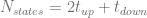
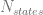

<!--yml

类别：未分类

日期：2024-05-17 23:40:36

-->

# 虚拟电厂在 GPU 上的定价 - HPC-QuantLib

> 来源：[`hpcquantlib.wordpress.com/2011/10/03/pricing-of-a-virtual-power-plant-on-a-gpu-with-cuda-4-0/#0001-01-01`](https://hpcquantlib.wordpress.com/2011/10/03/pricing-of-a-virtual-power-plant-on-a-gpu-with-cuda-4-0/#0001-01-01)

即使是简单的虚拟电厂（VPP）的定价也是具有挑战性的。主要原因是 VPP 可能的状态数量和大范围的行权日期，通常因为 VPP 被定价为带有每小时行权权的百慕大风格期权。基于有限差分方法（例如[1]）或基于最小二乘蒙特卡洛的准确定价引擎的实现工作量相当大。如[1]所示，结合蒙特卡洛和*完美洞察*优化可以得到非常好的近似。算法包括一个蒙特卡洛路径生成器和一个动态规划优化部分，它为每条路径分别计算最优负载计划。涉及的随机过程在[1]中有概述。

CUDA based GPU 实现可在此处获得。它依赖于最新的[QuantLib](http://www.quantlib.org/)版本，该版本来自[SVN 主干](http://sourceforge.net/p/quantlib/code/HEAD/tree/)或即将发布的 QuantLib 1.2 版本，以及 CUDA 4.0。相应的 C++实现是测试用例 VPPTest::testVPPPricing 的速度优化版本。此版本还支持多线程。以下硬件用于比较两种实现：

+   CPU：Core i5@3.0 GHz，四核

+   GPU：GTX560@810/1620MHz，336 核心

正如下面图表所示，对于单精度计算，GPU 的性能比 CPU 高出大约 100 倍，如果 GPU 使用双精度计算，则性能高出大约 50 倍。

CUDA 实现包括以下文件：

**gpuvpppricingengine.hpp / gpuvpppricingengine.cpp**

一个基于蒙特卡洛模拟的简单 VPP 定价引擎，并通过动态规划实现*完美洞察*优化。蒙特卡洛模拟的物理大小由构造函数以下参数控制

1.  大小 nSimulations：进行的蒙特卡洛模拟的数量。

1.  bool antithetic：启用/禁用反向采样

1.  块大小（blockSize）：CUDA 块中的线程数。

1.  网格大小（gridSize）：在模拟内核中组合在一起的 CUDA 块的数量。

**gpuvpppricingengine_kernel.hpp

gpuvpppricingengine_kernel.cu/ gpuvpppricingengine_kernel.def** CUDA 实现包括两个内核。第一个内核是蒙特卡洛路径生成器，它计算以每小时粒度为基础的路径，并将它们存储在图形卡的全球内存中。使用的技术在[2]，[3]和[4]中概述。第二个内核执行基于动态规划的负载调度优化。这一步骤的内存布局取决于 VPP 可能状态的数量，因为每个可能的状态都存储在 GPU 的共享内存中。状态的数量由  给出。CUDA 不支持有效的动态共享内存分配。因此，所有共享内存数组的大小必须在编译时给出。为了充分利用有限的共享内存容量，使用 X-宏生成不同  值的多个内核，并在运行时选择合适的内核。

**cudatype.hpp**

定义基本 CUDA 类型，特别是“real”类型的 typedef，可用于编译单精度或双精度代码。

**gpurand.hpp**

C++接口，用于 GPU 随机数生成器

**gpucurand.hpp / gpucurand.cpp / gpucurand_kernel.hpp / gpucurand_kernel.cu** 基于 CURAND 库的 GPURand 接口实现，后者是 CUDA 4.0 的一部分。

**[1] 本博客，[VPP 定价 III：基于有限差分法精确定价](https://hpcquantlib.wordpress.com/2011/08/07/vpp-pricing-iii-exact-pricing-based-on-finite-difference-methods/)。**

**[2] L. Howes, D. Thomas, [使用 CUDA 进行高效随机数生成及其应用](http://http.developer.nvidia.com/GPUGems3/gpugems3_ch37.html)。

[3] A. Bernemann, R. Schreyer, K. Spanderen, [使用 GPU 加速异国情调期权定价和模型校准](http://papers.ssrn.com/sol3/papers.cfm?abstract_id=1753596)

[4] M. Joshi, [图形亚洲期权](http://papers.ssrn.com/sol3/papers.cfm?abstract_id=1473563)**
