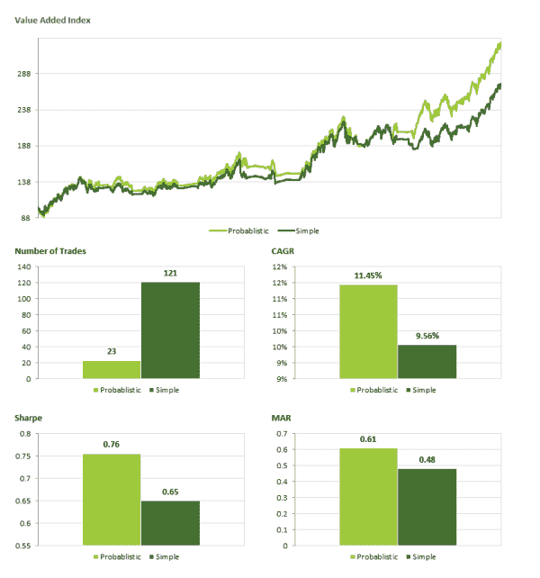

<!--yml

分类：未分类

日期：2024-05-12 17:55:01

-->

# Probabilistic Absolute Momentum (PAM) | CSSA

> 来源：[`cssanalytics.wordpress.com/2014/03/03/probabilistic-absolute-momentum-pam/#0001-01-01`](https://cssanalytics.wordpress.com/2014/03/03/probabilistic-absolute-momentum-pam/#0001-01-01)

在上一篇关于[概率动量](https://cssanalytics.wordpress.com/2014/01/28/are-simple-momentum-strategies-too-dumb-introducing-probabilistic-momentum/ "Are Simple Momentum Strategies Too Dumb? Introducing Probabilistic Momentum")的帖子中，我们介绍了一种简单的方法，将标准的动量策略转化为概率分布，以创建交易的置信度阈值。用于复制这个方法的电子表格可以在[这里](https://cssanalytics.wordpress.com/2014/02/12/spreadsheet-correction-probabilistic-momentum/ "Spreadsheet Correction- Probabilistic Momentum")找到。这个框架在两个资产之间的二元比较上智力上更优越，因为选择一个而非另一个的跟踪误差在动量机会上不是对称的。选择一个资产而非另一个的机会成本嵌入在这个框架中，使用大于 50%的置信度阈值将有助于在不同配对之间标准化动量决策的风险（例如，使用股票和债券的动量比使用标普 500 和纳斯达克的风险更大）。

同样的概念可以用于创建一个绝对动量方法论——这个概念是由 Gary Antonacci 在[Optimal Momentum](http://optimalmomentum.blogspot.com/)的一篇论文中提出的，论文链接[在此](http://papers.ssrn.com/sol3/papers.cfm?abstract_id=2042750)。对于那些不熟悉的人来说，基本想法是你可以使用目标资产（比如说股票）与某些低风险资产（如国债或短期国债）之间的相对动量来产生在目标和现金之间的切换决策。这可以代替对基础资产应用简单移动平均策略。在这个案例中，我们可以应用概率动量方法，使用短期国债 ETF（如 SHY）和一些目标资产来创建一个概率绝对动量策略（PAM）。在这个例子中，我用纳斯达克（QQQ）和 1-3 年国债（SHY）创建了一个例子，并使用了两者都有历史数据的时间最长的一段（大约 2800 个柱子）。我选择了 60%作为在 QQQ 和 SHY 之间切换的置信度阈值。选择的动量回溯窗口是 120 天。在这个案例中，我们没有假设任何交易成本——但这会让 PAM 更有优势。以下是使用概率方法（PAM）与简单绝对动量方法的历史转换图表：

以下是应用这个策略的性能分解：

（[概率绝对动量](https://cssanalytics.files.wordpress.com/2014/03/pam2.png)）

在这里我们看到，概率绝对动量将交易次数从 121 减少到 23，减少了超过 80%。原始绩效提高了近 2%，夏普比率提高了大约 15%。更重要的是，从心理角度来看，作为任意类型的交易者或量化组合经理，使用 PAM 要容易得多，也更容易坚持。它消除了许多由于试图在持仓和持现之间切换而产生的昂贵震荡。此外，由于现金决策的干扰减少，它还使得更容易在标准动量策略上叠加绝对动量策略。
