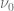
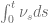
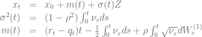

<!--yml

category: 未分类

date: 2024-05-17 23:31:46

-->

# [Heston 模型的概率分布，第一部分 – HPC-QuantLib](https://hpcquantlib.wordpress.com/2014/02/04/probability-distribution-of-the-heston-model-part-i/#0001-01-01)

> 来源：[`hpcquantlib.wordpress.com/2014/02/04/probability-distribution-of-the-heston-model-part-i/#0001-01-01`](https://hpcquantlib.wordpress.com/2014/02/04/probability-distribution-of-the-heston-model-part-i/#0001-01-01)

Heston 模型由对数现货的以下随机微分方程定义 

在很大程度上，Heston 模型的受欢迎程度是基于该模型的特征函数存在半闭合的欧式期权的公式。概率密度函数  的时间演化由相应的 Fokker-Planck 方程 [1] 给出

带有初始条件

减少的概率密度函数

可以使用半闭合积分公式计算此初值问题的概率密度函数的时间演化 [2]

![\begin{array}{rcl} \Gamma &=& \kappa+i\rho\sigma p_x \\ \Omega &=& \sqrt{\Gamma² + \sigma²\left(p_x²-ip_x \right )} \\ p(x_t, t \mid \nu_0) &=& \int_{-\infty}^\infty \frac{dp_x}{2\pi}\exp\left( ip_x (x_t-x_0 -(r-q)t) -\nu_0 \frac{p_x²-ip_x}{\Gamma + \Omega \coth\left(\Omega t/2 \right )} \right) \\ && \ \ \ \ \ \ \ \ \times \exp\left(-\frac{2\theta\kappa}{\sigma²}\ln\left(\cosh\frac{\Omega t}{2} + \frac{\Gamma}{\Omega} \sinh \frac{\Omega t}{2}\right )+\frac{\kappa\Gamma\theta t}{\sigma²} \right) \\ &=& \int_{-\infty}^\infty \frac{dp_x}{2\pi} \tilde{p}(p_x,t \mid \nu_0) \end{array} ](img/a0e49ce51c2300075a03113c80341f10.png)

这给了我们机会编写任意欧式支付的定价引擎。在到期时刻  的欧式期权的价值由下式给出

计算需要两个嵌套积分，可以使用高斯-洛巴托算法高效完成。方程的解

确定了对  的积分的上限。选择积分  的边界 ![\left[ -x_{min}, x_{max}\right]](img/af88cd3b4874253b43d38bd4a82f60d4.png)，使得该区间覆盖期望方差的十倍。

![-x_{min} = x_{max}=10\sqrt{\int_0^{t}E\left[ \nu_t \right ] dt} = 10\sqrt{\theta t + \frac{1}{\kappa}\left(\nu_0-\theta\right)\left(1-e^{-\kappa t}\right)} ](img/15e9152f288eefbbe042d319860f3014.png)

显然，嵌套积分使得这个算法比标准的欧式期权定价方法更复杂，但它并不局限于香草期权的支付方式。可以在[这里](https://github.com/lballabio/quantlib/blob/master/QuantLib/ql/experimental/exoticoptions/analyticpdfhestonengine.cpp)找到该算法的实现，位于 Github 上的[QuantLib 主干](https://github.com/lballabio/quantlib)内。

Broadie 和 Kaya [1] 概述了一种从完整概率密度函数  而不是简化密度函数  中抽样的算法。该算法的起点是 Heston 随机微分方程的确切解。

方差过程  的概率密度函数由非中心卡方分布给出。

在给定  和  的条件下，积分  的分布  可以通过特征函数计算。

![\\begin{array}{rcl} \\text{Pr}(\\Psi(t) \\le x)&=& \\frac{2}{\\pi}\\int_0^\\infty \\frac{\\sin ux}{u}\\text{Re}(\\Phi(u)) du \\\\ \\\\ \\Phi(a)&=& \\frac{\\gamma(a)e^{-\\frac{1}{2}(\\gamma(a)-\\kappa)t} \\left(1-e^{-\\kappa t}\\right)} {\\kappa\\left(1-e^{\\gamma(a)t}\\right)} \\exp\\left( \\frac{\\nu_t+\\nu_0}{\\sigma²} \\left[ \\frac{\\kappa\\left(1+e^{-\\kappa t}\\right)}{1-e^{-\\kappa t}} - \\frac{\\gamma(a)\\left(1+e^{-\\gamma(a)t}\\right)}{1-e^{-\\gamma(a)t}} \\right] \\right) \\\\ && \\times \\frac{I_{0.5d-1} \\left( \\sqrt{\\nu_0\\nu_t} \\frac{4\\gamma (a) e^{-0.5\\gamma(a)t}}{\\sigma²\\left(1-e^{-\\gamma(a)t}\\right)}\\right)}{ I_{0.5d-1} \\left( \\sqrt{\\nu_0\\nu_t} \\frac{4\\kappa e^{-0.5\\kappa t}}{\\sigma²\\left(1-e^{-\\kappa t}\\right)}\\right)} \\\\ && \\times \\frac{\\exp\\left((0.5d-1) \\left[-\\frac{1}{2}\\gamma(a)t + \\ln \\frac{\\gamma(a)}{1-e^{-\\gamma(a)t}} \\right]\\right)}{\\left(\\frac{\\gamma(a) e^{-0.5\\gamma(a)t} }{ 1-e^{-\\gamma(a)t}}\\right)^{0.5d-1}} \\\\ \\\\ \\gamma(a)&=&\\sqrt{\\kappa²-2 i \\sigma² a} \\end{array} ](img/e6f33792cf83abd053d4dab3d5e29c73.png)

第一类修正贝塞尔函数 可以使用小和中等 的级数展开或大 的渐近近似来评估[5]。不幸的是，Boost 只提供第一类修正贝塞尔函数的实数版本，而旧的复值 Fortran77 例程的版权状态不明确。因此，QuantLib 自带了自己的[实现](https://github.com/lballabio/quantlib/blob/master/QuantLib/ql/math/modifiedbessel.cpp)。

请注意， 已经是特征函数的连续版本，因此在计算复值贝塞尔函数[4]时，积分无需跟踪 的分支。

对特征函数的积分最好使用高斯-拉盖尔、高斯-洛巴托或梯形法则进行。后两种算法需要在某个上限处截断积分。第一次截断限制的初步猜测可以从[康尼什-费舍尔展开](http://en.wikipedia.org/wiki/Cornish%E2%80%93Fisher_expansion)中取得，适用于一些非常小的。通过矩生成函数，可以通过有限差分商得到分布的第一、第二和第三阶矩。

接下来的项现在相对容易计算了。

对数现货过程现在可以使用标准正态随机变量进行采样和

这个采样算法即使对于非常大的时间步长也是精确的，因此对于准随机 Monte-Carlo 方法有一些优势，但特征函数的积分的反演也非常慢。该算法实现在[HestonProcess](https://github.com/lballabio/quantlib/blob/master/QuantLib/ql/processes/hestonprocess.cpp)类中。

[1] I. Clark, [外汇期权定价：实践者指南](http://books.google.de/books?id=7vua-0-2sgMC&pg=PT130&lpg=PT130&dq=heston+model+fokker+planck+equation&source=bl&ots=nHutgX1qSu&sig=2FFDK3WVot5LSxBldfE5VoYCZKc&hl=de&sa=X&ei=R_3kUvDpBoWEtAb0xIHYAQ&ved=0CEwQ6AEwAg#v=onepage&q=heston%20model%20fokker%20planck%20equation&f=false), p. 113

[2] A. Dragulescu, V. Yakovenko, [随机波动率 Heston 模型中回报的概率分布](http://arxiv.org/pdf/cond-mat/0203046.pdf)

[3] M. Broadie, Ö. Kaya, [随机波动率和其他 affine 跳跃扩散过程的精确模拟](http://finmath.stanford.edu/seminars/documents/Broadie.pdf)

[4] R. Lord, [用于奇异衍生品的有效定价算法](http://www.google.de/url?sa=t&rct=j&q=&esrc=s&source=web&cd=3&ved=0CDwQFjAC&url=http%3A%2F%2Frepub.eur.nl%2Fpub%2F13917%2FLordR-Thesis.pdf&ei=49nwUsreLYjnswbZ2IHIDQ&usg=AFQjCNFWjTcnOft7cgo_0q-VDDhUaS1YUA&bvm=bv.60444564,d.Yms), p. 40

[5] J.R. Culham, [第一和第二类贝塞尔函数](http://www.mhtlab.uwaterloo.ca/courses/me755/web_chap4.pdf)
