<!--yml

类别：未分类

日期：2024-05-17 23:32:32

-->

# Heston 模型的概率分布，第二部分 - HPC-QuantLib

> 来源：[`hpcquantlib.wordpress.com/2014/02/22/probability-distribution-of-the-heston-model-part-ii/#0001-01-01`](https://hpcquantlib.wordpress.com/2014/02/22/probability-distribution-of-the-heston-model-part-ii/#0001-01-01)

Heston 模型的 Fokker-Planck 正向方程的半解析解的起点是 Broadie 和 Kaya [1] 的精确抽样算法（有关符号，请参见 [2]）

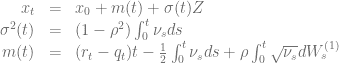

概率分布函数可以描述为

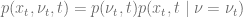

以及 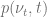 是一个非中心卡方分布。分布 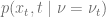 可以使用精确模拟算法计算。在这个算法中，变量 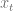 是两个随机变量 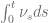 和 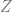 的函数。

 的分布现在可以使用随机变量的一般转换定理来推导：设 *X* 是一个具有概率密度函数 *f* 的随机变量。转换后的随机变量 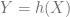 具有概率密度函数

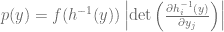

第一步是现在将精确模拟方法重写为两个随机变量的形式

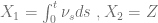。

模拟方案现在变成了

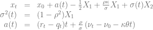

或者用转换后的随机变量表示

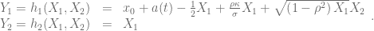

让 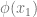 成为 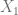 的密度函数

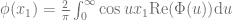

并且 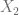 根据定义遵循正态分布。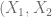 的联合概率密度函数为

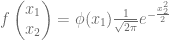

通过

这导致了 Fokker-Planck 方程的半解析解，因为根据定义  是 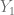 的分布密度函数，它由以下给出

![p(x_t,t \mid \nu = \nu_t) = \int_0^\infty \mathrm{d}y_2 p(y_1, y_2)\mid_{y_1=x_t} = \int_0^\infty \mathrm{d}y_2 \left[f\left(h^{-1}(y)\right)\left|\det \left( \frac{\partial h^{-1}_i(y)}{\partial y_j} \right)\right| \right]_{y_1=x_t}](img/30818ad101b0f674c0b63d908b613d37.png)

对 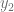 进行积分，例如使用 Simpson 积分法和 Cornish-Fisher 扩展，这给出了积分上限截断的上界。

下面的等高线图显示了 Heston 模型的概率密度函数，用一些示例参数化。

示例代码可在[此处](http://hpc-quantlib.de/src/hestonpdf.zip)获取，并依赖即将推出的 QuantLib 版本 1.4。

[1] M. Broadie, Ö. Kaya，[随机波动性和其他仿射跳跃扩散过程的精确模拟](http://finmath.stanford.edu/seminars/documents/Broadie.pdf)

[2] K. Spanderen，[Heston 模型的概率分布，第 I 部分](https://hpcquantlib.wordpress.com/2014/02/04/probability-distribution-of-the-heston-model-part-i/)

[3] R.U. Seydel，[计算金融工具，第 86 页](http://www.springer.com/mathematics/quantitative+finance/book/978-1-4471-2992-9)
