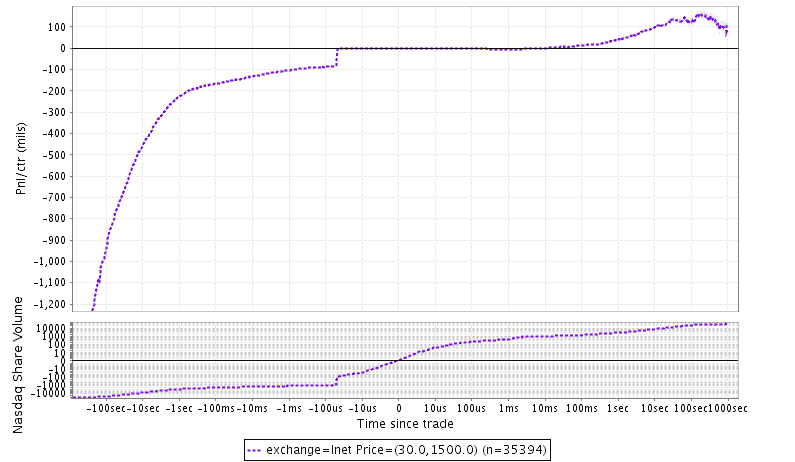

<!--yml

类别：未分类

日期：2024-05-18 06:44:13

-->

# 保护客户利益：美国股票市场的匿名性 | 机械市场

> 来源：[`mechanicalmarkets.wordpress.com/2015/02/16/protecting-client-interests-anonymity-in-us-equities/#0001-01-01`](https://mechanicalmarkets.wordpress.com/2015/02/16/protecting-client-interests-anonymity-in-us-equities/#0001-01-01)

匿名性是许多市场参与者的首要关注点，整个订单处理链都有责任保护交易者的身份。尽管如此，美国股票市场的匿名交易仍有许多例外。何时证券经纪商和交易所透露可能识别客户的信息是合理的？在这篇文章中，我将讨论几种交易并非完全匿名的情况，简要概述了一种依赖这些情况的超高速交易策略，并提出了一些相关伦理问题。

许多交易所允许证券经纪商可选地将他们的订单标识给整个市场（例如[纳斯达克](http://www.nasdaqtrader.com/content/ProductsServices/Trading/OrderTypesG.pdf)）。在之前的文章中，我们研究了订单特征以识别理想的交易伙伴。本着同样的精神，我们要探索的第一个问题是纳斯达克通过对手方 MPID（市场参与者 ID）可识别的交易表现。

以下是按 MPID 与市场价格相对关系分组的交易表现图表。交易量最多的 MPID 是 UBSS（瑞银证券）。

顶部面板：平均每股利润或损失与交易时间距离。例如，交易后 60 秒，平均 UBSS 订单相较于市场亏损了 1.05 美分，而平均匿名订单亏损了 0.37 美分。此处市场价格是通过排除费用和回扣后，纳斯达克最近 100 股交易的平均价格估算的。图表为 8 月份 3 周的数据。底部面板：纳斯达克交易的股票与交易时间（包括基准交易）。

标记为 UBSS 的订单与标记为匿名的订单相比，长期表现要差得多。这种倾向在具有不同流动性概况的股票（例如价格、买卖差价、成交量）中都是成立的。我们在先前的帖子中讨论了为什么看似有效的市场没有消除这种差异。一种直观的反应可能是：“哇，如果他们在交易时损失这么多钱，UBS 处理客户订单的能力真是差。”我不知道这些订单通常代表谁发送的，但合理猜测它们可能是零售类型的客户。在你说“典型的银行，剥削最不成熟的客户”之前，我认为 UBS 可能正是从客户的角度出发，做对了所有的事情。如果这些订单来自不太成熟的人，它们可能是限价订单，价格是客户而不是经纪人选择的；在这种情况下，客户想要的只是最大化以提交的价格成交的概率，而不管之后的几分钟内会发生什么。通过带有 MPID 字段的纳斯达克提交它们，UBS 实际上在这些订单上贴上了一个巨大的“打我”标签，这应该能提高它们的成交率，即使其他市场参与者因此获利。尽管这可能看起来反直觉，但更令人担忧的是，这些订单实际上表现得出奇地好，相对于市场来说。那将暗示他们的经纪人通过带有他们 MPID 的标签向市场泄露信息，这显然不是为了客户的利益。

啊，你可能会问，但这仅当订单成交时才指的是订单的 alpha，如果它实际的成交率很低，并且一提交到纳斯达克市场价格就远离它呢？为了确保这不是正在发生的事情，这里有一个市场价格图表，在提交所述订单的时间附近，当它们以比 NBBO 高或低 10 美分的价格提交时。[1]

图片：

顶部面板：每股平均利润或损失（相对于订单价格）与从订单提交时间开始的距离。例如，在 UBSS MPID 的订单提交后 0 秒钟，其价格平均比市场价格低 3.15 美分。请注意，这些订单有大约 37%的提供量被成交，这相当高。底部面板：纳斯达克交易的股票数量与从订单添加时间开始的时间。请注意，直到 UBSS 订单添加 100 股平均交易超过 100 毫秒后，才出现对订单提交的即时反应，这暗示着订单提交后并没有立即的价格变动。

-   瑞银最近并没有为自己赢得一颗璀璨的声誉([Libor](http://www.reuters.com/article/2012/12/19/us-ubs-libor-idUSBRE8BI00020121219), [股票](http://www.bloomberg.com/news/articles/2015-01-15/sec-fines-ubs-dark-pool-more-than-14-million-for-breaking-rules), [外汇](http://dealbook.nytimes.com/2014/11/12/british-and-u-s-regulators-fine-big-banks-3-16-billion-in-foreign-exchange-scandal/), [税收](http://www.bloomberg.com/news/articles/2015-02-04/ubs-said-to-be-under-new-tax-evasion-investigation-in-u-s-)),但在这一点上，我愿意给他们一些信任。

-   与纳斯达克不同，DirectEdge 确实为公司向市场展示他们的 MPID 提供了金融激励（参见“边缘属性激励计划”[此处](http://www.bats.com/us/equities/membership/fee_schedule/edgx/)）。不幸的是，DirectEdge 为其标记订单数据订阅收取额外费用，所以我没有可用的数据来重复对 EdgeX 的分析。但我非常好奇，看看与任何特定 MPID 相关的订单是否具有异常属性，特别是如果它们的表现优于市场。如果是这样，这表明（当然这是一种猜测）可能存在一种可能性，即经纪人愿意泄露对市场有影响的客户数据，以换取 DirectEdge 提供的收入。再次强调，我不是说这在 Edge 上正在发生，但这种激励计划充满危险，我不禁想知道为什么它甚至被提供。 [2]

# -   交易策略

-   我不会向您详细介绍太多细节，因为我们已经看到了利用类似低 alpha 订单的策略。这里的基本想法是，当我们看到一个 UBSS 订单成交时，我们会发送订单尝试与剩余的任何数量交易。下面的模拟仅仅是那样，向股价超过 30 美元/股的股票发送 1000 股订单以清理可用的数量。请注意，如果我们发送 100 股或 1000 股订单，利润率几乎是一样的，这确实表明这些（通常是大型）UBSS 订单来自零售客户。

（图片链接，不翻译）

-   顶部面板：7 月份 9 天内执行的模拟交易的性能。（注意：这个策略对延迟非常敏感，并且没有在生产环境中运行；如果纳斯达克在执行 UBSS 时倾向于放慢速度，那么模拟可能会有点乐观。）底部面板：纳斯达克的成交量（不包括模拟交易）

这个策略在每天 4000 笔交易中，每笔平均交易量为 250 股后，扣除费用大约能赚 1000 万美元，每天净赚 10,000 美元（假设退出成本最低）。通过向 EdgeX 发送相同订单，还能再赚 5,000 美元/天。还有潜力赚得更多；通过提交更具侵略性的价格，可以将成交量提高到更高的水平。这个策略对延迟比较敏感，在 UBSS 订单执行后 50 微秒，成交量明显增加，这表明有人已经注意到 MPID 特性。

之前帖子关注的是可能透露发送者身份的订单属性。显示较少 HFT 特征的订单成为理想的对手方。现在我们发现，知道经纪人的身份也能让我们了解到关于客户的大量信息。想象一下，如果我们知道遇到的每个订单的经纪人会怎样！

# 道德问题

这些例子并不是市场上匿名性的唯一例外。当然，一些暗池公开宣传它们过滤掉有毒的对手方，或者允许用户选择与池中的哪个子群体互动（我们看到了巴克莱因这类声明而陷入麻烦）。据我所知，内部人士可以看到一些 incoming orders 的识别特征。这种识别背后的普遍想法是，它可能导致客户在执行时获得更好的价格。通过 Charles Schwab 发送的市场订单可能对 Getco 来说就像噪音交易者，可能会在中间点附近执行；随后通过 Goldman 发送的另一笔订单可能会吓到他们，根本不会执行。

这听起来像是良好的客户服务，但有一些问题值得考虑。与其将他们的市场制造收入通过改善 NBBO 传给 Schwab 客户，那么部分收入能否转给 Schwab 本身通过订单流量支付？在这种情况下，Schwab 可能会有激励与 Getco 分享不一定总是符合客户利益的信息。Schwab 是否会透露任何可能让内部人士认为订单不是来自你祖父母的退休金账户，而是高管在行使股票期权的信息？从我们的例子中记住，即使像时间戳或数量这样平凡的信息也能让我们知道可能是谁下了订单，所以 Schwab 甚至可能无意中传输敏感数据。我没有理由相信 Schwab 会这样做，但这是会让投资者感到不安的想法。 [3]

这种假设让我们来到了前冲交易定义的问题。向外界出售客户信息算不算前冲交易？如果出售信息能帮助客户，那么答案似乎应该是否定的。但如果不是呢？让我们假设性地看看以下情况会发生什么：

1.  经纪人拥有在首次下单后倾向于继续在同一方向交易的客户。

1.  经纪人将交易员 A 的订单转发给 DirectEdge。

1.  经纪人告诉 DirectEdge 向市场透露其 MPID。DirectEdge 支付给经纪人。

1.  交易员 B 向 DirectEdge 支付 MPID 数据的费用。

1.  交易员 B 看到新增的订单后，预计价格会从中偏离，于是发送其他订单，从而降低交易员 A 当前或未来订单的成交质量。

这听起来与经纪人在接到客户指令后给朋友打电话没有太大区别，朋友利用这些信息赚钱，然后给经纪人一个手提箱装满现金。我不是律师，但如果发生类似的事情，它将对任何了解后果的参与方产生非常负面的影响。我再强调一次，这种情况是假设性的；据我所知，DirectEdge 甚至可能没有订阅他们归属数据源的订阅者。

关于市场匿名性降低的更广泛后果的最后一点是：即使客户的利益被精心照顾，交易员的去匿名化也可能导致一个两层市场，且市场碎片化严重。由于噪音交易者在身份部分透露后可以获得更好的价格，因此保持完全匿名的订单往往来自大型机构交易者。你可以说这正是当今市场所发生的事情；零售流量通过内部交易者，而机构则在其他地方相互竞争，HFT 连接了这两者。

**1.** 这里的“NBBO”意味着实际 NBBO 的一个近似值，基本上是基于交易所子集的一个估计。请注意，带有 UBSS MPID 的订单如果在比 NBBO 更激进的价格提交，它们确实表现出显著的毒性。也许这是来自 MPID 的信息泄露的迹象，但考虑到这些订单的巨大规模（通常是改善 NBBO 的典型纳斯达克订单规模的 10 倍）以及它们的非常高成交率接近 80%，我不认为这种想法特别有说服力。公布的图表在其平均值中包括了这些订单。

**2.** 我可以想到一个合理的理由来解释这种归属激励计划背后的动机，这并不暗示任何不希望的行为。DirectEdge 可能只是在激励那些已经决定透露其 MPID 的券商，让他们将订单发送到 EdgeX，而不是其他交易所。如果有这些订单中的客户订单，券商可能已经确定透露 MPID 有助于客户获得更好的执行。

**公司名称**在这里只是占位符。我不知道 Schwab 是否与 Getco 或其他内部交易者做生意，或者是否接受订单流支付。
