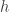

<!--yml

类别：未分类

日期：2024-05-18 13:42:54

-->

# 代理/交叉套期保值 | Quantivity

> 来源：[`quantivity.wordpress.com/2011/10/02/proxy-cross-hedging/#0001-01-01`](https://quantivity.wordpress.com/2011/10/02/proxy-cross-hedging/#0001-01-01)

当前两个权益风险和α项目的根本挑战在于使用非基础工具进行套期保值，即所谓的*代理套期保值*或*交叉套期保值*。这种技术对于*权益塑形*交易非常有用，也是长/短和 statarb 的基本原理之一：

+   **价格敞口**：中和股票或篮子的价格敞口，可能留下有用的剩余（例如股息或权利）

+   **市场敞口**：中和股票或篮子的市场敞口，仅留下特异性敞口

在实践中交易这些套期保值比标准文本所建议的更困难（*例如* [Hull](http://books.google.com/books?id=sEmQZoHoJCcC)），因为现实世界很少符合理论：市场不完整（具有挑战性的风险中性模型），随机协变（具有挑战性的静态模型）和非线性脉冲响应（具有挑战性的线性模型）。

通过多部分系列（参见[经验分位数和代理选择](https://quantivity.wordpress.com/2011/10/03/empirical-quantiles-proxy-cross-hedging-selection)，[经验 Copulas 和套期基础风险](https://quantivity.wordpress.com/2011/10/10/empirical-copulas-and-proxy-cross-hedge-basis-risk)，[具有自相关 Copulas 的滞后动态](https://quantivity.wordpress.com/2011/10/16/lag-dynamics-with-autocopulas)，[探索性套期分析](https://quantivity.wordpress.com/2011/10/22/exploratory-proxy-cross-hedge-analysis)，[代理套期和相关性](https://quantivity.wordpress.com/2011/10/26/proxy-cross-hedge-correlation-dependence/)以及[代理条件模型选择](https://quantivity.wordpress.com/2011/10/30/proxy-cross-hedge-conditional-model-selection)），包括 R 代码和真实数据来探讨这一挑战。本文首先介绍了基本模型。第二篇文章将将此模型应用于一些众所周知的权益。鼓励读者在所有文章中就改进或替代技术发表评论，因为这个问题是真实的，并且仍然是一个开放的研究课题。

**代理套期保值模型**

从教科书数学模型开始。这个*代理套期保值模型*由两个工具和组成，分别是长期基础和短期套期，它们的加权和产生一个残差：


避险比率确定单位下避险的比例量。虽然没有明确建模，但两者和意味着的价格暴露被中和。当是一个市场指数时，非零相当于中和市场暴露，留下特定的特有的暴露（某种[异质贝塔](https://quantivity.wordpress.com/2011/09/29/you-dont-have-alpha)）。在这两种情况下，的行为在测度上是渐进的。传统上，期货是的首选工具。最近，由于其多样性（包括[杠杆](https://quantivity.wordpress.com/2009/08/11/lever-options-gamma-decay)），ETF 变得越来越有趣。

尽管数学很简单，但它隐藏了两个严重的研究挑战：

+   **仪器选择**：选择用于的仪器。

+   **比率计算**：选择算法来计算。

两者都在下面进行了探讨。

**仪器选择**

决定仪器探索的宇宙更多是艺术而非科学，因为避险被定义为不是的衍生品。因此，标准机制不可用。因此，对和边际和联合行为的重要探索是值得的。

一个传统的答案是寻找最大化皮尔逊相关系数的仪器。这最终被证明相当天真：尽管表达了线性关系，但这并不意味着–关系应该被限制在线性性（因为皮尔逊表达的只是线性感应）。一个更好的答案是遵循经济直觉，找出有强烈的基本理由 why they covary 的仪器。

**比率计算**

计算的技术在过去几十年里受到了大量研究。最近的两篇总结文章是[de Prado 和 Leinweber（2011）](http://papers.ssrn.com/sol3/papers.cfm?abstract_id=1906489)和[Alexander 和 Barbosa（2007）](http://www.carolalexander.org/publish/download/JournalArticles/PDFs/JPM_33_2_46-59.pdf)。

在这里分析中，选择了 de Prado（2011）的 Box-Tiao 典型分解（BTCD）方法。简而言之，这种方法最大化了一个可预测性度量，该度量是从[Box 和 Tiao（1977）](http://biomet.oxfordjournals.org/content/64/2/355.abstract) generalized on the combined portfolio of  and :


基于广义[拉伊 leigh 商数](http://en.wikipedia.org/wiki/Rayleigh_quotient)形式，在下的解是：


这种方法特别有用，因为它允许使用一个*任意的预测模型*，而不是限制解释变量为单个时期滞后的预测变量（如标准技术中所常见）。

以下是用 R 语言实现比特币对冲（BTCD）的标准向量自回归（VAR）预测模型（采用 Ledoit 和 Wolf（2004）协方差压缩）的代码，该模型是对 de Prado（第 8 页）所提供公式的稍作简化：[Ledoit 和 Wolf（2004）](http://www.ledoit.net/ole1a.pdf)的协方差压缩。

```

require("vars")
require("tawny")

btcdHedge <- function(p, start=1, interval=4)
{
  # Generate hedge using BTCD method, as defined by de Prado [2011].
  #
  # Args:
  #   p: matrix of instrument price data
  #   start: index into p, which to begin generating hedge
  #   interval: number of periods used to calibrate hedge
  #
  # Returns: BTCD hedge ratio vector

  end <- start+interval
  pvar <- VAR(p[start:end,], p=1, type="none")

  varfit <- fitted(pvar)
  B <- cov.shrink(p)        # shrink covariance
  A <- t(varfit) %*% varfit

  C <- chol(B)
  CInv <- solve(C)
  D <- t(CInv) %*% A %*% CInv
  eigens <- eigen(D)
  z <- eigens$vectors[,length(eigens$values)]
  x <- CInv %*% z
  hedge <- x/x[1]

  # perform sanity check
  tx <- t(x)
  num <- tx %*% A %*% x
  denom <- tx %*% B %*% x
  check <- num / denom
  if ((check - eigens$values[length(eigens$values)]) > 0.0001)
  {
    message("failed sanity check")
  }

  return (hedge)
}

```

此算法需要通过`interval`参数输入先前连续时间窗口的持续时间。像任何基于窗口的算法一样，间隔代表了权衡：较短的间隔更精确，但噪声更大；较长的间隔更平滑，但响应性较差。因此，间隔长度的选择更多的是艺术而非科学。
