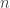

<!--yml

类别：未分类

日期：2024-05-18 13:45:50

-->

# 代理条件模型选择 | Quantivity

> 来源：[`quantivity.wordpress.com/2011/10/30/proxy-cross-hedge-conditional-model-selection/#0001-01-01`](https://quantivity.wordpress.com/2011/10/30/proxy-cross-hedge-conditional-model-selection/#0001-01-01)

使用自动相关 copulas 进行滞后动态研究，应用于[代理/交叉对冲](https://quantivity.wordpress.com/2011/10/02/proxy-cross-hedging/)，得出存在*大幅度的时间波动聚类*的结论。这确实是金融收益率的一个已知的风格化事实（参见[Tsay 2010](http://books.google.com/books?id=OKUGARAXKMwC)，第二章和第三章）。

捕捉这种*统计条件性*的经典*离散时间*模型有[ARMA](http://en.wikipedia.org/wiki/Autoregressive%E2%80%93moving-average_model)（参见[Box *et. al* (1994)](http://books.google.com/books?id=lJnnPQAACAAJ)）和[GARCH](http://en.wikipedia.org/wiki/Autoregressive_conditional_heteroskedasticity#GARCH)（参见[Engle (1982)](http://www.jstor.org/pss/1912773)和[Bollerslev (1986)](http://www.sciencedirect.com/science/article/pii/0304407686900631)），分别用于收益率和波动性。然而，这里有一个面对对冲分析的实际问题：*需要选择一个具有最优参数和误差分布的模型来对冲*.本文描述并实现了从标准参数和非正态误差分布的宇宙中选择模型的[模型选择](http://en.wikipedia.org/wiki/Model_selection)。

为了说明代理对冲的这种方法，首先回顾所需的统计机器。然后，用一个知名股票和 QQQ 为例说明结果和图形可视化。最后，用 R 代码结束。

**统计模型**

需要三种统计机器，在这里简要回顾：ARMA，GARCH 和 BIC。

条件收益率可以用 ARMA(*p*, *q*)模型来描述：

![r_t = \left[ \phi_0 + \sum\limits_{i=1}^p \phi_i r_{t-i} \right] + \left[ a_t + \sum\limits_{j=1}^q \theta_j a_{t-j} \right] ](img/9d7a689bfb16831b8da2318ac9cc1f08.png)

是自回归多项式，是移动平均多项式。回忆一下[为什么移动平均](https://quantivity.wordpress.com/2010/01/08/why-moving-averages/)中的内容，任何*平稳*的随机过程都可以表示为，这是由于[沃德分解](http://en.wikipedia.org/wiki/Wold%27s_theorem)。值得回忆的是，任何绝对参数值小于 1 的模型都是弱平稳的。

条件波动性可以用 GARCH(*m*, *s*)模型来描述：


从这种形式来看，GARCH 很好地说明了对平方序列应用 ARMA。为两个以上 ARMA+GARCH 模型的比较拟合提供了统计量：


其中是模型最大似然值，是观测次数，是自由参数个数。因此，最好的模型是 log 似然值（惩罚估计参数个数，即）。

**代理模型**

以下是对 CRM 和 QQQ 在 5 年观测期内的模型选择：

```

crmModel <- selectProxyModel(ROC(p[,1], type="discrete", na.pad=FALSE))
qqqModel <- selectProxyModel(ROC(p[,2], type="discrete", na.pad=FALSE))

```

CRM 被拟合为*GARCH(1,1)带有学生 t 误差*：

```

       Estimate  Std. Error  t value Pr(>|t|)    
omega  1.219e-05   5.781e-06    2.108    0.035 *  
alpha1 3.552e-02   9.004e-03    3.945 8.00e-05 ***
beta1  9.544e-01   1.115e-02   85.600  < 2e-16 ***
shape  4.247e+00   5.227e-01    8.124 4.44e-16 ***

```

因此，自回归系数是阶-1 的，显著的，且等于 0.0355；方差系数是阶-1 的，显著的，且等于 0.9544。系数之和为 0.9899，因此模型具有单位根 IGARCH 或长记忆性（例如[Andersen (1999)](http://papers.ssrn.com/sol3/papers.cfm?abstract_id=1298332)）。残差是自由度为 4.25 的学生 t 分布，与[Empirical Copulas and Hedge Basis Risk](https://quantivity.wordpress.com/2011/10/10/empirical-copulas-and-proxy-cross-hedge-basis-risk)中进行的前分布拟合大体一致。

QQQ 被拟合为*GARCH(1,1)带有偏态 t 误差*：

```

        Estimate  Std. Error  t value Pr(>|t|)    
omega  2.833e-06   1.238e-06    2.288   0.0222 *  
alpha1 1.005e-01   1.840e-02    5.464 4.64e-08 ***
beta1  8.956e-01   1.748e-02   51.228  < 2e-16 ***
skew   8.516e-01   2.971e-02   28.669  < 2e-16 ***
shape  6.620e+00   1.410e+00    4.694 2.68e-06 ***

```

因此，自回归系数是阶-1 的，显著的，且等于 0.1；方差系数是阶-1 的，显著的，且等于 0.8956。残差是自由度为 6.62 的偏态 t 分布，偏度为 0.852（回忆学生 t 分布是偏态 t 分布当偏度为 0 时的极限；参见[McNeil, Frey, and Embrechts [2005]](http://books.google.com/books?id=vgy98mM9zQUC)）。注意自回归系数对于 QQQ 几乎是 CRM 的三倍。系数之和为 0.9956，因此也具有单位根 IGARCH 或长记忆性。

前面的模型可以通过多种方式进行可视化。首先，可视化两种工具的条件波动性：


波动性普遍符合直觉和之前的帖子中的图表，在金融危机期间有显著的峰值。正如之前帖子中所观察到的，CRM 波动性显著大于 QQQ。注意 CRM 在 2009 年和 2010 年有多个显著的波动性尖峰，而 QQQ 没有，这对应于收益公告（8 月底和 11 月中旬）。CRM 和 QQQ 之间条件波动的肯德尔相关系数为 0.529，因此存在适度的波动性依赖关系：

```

cor(crmModel[3][[1]]@h.t, qqqModel[3][[1]]@h.t, method="kendall")

```

GARCH 波动性依赖的 copula 在先前大变化条件下绝对变化的大概率，与[自相关 copula 的滞后动态](https://quantivity.wordpress.com/2011/10/16/lag-dynamics-with-autocopulas)一致：


接下来，由于它们保留了适度的异方差性，GARCH 残差在模型拟合方面存在一些不足：


最后，考虑拟合 GARCH 残差的分布图：


这展示了分布之间的显著差异，彼此之间以及与正态性相比。QQQ 的大正偏斜特别有趣。这个图表是由什么生成的，其中`p`是价格矩阵：

```

pROC <- ROC(p, type="discrete", na.pad=FALSE)
x <- seq(-6, 6, length=100)
cnames <- colnames(pROC)
x1 <- dnorm(x)
x2 <- dt(x,df=4.25)
x3 <- dst(x,df=6.62,shape=0.852)
plot(x, x1, type='l',lty=2, ylim=c(0,max(x1,x2,x3)), ylab="", main="GARCH Residual Distributions")
lines(x, x2, col=colors[2])
lines(x, x3, col=colors[3])
legend("topleft",legend=c("Normal",cnames[1],cnames[2]), fill=colors, cex=0.5)

```

* * *

R 代码用于选择代理对冲模型：

```

library("fGarch")

selectProxyModel <- function(p, useMean=FALSE)
{
  # ARMA+GARCH model selection based on BIC, using the following error
  # distributions: student-t, skew-t, and skew normal. ARMA
  # may be either (1,1) or (2,2); GARCH is only (1,1).
  #
  # Args:
  #   p: single vector of instrument price data
  #   useMean: flag indicating whether mean should be fitted in GARCH
  #
  # Returns: selected GARCH model

  g11Std <- garchFit(~ garch(1,1), data = coredata(p), trace = FALSE, cond.dist="std", include.mean=useMean)
  g11SStd <- garchFit(~ garch(1,1), data = coredata(p), trace = FALSE, cond.dist="sstd", include.mean=useMean)
  g11SNorm <- garchFit(~ garch(1,1), data = coredata(p), trace = FALSE, cond.dist="snorm", include.mean=useMean)

  g11A11Std <- garchFit(~ arma(1,1) + garch(1,1), data = coredata(p), trace = FALSE, cond.dist="std", include.mean=useMean)
  g11A11SStd <- garchFit(~ arma(1,1) + garch(1,1), data = coredata(p), trace = FALSE, cond.dist="sstd", include.mean=useMean)
  g11A11SNorm <- garchFit(~ arma(1,1) + garch(1,1), data = coredata(p), trace = FALSE, cond.dist="snorm", include.mean=useMean)

  g11A22Std <- garchFit(~ arma(2,2) + garch(1,1), data = coredata(p), trace = FALSE, cond.dist="std", include.mean=useMean)
  g11A22SStd <- garchFit(~ arma(2,2) + garch(1,1), data = coredata(p), trace = FALSE, cond.dist="sstd", include.mean=useMean)
  g11A22SNorm <- garchFit(~ arma(2,2) + garch(1,1), data = coredata(p), trace = FALSE, cond.dist="snorm", include.mean=useMean)

  gModel <- list(g11Std, g11SStd, g11SNorm, g11A11Std, g11A11SStd, g11A11SNorm, g11A22Std, g11A22SStd, g11A22SNorm)
  gBIC <- data.frame(g11Std@fit$ics[2], g11SStd@fit$ics[2], g11SNorm@fit$ics[2], g11A11Std@fit$ics[2], g11A11SStd@fit$ics[2], g11A11SNorm@fit$ics[2], g11A22Std@fit$ics[2], g11A22SStd@fit$ics[2], g11A22SNorm@fit$ics[2])
  colnames(gBIC) <- c("g11Std-BIC", "g11SStd-BIC", "g11SNorm-BIC", "g11A11Std-BIC", "g11A11SStd-BIC", "g11A11SNorm-BIC", "g11A22Std-BIC", "g11A22SStd-BIC", "g11A22SNorm-BIC")

  minBIC <- order(gBIC,decreasing=FALSE)[1]

  return (list(gBIC, colnames(gBIC)[minBIC], gModel[[minBIC]]))
}

visualizeGarchModels <- function (p, m1, m2, cnames)
{
  # Visualize two garch models in overlapping plots
  #
  # Args:
  #   p: matrix of instrument price data, including valid colnames
  #   m1: first GARCH model to visualize
  #   m2: second GARCH model to visualize
  #   cnames: list of column names
  #
  # Returns: none

  t <- index(p)[2:nrow(p)]

  plot(xts(m1[3][[1]]@h.t, order.by=t), main="GARCH Conditional Volatility", type='l', ylab="Volatility", ylim=c(min(crmModel[3][[1]]@h.t, qqqModel[3][[1]]@h.t),max(crmModel[3][[1]]@h.t, qqqModel[3][[1]]@h.t)))
  lines(xts(m2[3][[1]]@h.t, order.by=t), col=colors[2])
  legend("topleft",legend=c(cnames[1],cnames[2]), fill=colors, cex=0.5)

  plot(xts(m1[3][[1]]@residuals, order.by=t), main="GARCH Residuals", type='p', ylab="Residuals")
  points(xts(m2[3][[1]]@residuals, order.by=t), col=colors[2])
  legend("topleft",legend=c(cnames[1],cnames[2]), fill=colors, cex=0.5)
}

```
