<!--yml

类别：未分类

日期：2024-05-18 13:47:29

-->

# 代理对冲和相依性 | Quantivity

> 来源：[`quantivity.wordpress.com/2011/10/26/proxy-cross-hedge-correlation-dependence/#0001-01-01`](https://quantivity.wordpress.com/2011/10/26/proxy-cross-hedge-correlation-dependence/#0001-01-01)

当被问及他们对[代理/交叉对冲](https://quantivity.wordpress.com/2011/10/02/proxy-cross-hedging)方法进行总结时，许多大银行的资深人士将其简化为一个相关性：使用一个相关系数接近-1 的乐器进行对冲。这个观点与流行的实践文献相符，例如最近出版的书籍[Hedging Market Exposures](http://books.google.com/books?id=CpSv76NCmJcC)（Bychuk 和 Haughey, 2011）。此外，这个观点也是大量研究文献的核心，追溯到最优对冲比率的原始定义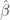（例如[Hull](http://books.google.com/books?id=sEmQZoHoJCcC)，第 57 页）：

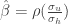

然而，虽然确实如此，但在实践中对于对冲众所周知的中等股并不非常有帮助，如前所述——因为没有其他相关性的乐器存在。这促使我们重新审视对冲中的相依性角色，揭示可能是一个有趣的结果：*多周期渐近完美对冲存在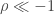*。

为了推导这个结果，首先问一个简单的问题：在基础和避险之间的相关性范围内，一个完美对冲可能被构建在哪里？当评估为*一个周期*时，答案显然是一个值：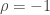，因为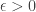对于其他任何相关性，给定：

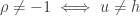。

然而，这个问题在泛化为*多个周期*时变得更加有趣。特别是，考虑多个连续周期内代理误差的时序系列：


能否通过直接建模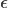的时间演变，而不是描述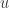和

这个模型很有趣，因为它捕捉到了最优代理对冲的两个理想属性：

+   **零交叉**：误差在其路径上正数次穿过零点（由下面的 `zerocross` 参数确定），提供频繁的零损失对冲退出机会（*即* ）

+   **绝对界限**：误差被限制在上下两个边界内，不超过某个最大阈值。

这两个属性对于交易相对价值策略的读者来说应该是熟悉的。

鉴于上述时间演变的，下一个问题是询问给定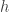 和  的任意路径，可能出现的 范围。正如常言道，一图胜过千言万语。

定义  遵循长度为  的随机过程，其值从高斯分布中绘制（给定 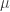 和 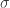 参数）：

```

u <- rnorm(n, mu, sd);

```

换句话说，基础遵循一个随机过程，这似乎是合理的。鉴于此， 被确定为算术差异，给定正弦曲线的离散微分  和期望的零交叉数：

```

e <- (sin(seq(-zerocross*pi, zerocross*pi, len = n)) + 0.01) / 10
de <- diff(e)
h <- de - u

```

以下图表说明了一条样本路径 ，及其相应的 ，跨越多个周期（参数 `n=200; zerocross=1; mu=0; sd=0.05`）：


这些收益看起来相当正常，尽管明显是从一个既没有长尾也没有记忆的分布中抽样得到的。

给定基础和对冲，相关密度可以通过对  进行抽样生成：

```

cor(h, u, method="kendall")

```

以下图表说明了模拟散点图和经验密度，对于给定 1000 次迭代（参数 `n=200; zerocross=1; mu=0; sd=0.05`）：


对于单个零交叉，该模型恢复了经典的一期最优对冲结果：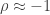。

当零交叉数增加到 1 以上时，这个模型变得有趣起来。这样做会使模型从经典的单周期中脱离出来，概念上延长时间跨越多个周期。以下图表说明了当零交叉为 10 时的收益：


累积回报图的视觉检查清楚地表明有些不同寻常的事情正在发生。显然，底层和套期保值并不像完美反向，当零交叉更多时。更深层次的因素正在起作用。为了进一步说明，考虑相应的抽样相关性图表：


说明相关性从-1 开始分歧，接近-0.73 峰值。记住这是底层和套期保值的相关性，在有限的时间点上提供了*渐进最优性*。这是偶然的，还是代表了一个更普遍原则在起作用？考虑以下带有 50 个零交叉的代理误差回报图：


现在底层和套期保值看起来并不像彼此，除了它们的大方向一致性地相反。再次，考虑相应的相关性图表，它说明抽样相关性减少到接近-0.30 密度的峰值。


这或许展示了一个有趣的成果，即对于代理对冲的完美负相关性传统观念的的反例，尽管只是理论上。

* * *

生成上述抽样和图表的 R 代码：

```

proxyMultiPeriodCorrelation <- function(i=100, zerocross=20, n=200, mu=0, 
                                        sd=0.05, doPlot=FALSE)
{
  # Monte carlo sampling for visualizing multi-period correlation dynamics.
  #
  # Args:
  #     i: number of sampling iterations
  #     zerocross: number of zero crosses for error
  #     n: number of iterations for error sin curve
  #     mu: mean of Gaussian samples for u
  #     sd: standard deviation of Gaussian samples for u
  #     doPlot: flag to indicate whether to plot returns
  #
  # Returns: vector of sampled correlations

  e <- (sin(seq(-zerocross*pi, zerocross*pi, len = n)) + 0.01) / 10
  de <- diff(e)

  cors <- sapply(c(1:i), function(i){ 
    u <- rnorm(length(de),mu,sd); 
    h <- de - u;
    pair <- u + h
    c <- cor(h, u, method="kendall");

    if (doPlot)
    {
      oldpar <- par(mfrow=c(2,1))
      plot(u, type='l', xlab="Time", ylab="Returns", main="Optimal Proxy Returns");
      lines(h, col=colors[2])
      legend("topleft",legend=c("Underlying", "Hedge"), fill=colors, cex=0.5)

      cumH <- cumprod(1+h)-1
      cumU <- cumprod(1+u)-1

      plot(cumU,ylim=c(min(cumH,cumU,e),max(cumH,cumU,e)), type='l', ylab="Cumulative Return", xlab="Time", main="Optimal Proxy Cumulative Returns")
      lines(cumH, col=colors[2])
      lines(e, col=colors[3]);
      legend("topleft",legend=c("Underlying", "Hedge", "Error"), fill=colors, cex=0.5)
      par(oldpar)
    }

    return (c)
  })

  oldpar <- par(mfrow=c(2,1))
  plot(cors, ylab="Correlation", main="Optimal Proxy Hedge Correlation Scatter")
  plot(density(cors), xlab="Correlation", main="Optimal Proxy Hedge Correlation Density")
  par(oldpar)

  return (cors)
}

```
