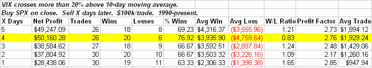

<!--yml

分类：未分类

日期：2024-05-18 13:29:15

-->

# Quantifiable Edges: 20% VIX Stretch Provides Upside Edge

> 来源：[`quantifiableedges.blogspot.com/2009/01/20-vix-stretch-provides-upside-edge.html#0001-01-01`](http://quantifiableedges.blogspot.com/2009/01/20-vix-stretch-provides-upside-edge.html#0001-01-01)

周二大幅上涨的一个指数是 VIX，当天其涨幅接近 23%。它收盘时较其 10 日移动平均线高出超过 20%——自 2008 年 11 月 20 日以来首次出现这种情况。VIX 的这种极端拉伸在过去几天内为标普 500 指数提供了看涨的历史优势。以下是证明这一点的研究案例：

（来源：[`quantifiableedges.blogspot.com/2009/01/20-vix-stretch-provides-upside-edge.html#0001-01-01`](http://quantifiableedges.blogspot.com/2009/01/20-vix-stretch-provides-upside-edge.html#0001-01-01)）

Peak stats here are at 4 days. Beyond the 1st week there is no significant edge. 89% of instances saw the market close higher than the trigger price within the next 4 days. The one recent failure was early October 2008\. Prior to that you’d need to go all the way back to 1998 to find another failure.
