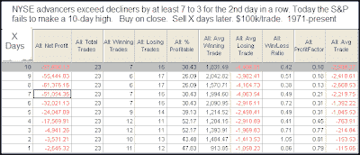
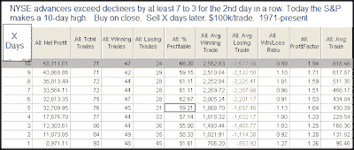

```

分类：未分类

日期：2024-05-18 13:18:36

```

# 量化边缘：一个暗示短期下跌的研究

> 来源：[`quantifiableedges.blogspot.com/2009/06/study-suggesting-short-term-downside.html#0001-01-01`](http://quantifiableedges.blogspot.com/2009/06/study-suggesting-short-term-downside.html#0001-01-01)

下面是一个已经在几次研究中展示过的研究。

订阅者信件：[Subscriber Letter](http://www.quantifiableedges.com/gold.html)

。它昨晚通过

量化搜索器：[the Quantifinder](http://www.quantifiableedges.com/quantifinderinfo.html)

。它研究了在两天强劲的广度未能将标普 500 指数(SPX)推至新的 10 日盘中高点时会发生什么。我已经重新运行了统计数据，并附在下面。

(点击表格放大)

（点击图片放大）

在连续两天强劲上涨之后未能创出 10 日高点，暗示在此之前有一次强烈的下跌。大多数情况下，强烈的下跌会重新占据主导地位，或者至少导致回调。作为比较，下面是在连续两天强劲上涨与 10 日高点一致时的数据：

(点击表格放大)

（点击图片放大）

强烈的负面预期在这种情境下转为积极。我之前展示过，如何

定位很重要](http://quantifiableedges.blogspot.com/2009/02/importance-of-positioning-in-analysis.html)

在解释动作时要注意这一点。这是另一个例子。
