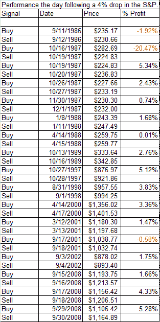

<!--yml

分类：未分类

日期：2024-05-18 13:37:24

-->

# 可量化的边缘：前所未有的波动性的另一个例子

> 来源：[`quantifiableedges.blogspot.com/2008/10/another-example-of-unprecedented.html#0001-01-01`](http://quantifiableedges.blogspot.com/2008/10/another-example-of-unprecedented.html#0001-01-01)

包括周四在内，自 1960 年以来，标普 500 指数收盘下跌 4%或以上的日子共有 18 天。其中四个发生在过去的三周内。此前接近的时期是 1987 年的大崩溃，当时发生在 10 月 16 日、10 月 19 日和 10 月 26 日。在之前的 17 个实例中，市场第二天收盘上涨的有 14 次。所有实例如下：

最近的波动性巨大，这不过是其中的另一个例子。

如此波动带来了机会。当寻找在这种极端时期利用边缘时，交易者需要确保他们对自己的计划感到舒适。否则他们可能会成为恐慌的人群的一部分。在恐慌的状态下交易 simply isn’t conducive to optimal decision making.

最后一个建议。明天可能有救助新闻，市场情况可能迅速变化。交易者可能想将他们计划中的任何止损位提前于新闻。否则执行可能会变得困难甚至不可能。
