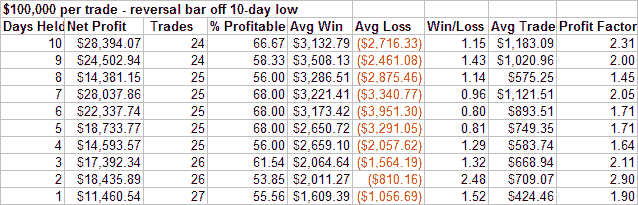

<!--yml

类别：未分类

日期：2024-05-18 08:32:27

-->

# 量化边缘：连续反转与不断增长的 CBI

> 来源：[量化边缘博客](http://quantifiableedges.blogspot.com/2008/03/back-to-back-reversals-and-growing-cbi.html#0001-01-01)

**反转柱状图**

今天市场低开，下跌至 10 日低点后反转，并以开盘价之上收盘。开盘价和收盘价都在当日波动区间的上半部分。我也测试了这种类型柱状图可能的重要性。以下是结果：

今天最惊人的是，这是连续第二天我们出现了同样的形态。我进行了一次测试，看看市场在过去如何对这种连续反转的柱状图作出反应，但一无所获。这是标普 500（SPY）首次出现这种情况，而纳斯达克 100（NDX）从未出现过。

上述反转柱状图本身显示出轻微的看涨倾向。我们将看看市场是否能聚集起比午后谣言引发的上涨更多的力量。

**投降宽度指标（CBI）**

今天的 CBI 达到了“5”。这是我认为的第一个重要水平。自 1995 年以来，当 CBI 收盘在“5”或更高时买入标普 500，并在其回到“3”时卖出，将会有 77%的盈利交易，且毛利润与毛亏损之比超过 5:1。我通常不会在这个水平买入，而是停止建立新的空头头寸。如果市场继续下跌，这个形成的集群很容易在明天或后天上升到“7”或“10”。在这些水平上，我可能会考虑指数多头头寸。
