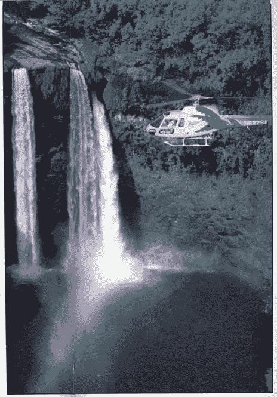

<!--yml

分类：未分类

日期：2024-05-18 08:11:46

-->

# 可量化的边缘：宽度、风险感知和夏威夷直升机

> 来源：[`quantifiableedges.blogspot.com/2008/07/breadth-perceptions-of-risk-and.html#0001-01-01`](http://quantifiableedges.blogspot.com/2008/07/breadth-perceptions-of-risk-and.html#0001-01-01)

6 月 11 日，测量 TC2000 的麦克尔伦振荡器(McClellan Oscillator)跌破-200。

[那天晚上我发布了一个系统](http://quantifiableedges.blogspot.com/2008/06/what-mcclellan-oscillator-is-suggesting.html)

与这个振荡器相关，当 SPX 跌破-200 时买入，当它回升至 0 以上时卖出。该系统自 1986 年以来一直是 17 胜 17 负。退出触发器在 7 月 17 日响起。在这种情况下，系统可能会损失约 5.6%。

联邦调查局（CBI）是我使用的另一种宽度工具。

[它在 7 月 1 日达到了 10](http://quantifiableedges.blogspot.com/2008/07/cbi-hits-10-some-hypothetical-results.html)

，我会多次用作买入信号。回到 1995 年，当 SPX 达到 10 时买入，当它回到 3 或更低时卖出，自 1995 年以来会有 18 个赢家出自 18 个交易。在周五的第 18 天它回到了 3。这将导致约 1.9%的损失。

现在完美记录被打破了，这如何改变未来的风险/收益？

首先是一个故事…

结婚后，我和妻子去夏威夷度蜜月。酒店里有一个礼宾部，提供各种各样的 1 日套餐——浮潜、去其他岛屿旅游等。我们认为很刺激的一项是岛上游直升机游览。她告诉我们，直升机前军事飞行员驾驶，所有都是全新且最先进的。公司已经运营了 15 年，从未发生过坠毁事故。我们打算两天后签约参加某个项目。我们告诉她我们会考虑一下，明天再来签约。

离开后我们一致认为，直升机在那天的选项中听起来最好。我们第二天要去观光，打算下午回来后签约。回到酒店，下楼到礼宾部之前，我们打开了电视。新闻正在播放，头条新闻是

[一场导致 7 人死亡的直升机坠毁](http://starbulletin.com/2000/07/22/news/story1.html)

这是我们计划签约的公司和我们要进行的游览。说真的，这很令人担忧。

看到新闻后的想法是，明天很可能是乘坐直升机游览的最佳时间。每 15 年一次坠毁，今天发生了。他们不可能在同一天连续坠毁两次。我新娘对风险的看法却不同。

我们去浮潜了。

实际上，坠毁事件对乘坐直升机的风险没有任何影响。也许在坠毁后采取了额外的预防措施，但大多数情况下，如果周五坠毁的风险是五分之一千，那么在周六坠毁后，风险仍然是五分之一千。它并没有像我妻子认为的那样变得更加危险，也没有像我认为的那样变得不那么危险。

具有完美记录的系统应被视为与夏威夷直升机类似。McClellan Oscillator 信号或 CBI 信号产生盈利交易的概率从来不是 100%。现在他们遭遇了第一次亏损，应该重新评估风险吗？在我眼里，不应该。在失败之前，风险应该小于 100%，在失败之后也应该大致相同。我会像以前一样对待 breadth indicators 通用和这两个特定指标。如果它们开始提供比预期更频繁的错误信号，那么可能是时候重新评估了。

交易者应尝试利用他们识别出的任何优势。他们不应将任何优势视为保证，也不应过于受限于小样本集的影响。直升机坠毁事件至今已经快 8 年了，我不认为那家公司自那以后有过坠毁事件。如果能看到 breadth indicators 在接下来的 8 年里保持完美的记录那就太好了。即便他们做到了，也不会改变我的方法。
