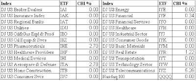
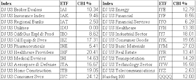

<!--yml

分类：未分类

日期：2024-05-18 13:29:35

-->

# 可量化边缘：CBI 保持平稳

> 来源：[`quantifiableedges.blogspot.com/2009/01/cbi-remains-flatlined.html#0001-01-01`](http://quantifiableedges.blogspot.com/2009/01/cbi-remains-flatlined.html#0001-01-01)

关于我的投降式广度指标（CBI）有一些疑问。（更多信息请参见页面右侧的“CBI”标签。）当市场剧烈下跌时，它通常会开始上升。到目前为止，这次下跌它还没有动静。仍然是零。

我每晚都会在订阅信件中跟踪 24 个部门的 CBI 百分比。截至周四收盘，以下是详细 breakdown：（点击表格放大）

（[点击此处](https://blogger.googleusercontent.com/img/b/R29vZ2xl/AVvXsEi6uzgKVgZS6KIfRsz_PX3HvQ7Vhgb46b1ef2prprJDbqybwYFedkb3mJizScxjYWY9MPSJ6Y1dslve-XfFCXPTo72BqjRZunxRr9ZETfmnvm19f73DVJHGEkEMpZm_Nx4rtuPizVwlKtM/s1600-h/2009-1-16+Jan+CBI.PNG) 查看原图）

所以尽管在过去一周左右的时间里出现了一些剧烈的抛售，但这并不是我的指标所认为的投降型抛售。这并不意味着市场不会反弹。这只是意味着我们没有来自 CBI 的证据表明它将反弹。

为了更全面地理解以上数据，以下是 2009 年 11 月 20 日收盘时的快照：（点击表格放大）

（[点击此处](https://blogger.googleusercontent.com/img/b/R29vZ2xl/AVvXsEhvZ-YPuN8_9iED9FMVlpd3U7pWTelfsraF33PYbEbUPiq0FnfSD0oeh7iLF-ClDgidgQDCCSybHn8xDOI6eyxW6x76H-lTv6VmlsBbt5s2jR3QrtHw8dagQCpkcnRWw0O2jdNqBEfZmMM/s1600-h/2009-1-16+Nov+CBI.PNG) 查看原图）
