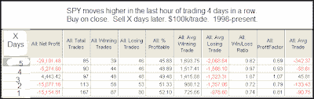

<!--yml

分类：未分类

日期：2024-05-18 13:16:59

-->

# 量化边缘：持续强劲的最后一小时

> 来源：[`quantifiableedges.blogspot.com/2009/07/consistently-strong-last-hour.html#0001-01-01`](http://quantifiableedges.blogspot.com/2009/07/consistently-strong-last-hour.html#0001-01-01)

最近，尾盘拉升的情况很常见。最后一个小时通常被视为“聪明钱”的时间，机构在这个时候放置许多交易。一些指标只追踪最后小时的波动，或者追踪第一个小时和最后小时。虽然市场已经整合，但 SPY 在过去一个小时内连续四天上涨。我查看了其他类似的情况。

近一个小时内的强劲走势通常被视为看涨信号。我这里的一个相当简单的测试显示，在接下来的一周内，这种走势并没有看涨的证据。我计划在将来更详细地探讨近一个小时的概念。
