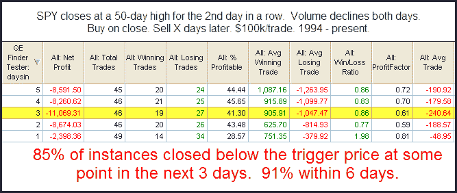

<!--yml

-->

日期：2024-05-18 13:07:12

分类：未分类

# 可量化边缘：在新高时 SPY 成交量下降

> 来源：[`quantifiableedges.blogspot.com/2010/01/declining-spy-volume-at-new-highs.html#0001-01-01`](http://quantifiableedges.blogspot.com/2010/01/declining-spy-volume-at-new-highs.html#0001-01-01)

在假期期间，很容易忽略低成交量，将其视为典型的假期流量。交易员可能已经回来，但交易量仍然不足。低成交量并不是明显可见，因为它仍然比假期期间的成交量高。然而，从这里开始明显走向错误的方向。以下是我在昨晚查看的利用 SPY 进行的研究。

这个边缘在这里并不是很大，但它确实表明在非常不久的将来可能会有一些下行趋势。（根据期货，回调可能今天早上已经开始。）
