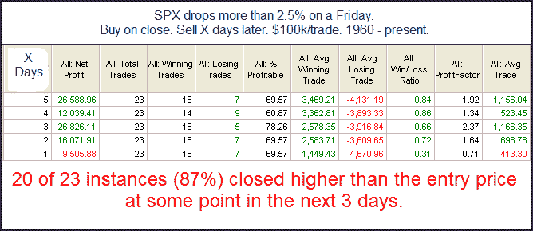
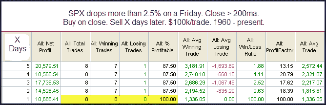

<!--yml

分类：未分类

日期：2024-05-18 13:10:47

-->

# Quantifiable Edges: Do Very Bad Fridays Set Up Crash Mondays?

> 来源：[`quantifiableedges.blogspot.com/2009/11/do-very-bad-fridays-set-up-crash.html#0001-01-01`](http://quantifiableedges.blogspot.com/2009/11/do-very-bad-fridays-set-up-crash.html#0001-01-01)

许多了解 1987 年崩盘历史的交易者可能在经历一个糟糕的周五后常常想，“这会在周一显著恶化吗？我们是不是正准备像 1987 年那样的崩盘？”这是一个有趣的问题。1987 年是异常情况吗，还是一个真正糟糕的周五经常持续到下周？我从 1960 年以来所有至少下跌 2.5%的周五开始分析。

（[图片](https://blogger.googleusercontent.com/img/b/R29vZ2xl/AVvXsEhBXvRSiggkczlX_DEw8jwiTBbYSMffQuu3JNTdbhJ5bBPKoJtkuojkXjcamQ9EHsQ26YTgHO4EBrJc5iMOjhmxHL7DsFMK20wcLXj-U2hzGEyxPptxQNyIRbYut4GXKl-BSPA9jt806G9u/s1600-h/2009-11-2+png1.png)

右侧最远的“平均交易”栏目由于 1987 年的崩盘而偏斜，当时市场在周一下跌了 20%。在几乎所有的情况下，市场似乎都是根据周五的行动而非崩盘来设置反弹。当然，尽管上周的最后几天表现不佳，市场仍然处于长期上升趋势中。我决定再次过滤上述结果，以检查在长期上升趋势中出现的糟糕周五。

（[图片](https://blogger.googleusercontent.com/img/b/R29vZ2xl/AVvXsEhmsflZ3DfhDYI0amUnZxpFBFHncpqnv7ND1nMUfhOElVAaCvka0hNIOsNXS0Id_G0GieEuIZSBZudJHzri4nh78GpBdbG2QFIc3t5SNyVv1x6tEUVA1jn1g7VPGDdeIxg53_rw_78zbpam/s1600-h/2009-11-2+png2.png)

在这里的实例很少，但对于短期来说，它们真的不能再更看涨了。再次，它们也表明反弹基本上应该立即到来。
