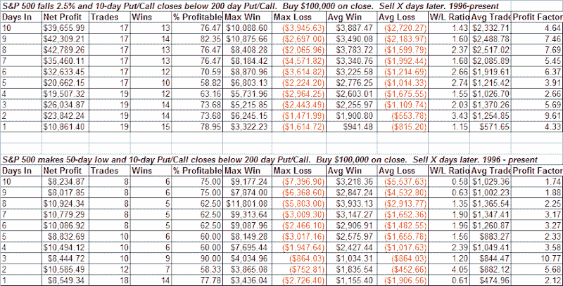

<!--yml

category: 未分类

date: 2024-05-18 08:13:40

-->

# 可量化的边缘：懒散的看跌/看涨期权是否阻止了市场的反弹？

> 来源：[`quantifiableedges.blogspot.com/2008/06/does-lackadaisical-putcall-keep-market.html#0001-01-01`](http://quantifiableedges.blogspot.com/2008/06/does-lackadaisical-putcall-keep-market.html#0001-01-01)

一个明显令人失望的情绪指标是 CBOE 看跌/看涨比率。这对一些交易者来说是一个担忧。截至今天，10 日看跌/看涨比率为 101.3\。这实际上低于 200 日移动平均线的 101.7\。下面有两个研究显示了当负面价格行动伴随着懒散的看跌/看涨比率时发生了什么：

我在 200 日移动平均线以上和以下都观察了第一个指标，结果几乎没有区别。看跌/看涨测试的含义似乎是，相对较低的看跌/看涨比率并不会损害市场反弹的机会。这有点令人惊讶。也有点鼓舞人心。
