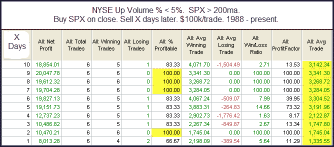

<!--yml

分类：未分类

日期：2024-05-18 13:05:19

-->

# 量化边缘：长期上升趋势中的极度负面广度交易日

> 来源：[`quantifiableedges.blogspot.com/2010/02/extremely-negative-breadth-days-in-long.html#0001-01-01`](http://quantifiableedges.blogspot.com/2010/02/extremely-negative-breadth-days-in-long.html#0001-01-01)

我昨晚从多种不同的角度审视了昨天的抛售情况。总体来看，市场这次的调整似乎已经过头了。下面是我运行的一个研究的例子。

（[链接](https://blogger.googleusercontent.com/img/b/R29vZ2xl/AVvXsEjzN1PGYgOKIssAJCzip6kZ84AS0t3z-Lsj1kfeKqnbOFy7ENpS-cODJh21XFmymCHTHxu57JdjdkSRcmCBk2-u7XicyDrRXFBmObm4Dm5ATsJ_JaC8DEJdpG9ckRGTNwgxDYuUlMAQTxm5/s1600-h/2010-2-5+png.png)）

虽然实例数量不多，但由于在第二天、第七天、第八天和第九天都有 100%的胜率，以及在这一时期内交易结果非常强劲，我认为值得考虑。
