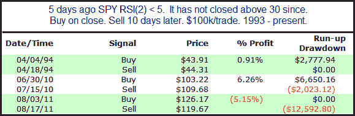

<!--yml

分类：未分类

日期：2024-05-18 08:50:04

-->

# 量化边缘：未能反弹使标普 500 进入异常市场

> 来源：[`quantifiableedges.blogspot.com/2012/05/failure-to-bounce-puts-spx-in-abnormal.html#0001-01-01`](http://quantifiableedges.blogspot.com/2012/05/failure-to-bounce-puts-spx-in-abnormal.html#0001-01-01)

尽管几天前市场达到了短期超卖状态，但市场未能出现任何实质性的反弹。我在周末和昨晚的订阅信中从多个角度研究了这一点。我进行的一项研究查看了在其他时段 SPY 高于 200 均线并在 RSI(2)低于 5 后未能在 5 天内突破 30 的情况。（RSI(2)首次低于 5 发生在 5 月 4 日，而 5 天内未能突破 30 的情况从 5 月 11 日开始。）这是前所未有的。当 SPY 低于其 200 均线时，它设法做到了 3 次，我在下面列出了这些情况。

底线是我们正处于未知的领域。量化分析在帮助我们识别高概率情况方面非常出色。这些时候你通常想要下大注。但是当我们从“超卖并可能反弹”进一步到“超卖并以前所未有的方式行动”时，这让我感到谨慎。我们正处于异常市场，在这种异常情况下保持较小规模的投注通常是个好主意。
