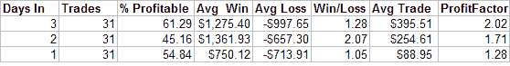
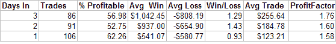

<!--yml

分类：未分类

日期：2024-05-18 08:28:36

-->

# 可量化边缘：平稳

> 来源：[`quantifiableedges.blogspot.com/2008/04/flat-lined.html#0001-01-01`](http://quantifiableedges.blogspot.com/2008/04/flat-lined.html#0001-01-01)

在上周二飙升 3.5%后，标普 500 指数已经平稳。图表可能会让你认为上周二早上宣布了所有 500 个成分股的收购。成交量也每天都在下降。

我回顾了过去 30 年类似的价格行动。市场在 3%或更多的涨幅后，连续 3 个收盘价在 3%那天的收盘价 0.25%以内的唯一其他时间是 1982 年 12 月 3 日。通过将 surge 天的要求从 3%降低到 0.75%，我能够获得更大的样本量。下面表格总结了那些实例。

(https://blogger.googleusercontent.com/img/b/R29vZ2xl/AVvXsEiTIN2BLcbJygoryu6zUv2QnBfiTKdZ4MMDJWY1VL5WXZy4Zr-kvgpAFYG6Rbf6ps4cbJ1lqVPQb8Sl3Av2_YjHSoMvJkTTjBW1ZfmTDGsT1CGsrsHrH0t-T5caPEps3mT6vN567mjuIso/s1600-h/2008-4-7+coiled+after+surge.PNG)

如果这种情况发生，一天后的结果基本上与随机相符。两天到三天后，似乎有一个轻微的上行趋势。

以下是如果你完全排除 surge 那天，并且只要求卷曲动作发生在 10 天移动平均线以上的结果。

(https://blogger.googleusercontent.com/img/b/R29vZ2xl/AVvXsEj4bdQtOG8NLmQHrXFYd0JV_Jq0HuqbSQxYw9Nehy8FsQpUOBCLopTrQDXDgS1xYsoaHtLve4cfZieuHPYpfYPF6S5xJPOhYa1B9Mj0kLnJx6ukl01xpFrpukyp4H8ZQMVdh7ApuG8MRLw/s1600-h/2008-4-7+coiled+above+10ma.PNG)

再次，前三天略微好于随机。这里没有太多激动人心的内容，但这又是关于高价的小暗示。
