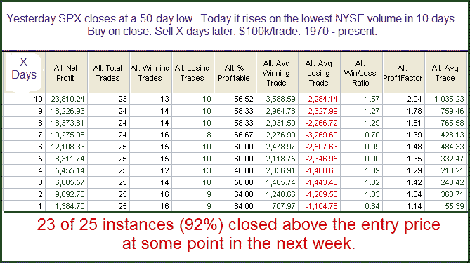

<!--yml

分类：未分类

日期：2024-05-18 13:05:45

-->

# 量化边缘：周一低成交量如何影响反弹几率？

> 来源：[`quantifiableedges.blogspot.com/2010/02/how-does-mondays-low-volume-affect.html#0001-01-01`](http://quantifiableedges.blogspot.com/2010/02/how-does-mondays-low-volume-affect.html#0001-01-01)

纽约证券交易所的成交量在周一市场反弹时降至两周多以来的最低水平。传统智慧认为，这种低成交量是一个坏迹象，它损害了进一步反弹/ rally 的机会。在过去 24 小时内，我看到了很多评论，称由于低成交量，这次反弹不能被信任。所以，下面是我运行的一项测试，用以检验这个理论。

我将这些统计数据与成交量

不是

处于 10 日低点，这里的情况要好得多。从这个角度来看，低成交量似乎并不是一个警告信号。实际上，这个设置似乎提供了一个看涨的边缘。或许成交量非常疲软，使得怀疑者足够少，他们在接下来的几天里会追逐市场走高，因为他们变得更加确信。
