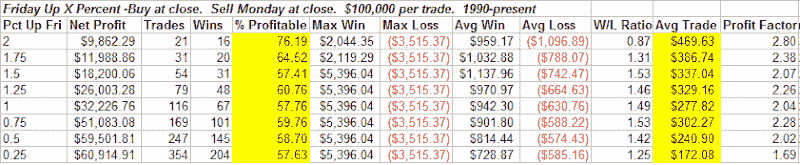

<!--yml

category: 未分类

date: 2024-05-18 08:14:41

-->

# 可量化的边缘：星期五的强劲如何影响了星期一

> 来源：[`quantifiableedges.blogspot.com/2008/06/how-strong-fridays-have-influenced.html#0001-01-01`](http://quantifiableedges.blogspot.com/2008/06/how-strong-fridays-have-influenced.html#0001-01-01)

上周五市场获得了一些实质性的收益。标普 500 指数上涨了 1.5%，道琼斯指数上涨了 1.4%，纳斯达克指数上涨了 2.1%。在 Gary Smith 的 1999 年的书中，

[“我如何交易谋生”](http://www.amazon.com/How-I-Trade-Living/dp/B000WGC8ZW/ref=sr_1_1?ie=UTF8&s=books&qid=1213581935&sr=1-1)

，Gary，如上图所示*，讨论了星期五的强劲动能往往会延续到星期一。如果你已经阅读了博客一段时间，你就会知道我对市场的看法很少。因此，我希望测试一切。所以我对 Gary 的理论进行了测试。

对标普 500 进行了自 1960 年以来的测试。下表显示了左边最左列的星期五的百分比回报率。之后，您可以看到星期一发生的情况的细分。（在星期五收盘时买入，星期一收盘时卖出。）此外，您应该注意，如果星期一是假期，那么销售将在星期二的收盘时进行。

看起来 Gary（上图所示）确实有些道理。特别有趣的是，星期五越强劲，平均星期一就越强劲。你可以通过查看平均交易列来看到这一点。

但随着股市的长期上升趋势，这些星期一与平均星期一相比如何？信不信由你，自 1960 年以来的星期一一直很糟糕。在 60 年代、70 年代和 80 年代，星期一一直是股市的稳定输家。在 87 年的股市崩盘之后（这发生在一个星期一），它们不再表现为持续输家。相反，它们更加符合一般市场趋势。这可以从下面的图表中清楚地看出，该图表显示了过去约 48 年中购买周五收盘并在周一收盘时出售的结果。

在整个 48 年期间，平均每个星期一的收益率为 0.04%。但当星期五表现强劲时，这种势头往往会延续下去，将星期一的收益变为正值。自 80 年代末以来，这种优势已不那么明显，但仍然存在。下面的最后一张表再次显示了基于星期五收益的星期一收益，但这次只追溯到 1990 年。

（[链接](https://blogger.googleusercontent.com/img/b/R29vZ2xl/AVvXsEjqTVYsIyzzOt08G3liG7V3CnEHytO_tQFFyo6Xib7KFYLSbKqEl8eSeI3zhsnkhQedP2YRWA8FgR1F6BcMsKqTmIPg71fM4-2L-k-UGfvvp1RP6c75k8qYQLbii8dWLGUKTrNtEPClvfI/s1600-h/2008-6-15+Friday+monday+table+2.PNG)

-   这不是真正的 Gary Smith。实际上那是《海绵宝宝》里的宠物，Gary 蜗牛。
