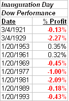

<!--yml

分类：未分类

日期：2024-05-18 13:29:27

-->

# 量化边缘：就职典礼日 - 市场的新的希望？

> 来源：[`quantifiableedges.blogspot.com/2009/01/inauguration-day-new-hope-for-market.html#0001-01-01`](http://quantifiableedges.blogspot.com/2009/01/inauguration-day-new-hope-for-market.html#0001-01-01)

美国全国各地和世界各地的许多人今天都在以一种希望的心情观看就职典礼。希望事情（对每个个体来说重要的事情）会变得更好。这种希望感并不仅限于巴拉克·奥巴马。每一位新就职的总统都会带来这种希望感。对于我们作为交易员来说，问题是，“这种希望感如何转化为股市回报？”

我决定回溯到 1920 年，使用道琼斯指数看看市场对过去的就职典礼是如何反应的。我将实例限制为只有那些新总统就职的情况。我不认为连任能带来像新总统那样的“新的希望”。我还排除了那些未当选总统的就职典礼（福特在 1974 年，约翰逊在 1963 年，杜鲁门在 1945 年，以及 1923 年的柯立芝）。我认为替代所引发的激动感不如新当选的总统。

*当选*

总统。

这让我剩下了以下 11 个实例：

1921 年 3 月 4 日 - 沃伦·G·哈定

1929 年 3 月 4 日 – 赫伯特·胡佛

1933 年 3 月 4 日 – 富兰克林·罗斯福

1953 年 1 月 20 日 – 德怀特·艾森豪威尔

1961 年 1 月 20 日 – 约翰·肯尼迪

1969 年 1 月 20 日 – 理查德·尼克松

1977 年 1 月 20 日 – 詹姆斯·卡特

1981 年 1 月 20 日 – 罗纳德·里根

1989 年 1 月 20 日 – 乔治·H·W·布什

1993 年 1 月 20 日 – 威廉·克林顿

2001 年 1 月 20 日 – 乔治·W·布什

首先，我查看了就职典礼当天市场的表现。当然，那些精彩的演讲和总体积极的氛围肯定对市场有积极的影响：

然而，也许并非如此。艾森豪威尔获得了最友好市场的演讲奖，因为他的演讲使道琼斯指数上涨了 0.35%。赫伯特·胡佛的总统任期一开始就不好，因为在他宣誓就职的那天，道琼斯指数下跌了超过 2%。（而且我们都知道那之后情况变得更糟。）小布什和罗斯福的第一次就职典礼不在列表中，因为那两天是周末。

如果我们看得更长远一些，会怎样呢？在就职典礼日收盘时买入（或对小布什和罗斯福来说，是第二天），并持有 10 天，会带来显著更积极的结果：

82%的胜率和 10 天内的平均回报 2.35%表明市场有看涨倾向。罗斯福是这里的英雄。卡特是替罪羊。总体跌幅有限，涨幅相当强劲。最后三个结果尤其出色。

以下是为新总统前 75 个交易日的中期视角结果：

这里大部分都是积极的。显然，这些结果中突出的是 1933 年的大型反弹。市场在 1932 年 7 月触底，接近 40 点。在 9 月中旬再次冲高至 80 点以上后，它开始再次大幅回调。1933 年 2 月，它在罗斯福就职前一周再次跌破 50 点。那次回调引发了一场巨大的反弹，在接下来的 5 个月内价格上涨了约 120%。即使那场反弹也没有把经济带出萧条。尽管那 5 个月可能很美好，但市场随后进入了一个持续约 10 年的区间。直到 1942 年第四季度，1933 年的约 110 点高位才最终被突破。

在过去几个月里，我已经展示了无数项研究，将当前环境与 1930 年代进行了比较。也许今天新领导层带来的希望感能够帮助点燃一场像 76 年前那样强烈的（熊市）反弹。

当然，这种测试的主要问题是，我们在这 90 年中只处理了 11 个实例。仅根据这些结果进行任何交易都是相当危险的。不过，我确实觉得它们很有趣，也有些显著。
