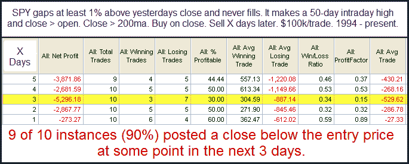

<!--yml

分类：未分类

日期：2024-05-18 12:53:42

-->

# 可量化边缘：再次审视大幅跳空上涨创新高

> 来源：[`quantifiableedges.blogspot.com/2010/09/large-gap-n-go-formations-to-new-highs.html#0001-01-01`](http://quantifiableedges.blogspot.com/2010/09/large-gap-n-go-formations-to-new-highs.html#0001-01-01)

周五我们看到 SPY 大幅跳空上涨，然后就没有回头路了。跳空从未被填补，并且收盘价远高于开盘价。在

[2009 年 10 月 15 日博客](http://quantifiableedges.blogspot.com/2009/10/large-gap-gos-to-intermediate-term.html)

当市场也创下了 50 天新高时，我研究了这类情况。我下面更新了那项研究。

在这里的实例很少，但结果足够强大，让我考虑在内。

编辑：这篇文章似乎没有在预期时间发布（几乎晚了一天才出现在我的 RSS 源中）。我正在使用新的 blogspot 编辑器，并将调查可能引起这种情况的原因。抱歉。

