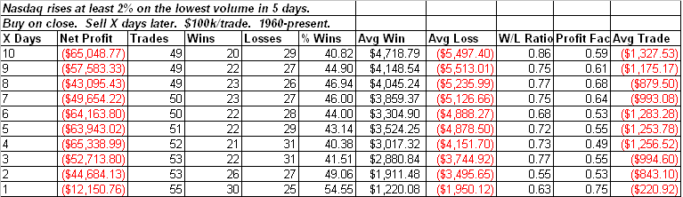
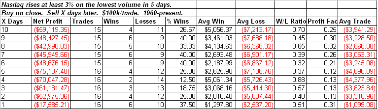

- <!--yml

- 类别：未分类

- 日期：2024-05-18 13:21:19

-->

# - 量化边缘：纳斯达克股价在成交量低迷时的巨大波动

> - 来源：[`quantifiableedges.blogspot.com/2009/05/large-nasdaq-price-moves-on-weak-volume.html#0001-01-01`](http://quantifiableedges.blogspot.com/2009/05/large-nasdaq-price-moves-on-weak-volume.html#0001-01-01)

- 周一的走势相当不寻常，因为市场上涨了这么多，而成交量却如此之低。我已经研究了多种低成交量的上涨方式。一套再次出现的研究

[是 2008 年 10 月 14 日的博客文章](http://quantifiableedges.blogspot.com/2008/10/volume-clues.html)

- 。在那里，我研究了纳斯达克强劲的波动，这些波动伴随着五天内最低的成交量。我更新了以下研究：

（[2009 年 5 月 19 日](https://blogger.googleusercontent.com/img/b/R29vZ2xl/AVvXsEhYFw02PIV3B8BCsmEBaloZa9Sc1NXZGe0sw5Ap8_sa8E-0OFdJYgxOi6JBVBvERJ5S_JkhIZeHAhOPpSke6w3-SNHmFNTKoacuDPy2eO8iCffX6JirLNZNHCez9wY2V8H_iU92lfJY4ms/s1600-h/2009-5-19+png1.PNG)

- 此类事件发生后的几天内通常表现出弱势。我还研究了 3%的波动。

（[未分类](https://blogger.googleusercontent.com/img/b/R29vZ2xl/AVvXsEi6f4bvrM2jTmEa2rjgDr4EDebdCdYcJ1gJCggwnSrh5McAECpPMbS2rs_RaKQ5aYApR75NjHEyTvYxTGsbcOwV8tnkj6d6z4GwZOqzk778WN0wWz0jTFrvwxjo0NFETCf3PMdsyGjeJFu1/s1600-h/2009-5-19+png2.PNG)

- 较大的百分比涨幅表现甚至更差。

- 当然，纳斯达克成交量不仅仅是五天低点，而且是一个月以来的最低水平。这种情况只发生过四次。下面我列出了所有伴随纳斯达克指数上涨 3%的 20 天低成交量发生的情况。下面显示的退出点只是一个五天的退出。
