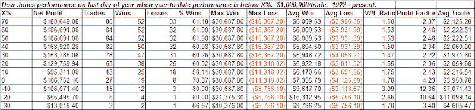

<!--yml

分类：未分类

日期：2024-05-18 13:31:00

-->

# 量化边缘：基于 YTD 表现的年度最后一天

> 来源：[`quantifiableedges.blogspot.com/2008/12/last-day-of-year-based-on-ytd_31.html#0001-01-01`](http://quantifiableedges.blogspot.com/2008/12/last-day-of-year-based-on-ytd_31.html#0001-01-01)

以下是表格，展示了如果截至当天，年初至今的表现低于 X%，则全年最后一天的表现。

（[链接](https://blogger.googleusercontent.com/img/b/R29vZ2xl/AVvXsEgsOxZ-oc3VDaWC_6qcAbYL4543uG0KZmVsGY5mAfWPM11hfH1gDQ0agftUBJrqthSNWnrIXxxo4OHiGMHJlB_XWPK0BRyo7Fo-CellDB3hj9BfxHnRprg22RBA5sjSHN0RH5Hi_b_ora4/s1600-h/2008-12-31+png.PNG)

看来坏年份倾向于以好结尾。
