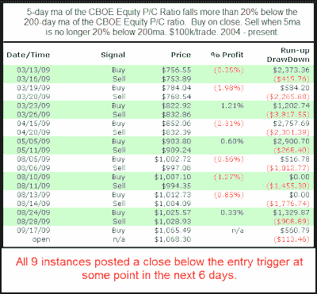

<!--yml

分类：未分类

日期：2024-05-18 13:13:39

-->

# 量化边缘：上周的股票看跌/看涨比率暗示市场将回调

> 来源：[`quantifiableedges.blogspot.com/2009/09/last-weeks-equity-putcall-ratios.html#0001-01-01`](http://quantifiableedges.blogspot.com/2009/09/last-weeks-equity-putcall-ratios.html#0001-01-01)

上周，CBOE 股票指数的看跌/看涨比率持续走低。5 日平均值为 0.53，这几乎是 200 日平均值 0.68 的 22%以下。当 5 日平均值像现在这样极低时，可能会导致短期市场回调。以下是证明这一点的研究案例。

这项研究最显著且最引人入胜的事实是，所有实例都是在 3 月份触底之后发生的。在那之前，5 日比率的 200 日移动平均线从未跌破 20%。这正是当前牛市行情变得多么极端的一个例证。同时，这也使得从负面角度来看取得的结果更加令人印象深刻，因为它们是在市场上涨 60%的背景下实现的。
