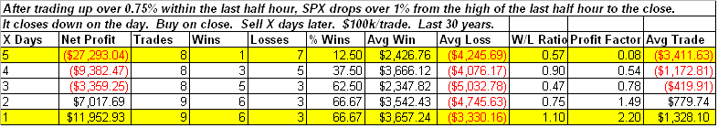

<!--yml

分类：未分类

日期：2024-05-18 13:23:13

-->

# 可量化的边缘：晚盘反转使标普 500 转为负面

> 来源：[`quantifiableedges.blogspot.com/2009/04/late-day-reversal-flips-s-to-negative.html#0001-01-01`](http://quantifiableedges.blogspot.com/2009/04/late-day-reversal-flips-s-to-negative.html#0001-01-01)

我们之前见过，强劲的尾盘卖盘常常是过度反应。经常这意味着在接下来的几天或几天内会出现反弹。今晚我查看了下面描述的情况，这是周三的动作：

实例数量不多，但结果很有趣。这个模式是先是一个剧烈的反弹，然后迅速再次下跌。在 9 个实例中，有 8 个在 4 天内

*大写*

在接下来的 3 天内某个时间点触发了入场。令人惊讶的是，9 个中有 7 个收盘

*小写*

如果看 6 天，数字将变为 8 个中的 8 个，如果你给它 6 天，那么所有 9 个实例在某个时间点都收盘走低。我所看到的是，在接下来的几天里，剧烈震荡的倾向。
