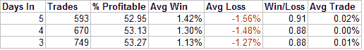
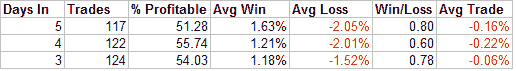

<!--yml

分类：未分类

日期：2024-05-18 08:30:12

-->

# 量化边缘：轻量级回调（好事？）

> 来源：[`quantifiableedges.blogspot.com/2008/03/light-volume-pullback-good-thing.html#0001-01-01`](http://quantifiableedges.blogspot.com/2008/03/light-volume-pullback-good-thing.html#0001-01-01)

像周三这样的日子，通常会这样说：

今天的标普 500 指数在成交量清淡的情况下回调。在最近的上涨之后，市场理应回调。成交量的清淡是一个迹象，表明卖方并不激进，应该被视为一个积极因素。这次回调似乎是有序的。看起来买家只是暂时退场。似乎没有任何大规模的机构在出货。

上面提到的任何一点听起来是否熟悉？这似乎是有道理的。每个人都声称他们希望市场在成交量清淡的情况下回调。这方面的内容在许多书籍中都有涉及，所以这肯定是对的。嗯……

我对标普 500 进行了一些测试，寻找以下条件：

1) 昨天 3 周期 RSI 超过 70（显示短期内有上涨）。

2) 今天的市场收盘价低于昨天。

在收盘时买入。在“X”天后卖出。在过去的 25 年里，标普 500 指数在这套设置后的 3、4、5 天内的表现如下：

在接下来的 3-5 天内，市场设法取得了非常轻微的上涨。

接下来我在混合物中添加了第三个条件：

3) 成交量必须是过去 10 天中的最低成交量。

再次在收盘时买入并在“X”天后卖出。在过去的 25 年里，标普 500 指数在这套设置后的 3、4、5 天内的表现如下：

显然，在第一天，“买家退场了”。在接下来的几天里，卖家填补了空白。在回调初期成交量清淡，这并不似乎是一个好事。

另一个神话被打破。
