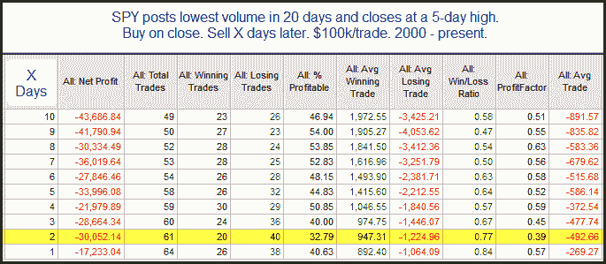

<!--yml

分类：未分类

date: 2024-05-18 12:58:55

暗示看起来是悲观的。悲观的影響主要在前两天显现。当然我们今天早上看到一个相当大的跳空上涨，所以这将很有趣，看看它如何发展。

# 量化边缘：SPY 短期内的低量上涨

> 来源：[`quantifiableedges.blogspot.com/2010/06/low-volume-rise-to-short-term-high-in.html#0001-01-01`](http://quantifiableedges.blogspot.com/2010/06/low-volume-rise-to-short-term-high-in.html#0001-01-01)

以下是昨晚订阅信中出现的一个与成交量相关的研究。

-->
