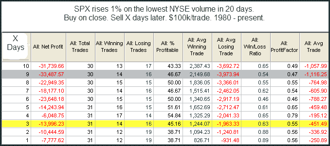

<!--yml

分类：未分类

日期：2024-05-18 13:13:06

-->

# 量化边缘：市场强劲上涨时的低成交量

> 来源：[`quantifiableedges.blogspot.com/2009/09/low-volume-when-market-rises-strongly.html#0001-01-01`](http://quantifiableedges.blogspot.com/2009/09/low-volume-when-market-rises-strongly.html#0001-01-01)

我昨天展示了在一个下降日中，成交量非常低往往可以导致短期内的逆转。今天我将回顾一个首次出现在博客中的研究，日期为 2008 年 5 月 13 日。它研究了在强劲上涨日中的极度低成交量——比如周一。（成交量研究通常使用 Tradestation 中的符号$TVOL，这是他们对 NYSE 成交量的衡量。这个研究就是使用下面的符号。）

我们随着时间的推移看到了几个这样的研究，其中很多都是由

[Quantifinder](http://quantifiableedges.blogspot.com/2009/05/quantifinder-unveiled.html)

在周一。由于这么多研究相互证实，这些低量上涨的潜在风险似乎是真实存在的。不过，值得注意的是，周一的行动是在犹太人的赎罪日（Yom Kippur），这意味着很多交易员都处于停工状态，因此成交量的减少是可以预见的。尽管如此，这已经是一个足够稳定的趋势，我决定对其进行回顾。
