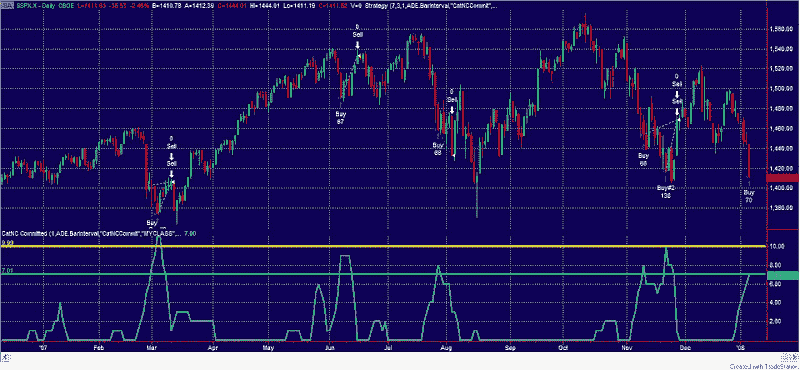
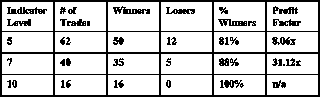

<!--yml

分类：未分类

日期：2024-05-18 08:37:45

-->

# 量化边缘：我的投降性广度指标

> 来源：[`quantifiableedges.blogspot.com/2008/01/my-capitulative-breadth-indicator.html#0001-01-01`](http://quantifiableedges.blogspot.com/2008/01/my-capitulative-breadth-indicator.html#0001-01-01)

几年前，我研究过投降性行动，既包括个股也包括指数。从那时起，我设计了一个系统，现在我已经交易了这个系统将近 2.5 年。这个系统最有趣的部分就是我所说的投降性广度指标。不详细说明，这个基本指标看起来是要测量一组精选的大型股票的投降广度。想法是，一旦足够多的这些股票符合我的条件，不仅它们，整个市场也非常可能出现急剧的反转。

我下面附上了一个图表，展示了 2007 年期间我的指标以及标普 500 的情况：

我通常使用两个级别来识别极端的投降性广度。第一个级别是“7”的读数，第二个是“10”的读数。为了展示这些级别的意义，我创建了一个策略，当我的指标达到某个级别时买入标普，然后当它回到“3”或更低时退出交易。这可以在上面的图表中看到买入和卖出的标记。

下面是一些使用不同入场水平和“3”或以下作为退出水平的表格统计数据，来自我的一次演讲：

还有一些事情需要注意：

1) 表中的统计数据是从 1995 年 1 月 1 日至今的。我开始交易是在 2005 年 9 月。其余的都是回测的。

2) 八月份的行动非常不寻常，因为指标在市场大幅下跌的那一天急剧下降到了“3”。这是因为当天早上有一个跳空高开，这使得指标在市场崩溃之前就降低了。实际上，八月份的信号实际上是不错的，因为交易本可以在早上就结束。但“系统”结果并没有反映出这一点。

3) 这个工具在警示我何时可能出现强劲反弹方面做得非常好。它在时机把握方面做得还可以。换句话说，这些信号可能经常提前发出。图表上的 11 月份行动就是一个很好的例子。在退出之前，这些盈利交易极大地考验了我的神经。因此，我通常喜欢对这些交易进行分批入场。

你会在图表上注意到，指标在周五达到了“7”。这表明强劲的反弹很可能即将到来（但并不意味着不会有进一步的下跌）。

我还用这个指标来观察个别群体和行业。根据我现在看到的情况，看起来在反弹中表现最好的群体是 1) 消费品和 2) 科技。

我将继续向您更新市场宽度指标的重大变化（超过 10，在 3 以下，等等）。

我今晚发布了很多内容。总结一下：1) VXO 告诉我我们可能随时反弹，但在我们真的反弹之前，市场可能会很糟糕。2) 我的市场宽度指标告诉我，这次反弹应该相当强劲——可能至少足以让我们回到目前的位置以上。3) 我的小股票观察名单让我觉得即使有强劲的反弹，也可能不足以引发一轮上涨。即将到来的反弹可能可以参与，但不要持有太久——之后可能还有更深的跌幅。

祝您交易顺利，

罗布·汉娜
