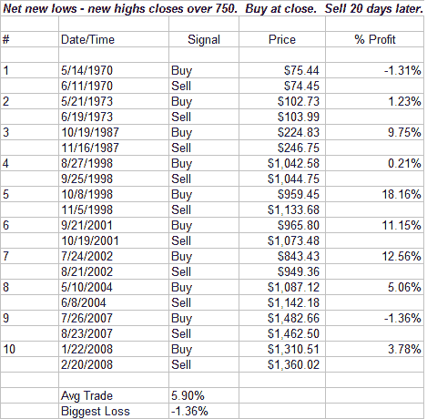
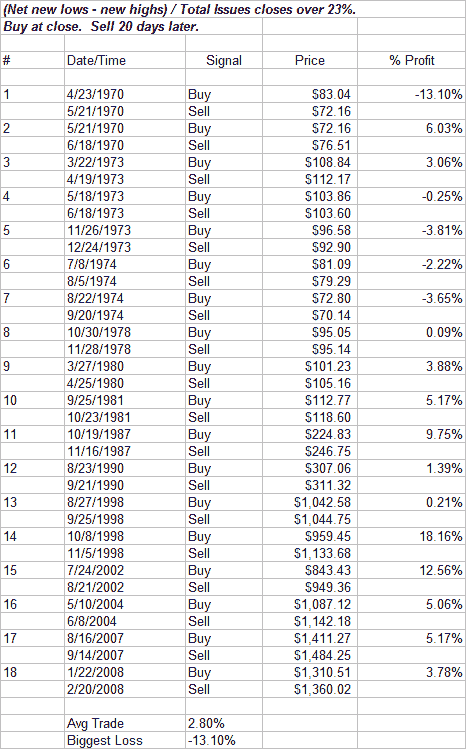

<!--yml

分类：未分类

日期：2024-05-18 08:12:29

-->

# 量化边缘：净新低测试和标准化需要

> 来源：[`quantifiableedges.blogspot.com/2008/07/net-new-lows-testing-and-need-to.html#0001-01-01`](http://quantifiableedges.blogspot.com/2008/07/net-new-lows-testing-and-need-to.html#0001-01-01)

周五达到极端的一个广度指标是纽约证券交易所股票触及新 52 周低点的数量。不仅仅是看 52 周低点，我通常喜欢看高低点的差异。与我所使用的许多指标一样，我认为在长期内查看结果时标准化结果很重要。（

点击此处讨论标准化看涨/看跌比率：[`quantifiableedges.blogspot.com/2008/06/why-you-need-to-normalize-putcall-ratio.html`](http://quantifiableedges.blogspot.com/2008/06/why-you-need-to-normalize-putcall-ratio.html)

对于这个指标，需要标准化的原因在于，在纽约证券交易所交易的股票总数现在显著大于 70 年代和 80 年代初。因此，我将原始结果除以流通中的股票数量，得到一个百分比数字。本周五的总结果是净 757 个，占纽约证券交易所交易股票总数的 23%以上。以下是一个示例，说明如果您未能调整交易总数，结果将会有很大差异：

将 750 作为您的触发水平将给您 10 个交易机会。其中大部分是比较近期的。现在让我们使用百分比而不是看看结果如何：

18 个交易机会，而不是 10 个，并且结果不如第一个测试看起来那么好。回顾 70 年代和 80 年代，在这里找到更多此类实例。使用原始数字而不是标准化数字，您将错过几乎一半的相关数据。
