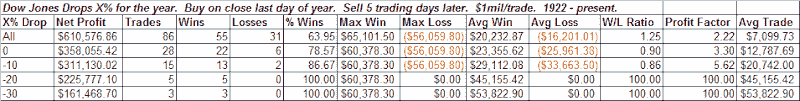

<!--yml

分类：未分类

date: 2024-05-18 13:30:51

-->

# 量化边缘：糟糕年份之后的新年

> 来源：[`quantifiableedges.blogspot.com/2009/01/new-years-after-bad-years.html#0001-01-01`](http://quantifiableedges.blogspot.com/2009/01/new-years-after-bad-years.html#0001-01-01)

由于 2008 年的表现如此糟糕，我决定看看基于前一年的表现，其他年份是如何开始的。在股票市场表现不佳的年份之后，新年的第一周通常表现相当不错——而且比在积极年份之后的第一周要好得多：

