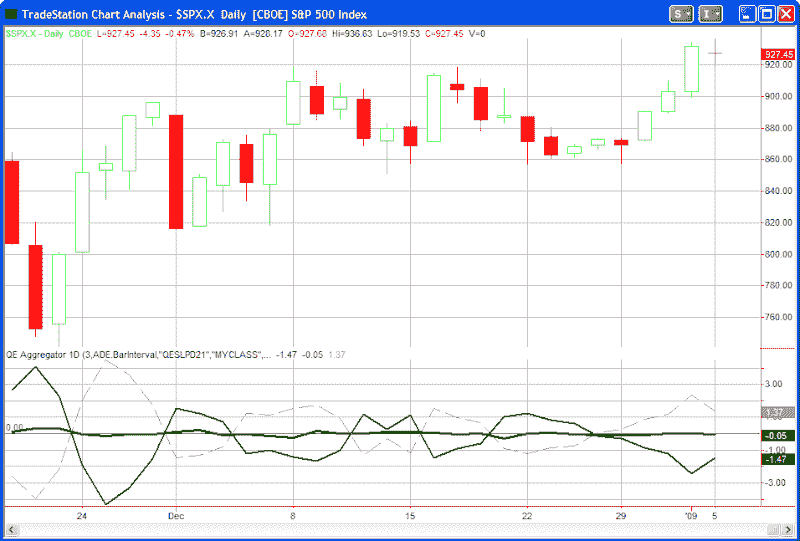

<!--yml

分类：未分类

日期：2024-05-18 13:30:33

-->

# 量化边缘：量化边缘聚合器建议短期偏向

> 来源：[`quantifiableedges.blogspot.com/2009/01/quantifiable-edges-aggregator.html#0001-01-01`](http://quantifiableedges.blogspot.com/2009/01/quantifiable-edges-aggregator.html#0001-01-01)

自从我上次讨论量化边缘聚合器以来已经很长时间了(

点击这里查看 7 月的文章和详细解释](http://quantifiableedges.blogspot.com/2008/07/quantifiable-edges-aggregator.html)

)，我从未在博客上发布过它的实时图表，但今天我决定这样做。作为一个快速的复习，聚合器收集了我所有当前正在进行并认为“活跃”的短期研究。其中一些研究发表在博客上。一些只出现在夜间或周订阅信件中。聚合器然后产生一个数字，估计这些研究集体认为市场在未来几天将如何表现。这在下面的图表中由绿色线表示。

虚线显示了标普过去几天（本案中为 3 天）的平均回报。我所说的实线差异线。它从近期表现中减去近期预期。当差异为负时，表明市场在过去几天内超越了预期。正差异表明市场在过去几天内未达到预期。

截至昨晚收盘，绿色的聚合器略低于 0，黑色的差异线坚定地低于 0。这意味着研究在接下来几天内表明略微看跌的偏向，而市场在过去几天内超越了预期并且超买。这是一个我通常会寻找进入空头交易的配置。一个进入多头交易的配置将看到绿色和黑色线都在 0 以上。需要注意的是聚合器不是一个机械系统。它只是我的研究相对于标普 500 的图形表示。

免费试用

量化边缘会员区](http://www.quantifiableedges.com/meminfo.html)

要了解我如何在分析中融入聚合器，只需

[点击这里](http://www.quantifiableedges.com/members/register.php)

.
