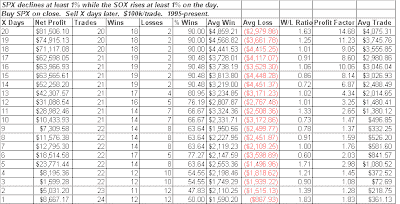

<!--yml

分类：未分类

日期：2024-05-18 13:20:38

-->

# 量化边缘：SOX 强度可能是看涨的信号

> 来源：[`quantifiableedges.blogspot.com/2009/05/sox-strength-potential-bullish-sign.html#0001-01-01`](http://quantifiableedges.blogspot.com/2009/05/sox-strength-potential-bullish-sign.html#0001-01-01)

过去我讨论过几次，当 SOX 在卖压下上涨时，这通常是个好事情。在 2008 年 8 月 13 日的博客中，我研究了在 SPX 下跌 1%而 SOX 上涨的那一天的表现。以下是那个研究的一个小变化，它研究了在 SPX 下跌 1%而 SOX 上涨 1%之后的回报。

（点击表格以放大）

在三到四周的时间里，你有 90%的胜率。接下来四周内 S&P 的平均涨幅超过了 4%。即使是在过去的一年中的情况，也伴随着接下来三周左右的正面数字。它们分别是 2008 年 7 月 15 日（接下来 15 个交易日的涨幅为 5.75%）、2008 年 8 月 7 日（涨幅为 2.73%）、2008 年 12 月 9 日（涨幅为 1.64%）和 2009 年 2 月 25 日（涨幅为 3.85%）。与此同时，如果你购买的是领先的 SOX 而不是 SPX，整个样本集的平均四周交易从 4%上升到 8.2%。

为牛市加上一分。（尽管我仍然看到几项看跌的研究。）
