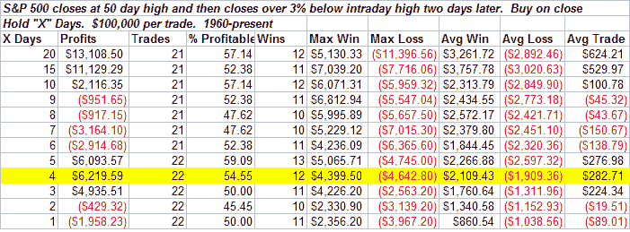

类别：未分类

日期：2024-05-18 08:16:55

-->

# Quantifiable Edges: Sharp Selloff A Buying Opportunity?

> 以下是百分比跌幅而不是 8 天低点：

市场在过去两天遭受重创。这有助于缓解我上周晚些时候提到的过度紧张的市场状况。最值得注意的是 CBOE 看跌/看涨比率以及 VIX。请注意，我周四下午分享的 VIX 系统触发了今天的退出——在 3 天内获得了 2.43%的收益。）那么现在呢？这是一个买入机会吗？两天前市场刚刚触及 4 个月高点。标普 500 指数今天收盘时较那些高点下跌了大约 3.5%。让我们来看看在这些大幅下跌发生在高点附近时过去发生了什么：

截至周一，SPY 连续 6 天上涨。在过去的两天里，这六天的涨幅全部被抹去。查看其他 51 次市场从 50 天收盘高点跌至 8 天收盘低点的情况，预期在未来几天将触顶。几周后，预期几乎回到了平坦线。

<!--yml

来源：[`quantifiableedges.blogspot.com/2008/05/sharp-selloff-buying-opportunity.html#0001-01-01`](http://quantifiableedges.blogspot.com/2008/05/sharp-selloff-buying-opportunity.html#0001-01-01)

再次出现短暂的反弹，但很快便消失了。然后我将这两个结合起来。只有 12 个出现，但结果似乎值得注意。在这种情况下，反弹只持续了 3 天，而那之后的市场预期迅速转为负面，并保持负面。

我今晚还进行了其他一些测试。到目前为止，我没有看到任何迹象让我相信大幅下跌已经完全结束。
