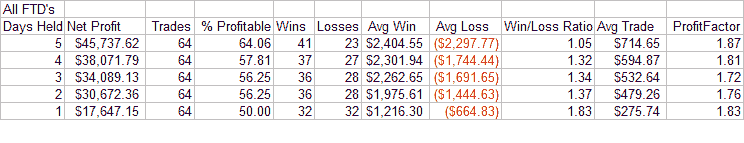
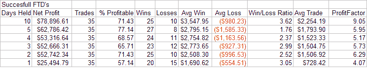
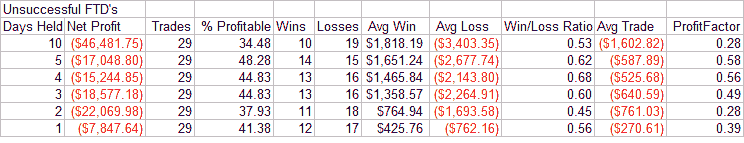

<!--yml

分类：未分类

日期：2024-05-18 08:35:39

-->

# Quantifiable Edges：跟随交易日的中期影响

> 来源：[`quantifiableedges.blogspot.com/2008/02/short-term-implications-of-follow.html#0001-01-01`](http://quantifiableedges.blogspot.com/2008/02/short-term-implications-of-follow.html#0001-01-01)

对于 CANSLIM 交易者来说，是回到工作岗位的时候了。今天触发了 IBD 跟随交易日。在 Quantifiable Edges 中，我详细讨论了跟随交易日的中期影响。以下是到目前为止整个系列的链接：

虽然中期交易者今天因为跟随交易日而欢欣鼓舞，但摆动交易者却在关注市场在短期内变得多么超买。我今天下午和晚上读到的短期交易者的绝大多数内容都是关于做空的。普遍的观点是我们现在处于长期下跌趋势（对一些人来说是熊市）的短期超买状态。大多数人认为这些是做空理想条件。

摆动交易者需要理解的是，几乎**每一个**跟随交易日都会在下跌市场中产生短期超买情况。它们经常在底部的 4-7 天内出现。今天是反弹的第 7 天。和上周一样，底部的大部分时候，反转都是剧烈的。这可能导致振荡器变得超买。当公式要求一个典型的剧烈反转、一周的上涨以及在高成交量上的强烈反弹时——你很可能会在短期内超买。这意味着尝试一个摆动交易做空是一个好时机吗？

为了测试它，我查看了我在研究中列出的所有 64 个跟随交易日的 1-5 天回报。每笔交易 10 万美元。在跟随交易日的收盘时做多。X 天后退出。结果如下：

通常情况下，市场在接下来的 1-5 天内会走高。平均盈利大于平均亏损。继续在多方获利。在这种情景下做空是一个输家的游戏。也许正是短期交易者的这种持续平仓亏损头寸的举动，帮助推动了反弹的持续。

***短期成功或失败是否预示着长期成功或失败？***

关于跟随交易日，IBD 有时会提出一个有趣的观点，即那些失败的情况通常会在跟随交易日之后不久发生。我决定今晚也研究一下这个概念。

我把 64 个跟随交易日分为两组——成功和失败的一组——来看它们的早期表现是否暗示了它们长期成功的可能性。以下是分解——与上面相同——每笔交易 10 万美元，跟随交易日收盘买入，并在 X 天后退出。

在跟随交易日之后早期行动，最终“成功”的情况：

（[点击查看](https://blogger.googleusercontent.com/img/b/R29vZ2xl/AVvXsEiUMpSN_E1sneMYkzXd0S4YioYR6rF3ToIJ1kNs9MCpJe1Edz04ml3XdA6O_ikcm-At9ZXO61fYARaU2_9Zr2-_5TMfs0BCc9vWdZ2QolYFCTOvLFoy6aQfsOl2azqTLZftGQSxPzWma1c/s1600-h/2008-1-31+FTD+Success+Results.PNG)）

一开始，这些大部分都取得了不错的收益。这个小组中的短期赢家平均在第一周又上涨了 2-3%。短期输家平均下跌了 1-1.5%。净收益是可观的。

在跟随交易日之后早期行动，最终“失败”的情况：

（[点击查看](https://blogger.googleusercontent.com/img/b/R29vZ2xl/AVvXsEgaHMA_J5FsjvMgzuc1KYUe4pgbd3NxCsEKXl5oGNYmqVzw128Woqsu3EbGPJT0XpXUhJWynPT4P0OffxUStKiKExttS4HizCvWB3CpmKLkWG3iqr73yq6q7yKVQ6eKOqIxes4bjcNymdg/s1600-h/2008-1-31+FTD+UnSuccess+Results.PNG)）

那些最终失败的一般很快就有失败的迹象。这里值得注意的是，平均亏损远高于平均收益。

一个基本的经验法则是，在跟随交易日之后的第一周内，成功或失败大约有 67%的可靠性。例如，注意总共有 41 笔交易在 5 天后处于盈利状态。其中约 2/3 继续了“成功”的上涨。同样的比例适用于亏损者。在 5 天后有 23 笔亏损。其中 15 笔最终导致了“失败”的上涨，另外 8 笔是“成功”的。2/3 的规则在查看跟随交易日之后 1-5 天内赢家和输家的任何时间段内都相当准确。明天早上的就业报告有可能为这个市场早期的走势定下基调。

今晚总结两个主要观点：

- 不要过于急切地做空。在跟随交易日之后，它并没有正的期望值。

- 密切观察下周的市场行动。它应该能为你提供中期市场的一个很好的指示。
