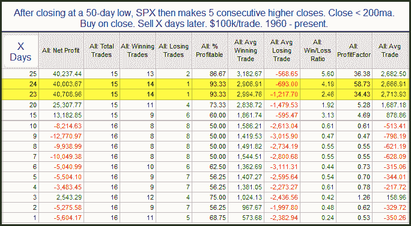

<!--yml

类别：未分类

日期：2024-05-18 12:57:13

-->

# 可量化的边缘：短期持续性对中期来说是积极的

> 来源：[`quantifiableedges.blogspot.com/2010/07/short-term-persistence-positive-for.html#0001-01-01`](http://quantifiableedges.blogspot.com/2010/07/short-term-persistence-positive-for.html#0001-01-01)

周一录得连续第五个交易日收盘走高。这种从低位开始的持续性几乎总是导致中期进一步的上行。下方的研究中可以观察到这一点。

短期回报非常波动。展望一个月左右，结果强烈支持多头。在昨晚的订阅者信中，我列出了所有实例。有趣的是，每个十年都有正面的表现。
