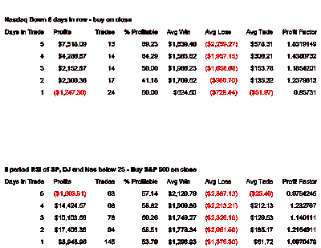

<!--yml

分类：未分类

日期：2024-05-18 08:37:28

-->

# 可量化边缘：我昨晚查看的一些硬数据

> 来源：[`quantifiableedges.blogspot.com/2008/01/some-hard-data-i-looked-at-last-night.html#0001-01-01`](http://quantifiableedges.blogspot.com/2008/01/some-hard-data-i-looked-at-last-night.html#0001-01-01)

我今天看到了几篇文章和博客，它们都暗示了强烈的上升空间

边缘

当时已经到位。这个

相反

我昨晚的研究成果。这些文章中只有一个是用统计数据来支持的。当我看到这一点时，我决定我犯了一个错误，那就是没有展示与我的评论相配套的数据。以下是两个研究案例，它们代表了我昨晚看到的情况。

第一个研究是关于在

纳斯达克

任何时候它连续 8 天收低，并在 X 天后卖出。

第二个研究是关于在 S&P 500 的任何时间，只要 S&P，道琼斯和

纳斯达克

所有案例在 8 周期 RSI 低于 25 时结束，并在 X 天后卖出。

每笔交易的 10 万美元。

我没有找到这些研究中有立即反弹的有力证据。当我像昨晚提到的那样添加额外的趋势和突破过滤器时，数字看起来甚至更糟。

或许一个真正的崩溃或者一个坚实的反转能够让我们获得我们寻求的可量化优势...
