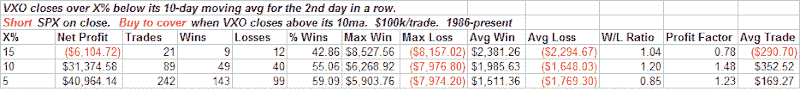
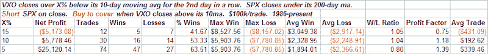

<!--yml

分类：未分类

日期：2024-05-18 13:35:43

-->

# Quantifiable Edges: Stretched VXO Not Bearish

> 来源：[`quantifiableedges.blogspot.com/2008/10/stretched-vxo-not-bearish.html#0001-01-01`](http://quantifiableedges.blogspot.com/2008/10/stretched-vxo-not-bearish.html#0001-01-01)

-   交易者中普遍存在的一个误解是，与短期移动平均相比，极度低的 VIX 或 VXO 会有看跌的影响。周二，VXO 连续第二天收盘时低于其 10 日移动平均线的 15%以上。下面是一个测试，展示了当 VXO 连续至少两天低于某些水平时，做空标普 500 指数的结果。它涵盖了一次已经出现了对短期平均值的回归：

（[其他一些研究](http://quantifiableedges.blogspot.com/2008/05/is-low-vix-short-trigger.html)）

设计中的系统在 VXO 温和拉伸时显示出微弱的优势。随着拉伸的增大，优势消失了。要理解为什么会这样，考虑一下是什么原因导致 VXO 极度拉伸，而不是稍微拉伸。温和的拉伸可能是市场通常上涨的结果。而极端的拉伸更有可能是市场强劲上涨的结果。如果市场确实很强，那么结果将是更多的上涨——而不是下跌。

当交易低于 200 日移动平均线时，差异更为明显。

（[费尔曼学习法](https://wiki.example.org/feynmans_learning_method)的灵感源于诺贝尔物理奖获得者**理查德·费曼**。）

在这里我们看到，温和的拉伸更有利于看跌。在下跌趋势的市场中，小幅上升可能会提供做空机会。另一方面，强劲的上升可能会导致恶性的空头回补反弹——这不是你通常想要用空头交易站在前面的东西。

我使用了

（[其他一些研究](http://quantifiableedges.blogspot.com/2008/05/is-low-vix-short-trigger.html)）

来阐述这些概念。

有一些指标显示短期内有下跌趋势，比如我昨天发布的成交量研究。极度低的 VXO 并不暗示卖出，尽管如此。
