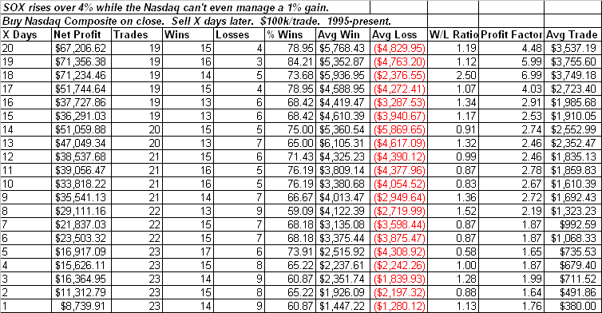

<!--yml

category: 未分类

date: 2024-05-18 13:29:02

-->

# Quantifiable Edges: 强有力的 SOX 行动可能会对纳斯达克有利

> 来源：[链接](http://quantifiableedges.blogspot.com/2009/01/strong-sox-action-could-be-good-for.html#0001-01-01)

I’ve discussed in the past the fact

一篇讨论强有力的 SOX 行动通常可能是市场的一个好兆头的文章[链接](http://quantifiableedges.blogspot.com/2008/08/sox-bucks-selloff-again.html)

对于市场来说，尽管标普 500 和纳斯达克指数周五都未能上涨 1%以上，但 SOX 指数上涨了超过 4%。特别是 SOX 在没有带动纳斯达克综合指数的情况下就实现了如此强劲的涨幅，这是非常不寻常的。它为纳斯达克未来的市场预期提供了一个很好的看涨信号。

（[点击查看](https://blogger.googleusercontent.com/img/b/R29vZ2xl/AVvXsEikIvB8_BvfVUpJB2KC-gAo-E_15MpSKMkD3q1mQM-2-jULc-VbBSAys1F4Lb0ElmQkBlHyymQGMUFocU5u6jztnyMUfIbnV_jOYUSQpZNukTNaait5KOAtZ-80Oeo657YkbwNg5KO9gUs/s1600-h/2009-1-26+png.PNG)）
